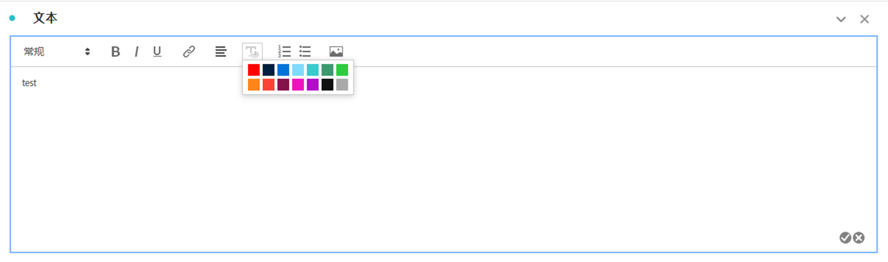
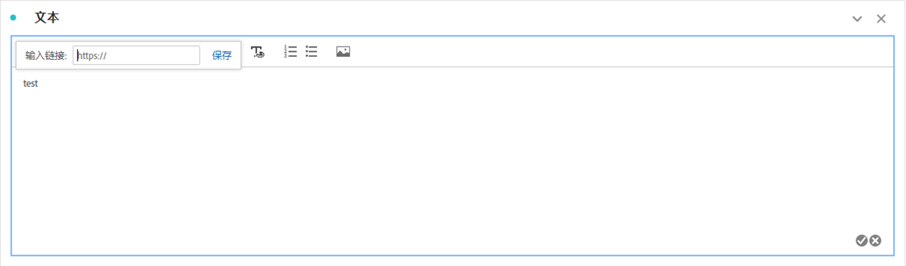
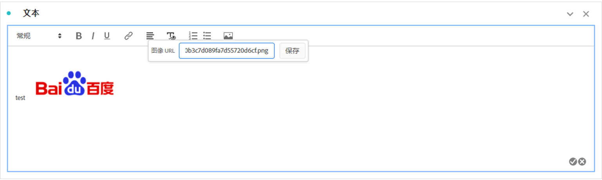

# 文本 {#text-visualization}

<!-- markdownlint-disable MD034 -->

>[!CONTEXTUALHELP]
>id="workspace_text_button"
>title="文本"
>abstract="向您的项目添加用户定义的富文本可视化图表。"

<!-- markdownlint-enable MD034 -->

若要向Workspace项目添加用户定义的富文本，您可以使用 **[!UICONTROL 文本]**&#x200B;可视化图表，或者将说明用于可视化图表和面板。

## 使用

您可以通过以下方式使用文本可视化图表：

1. 添加 **[!UICONTROL Text]**&#x200B;可视化图表。 请参阅[将可视化图表添加到面板](freeform-analysis-visualizations.md#add-visualizations-to-a-panel)。

1. 在面板或可视化中，从上下文菜单中选择&#x200B;**[!UICONTROL 编辑描述]**。

   编辑完描述时选择，选择取消。

您可以更改文本的格式、添加超链接以及添加图像。

## 调整格式 {#format}

编辑文本框或描述时，您可以调整字体大小（标题级别）、样式（粗体、斜体、下划线）以及对齐所选文本。还可以添加项目符号和编号列表。

## 添加超链接 {#hyperlinks}

要添加超链接，请突出显示文本并在菜单中选择。 您可以使用超链接向项目收件人提供进一步帮助。 超链接可以链接到外部网站、文档页面、[Workspace项目、面板或可视化图表](/help/analysis-workspace/curate-share/shareable-links.md)等。

## 添加图像 {#images}

若要向项目中添加图像，请在菜单中选择并插入公共图像URL。 该图像 URL 必须可公开访问、以 `https` 开头并且格式为 `.png`、`.jpeg`、`.jpg` 或 `.gif`。支持静态图像和动画图像。

