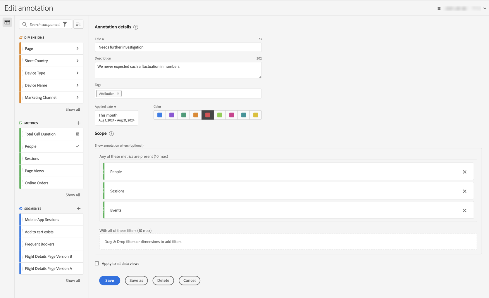

# 创建注释

默认情况下，只有管理员可以创建注释。用户有权查看注释，这与用户查看其他组件（例如区段、计算量度等）的方式类似。

但是，管理员可以通过 Admin Console 向用户授予&#x200B;**[!UICONTROL CJA Workspace 访问权限的编辑权限]**&#x200B;中&#x200B;**[!UICONTROL 报告工具]**&#x200B;的&#x200B;**[!UICONTROL 注释创建]**&#x200B;权限。请参阅[用户级别的访问控制](/help/technotes/access-control.md#user-level-access)，了解更多信息。

您可以通过以下方式创建注释：

* **A**。在主界面中选择&#x200B;**[!UICONTROL 组件]**，然后选择&#x200B;**[!UICONTROL 注释]**。从[[!UICONTROL 注释]管理器](/help/components/annotations/manage-annotations.md)中选择  [!UICONTROL **[!UICONTROL 添加]**]。
* **B**。在 Workspace 项目中，从可视化图表中的上下文菜单中选择&#x200B;**[!UICONTROL 从选择创建注释]**。
* **C**。在 Workspace 项目中，从线形图中的上下文菜单中选择&#x200B;**[!UICONTROL 注释选择]**。
* **D**。在 Workspace 项目中，从菜单中选择&#x200B;**[!UICONTROL 组件]**，然后选择&#x200B;**[!UICONTROL 创建注释]**。
* **E**。在 Workspace 项目中，使用快捷键 **[!UICONTROL ctrl+shift+d]** (Windows) 或 **[!UICONTROL shift+command+o]** (macOS)

要定义注释，请使用[[!UICONTROL Annotation Builder]](#annotation-builder)。

<!-- Should we really mention API here. If so, we can do it all over the place in the docs...
| **Use the [Customer Journey Analytics Annotations API](https://developer.adobe.com/cja-apis/docs/endpoints/annotations/)** | The Customer Journey Analytics Annotations APIs allow you to create, update, or retrieve annotations programmatically through Adobe Developer. These APIs use the same data and methods that Adobe uses inside the product UI. |
-->

## 注释生成器 {#annotation-builder}

<!-- markdownlint-disable MD034 -->

>[!CONTEXTUALHELP]
>id="components_annotations_details"
>title="注释详细信息"
>abstract="注释使您能够有效地将上下文数据的细微差别和洞察传达给您的组织。通过注释，您可以将日程表活动与特定的维度和量度关联起来。"

<!-- markdownlint-enable MD034 -->

<!-- markdownlint-disable MD034 -->

>[!CONTEXTUALHELP]
>id="components_annotations_scope"
>title="范围"
>abstract="您可以利用范围来自定义注释的数据。计算量度和区段不会自动继承其定义中使用的组件的注释。您可以将新的计算量度添加到现有注释的范围部分。新的区段需要新的注释。"

<!-- markdownlint-enable MD034 -->

 **[!UICONTROL 注释生成器]**&#x200B;对话框可用于创建新注释或编辑现有注释。对于您通过[[!UICONTROL 注释]管理器](/help/components/annotations/manage-annotations.md)创建或管理的注释，该对话框的标题为&#x200B;**[!UICONTROL 新建注释]**&#x200B;或&#x200B;**[!UICONTROL 编辑注释]**。

>[!BEGINTABS]

>[!TAB 注释生成器]

{zoomable="yes"}

>[!TAB 编辑注释]

{zoomable="yes"}

>[!ENDTABS]

1. 指定以下详细信息（为必要项）：

   | 元素 | 描述 |
   | --- | --- |
   | **[!UICONTROL 数据视图]** | 您可以选择注释的数据视图。您定义的注释可作为基于所选数据视图的 Workspace 项目中的注释使用。当您启用[!UICONTROL 应用于所有数据视图]时，此选择将会被推翻。 |
   | **[!UICONTROL 仅用于项目的注释]** | 用于解释您创建的注释仅在您正在处理的 Workspace 项目中可见的信息框。启用&#x200B;**[!UICONTROL 使此注释对您的所有项目可用]**，以使该注释对您的所有项目可见。仅当您在 Workspace 项目内创建注释时，此信息框才可见。 |
   | **[!UICONTROL 标题]**  | 对该注释进行命名，例如 `Needs further investigation`。 |
   | **[!UICONTROL 描述]** | 提供对该注释的描述，例如 `We never expected such a fluctuation in numbers.`。 |
   | **[!UICONTROL 标记]** | 通过创建或应用一个或多个标记来组织注释。开始键入，以查找您可以选择的现有标记。或者按&#x200B;**[!UICONTROL 输入]**&#x200B;键添加新的标记。选择  以移除标记。 |
   | **[!UICONTROL 应用日期]**  | 选择为了让注释可见所需的日期或日期范围。当您使用快捷方式创建注释时，注释默认为当天的日期范围。使用可视化图表中的选定内容创建注释时，注释会根据可视化图表所属面板的日期范围默认使用日期范围。 |
   | **[!UICONTROL 颜色]** | 将颜色应用于注释。注释以选定的颜色出现在项目中。颜色可用于对注释进行分类，例如公共假日、外部活动、跟踪问题等。 |
   | **[!UICONTROL 范围]** | 从组件面板中拖放触发注释的量度。例如，人员、会话和事件。 然后从组件面板中拖放任何用作区段的维度或区段，以确定是否显示注释。如果不指定范围，则注释会应用于您的所有数据。 您有两个选项：<ul><li>**[!UICONTROL 存在以下任一量度]**：拖放最多 10 个会触发注释显示的量度。 例如，收入量度已停止收集特定日期范围的数据。 将收入量度拖到此框中。</li><li>**[!UICONTROL 使用所有这些区段]**：拖放最多 10 个会在注释显示时进行分段的维度或区段。</li></ul>

**请注意：**&#x200B;任何应用于组件，随后用作计算量度或区段定义的一部分的注释，均不会自动继承注释。还必须将所需的计算量度添加到范围部分才能显示注释。但是，应为要用相同信息进行注释的任何区段创建新的注释。例如，您在某一天的[!UICONTROL 订单]中应用注释。然后，在相同日期范围的某个计算量度中使用[!UICONTROL 订单]。新的计算量度不会自动显示订单的注释。还要将计算量度添加到范围部分才能显示注释。 |
   | **[!UICONTROL 应用于所有数据视图]** | 默认情况下，注释应用于原始数据视图。通过选中此框，您可以在公司内的所有数据视图中应用注释。 |

   {style="table-layout:auto"}

1. 选择
   * **[!UICONTROL 保存]**&#x200B;以保存注释。
   * **[!UICONTROL 另存为]**&#x200B;以保存注释的副本。
   * **[!UICONTROL 删除]**&#x200B;来删除注释。
   * **[!UICONTROL 取消]**&#x200B;来取消对注释所做的任何更改，或取消创建新的注释。
