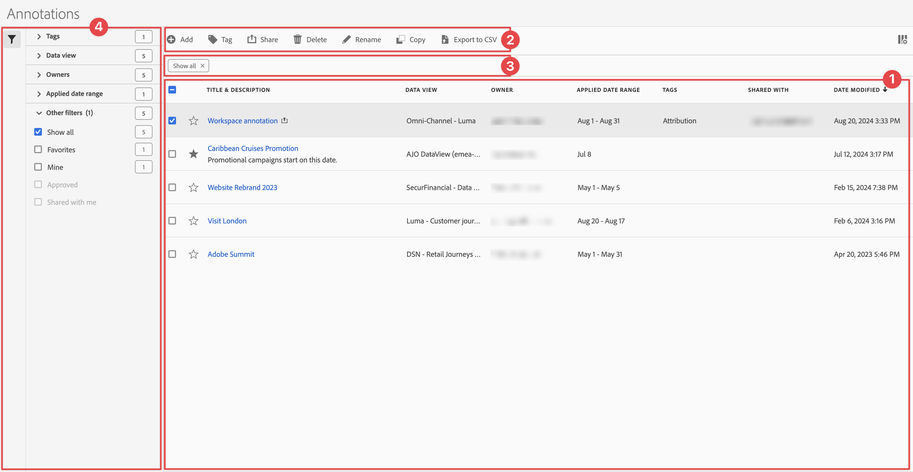

# 管理注释

您可以从中央[!UICONTROL 注释]管理界面共享、过滤、标记、批准、复制、删除注释并将注释标记为收藏夹。若要管理注释：

* 在主界面中选择&#x200B;**[!UICONTROL 组件]**，然后选择&#x200B;**[!UICONTROL 注释]**。

>[!NOTE]
>
>您在特定 Workspace 项目中创建的注释不会出现在[!UICONTROL 注释]管理器中，除非您已将该注释提供给所有项目。
>

## 注释管理器

注释管理器具有以下界面元素：

### 注释列表

注释列表 ➊ 显示了您拥有的注释、已覆盖到您的所有项目的注释以及已与您共享的注释。该列表具有以下各列：

| 栏目 | 描述 |
| --- | --- | 
|  | 选择加入收藏  或取消收藏  一项注释。 |
| **[!UICONTROL 标题和描述]** | 在注释生成器中提供。要编辑标题和说明，请选择标题链接：打开[注释生成器](/help/components/annotations/create-annotations.md#annotation-builder)。共享注释用表示。 |
| **[!UICONTROL 数据视图]** | 此注释应用于的数据视图。 |
| **[!UICONTROL 所有者]** | 注释的所有者。作为用户，您只能看到您拥有的注释或与您共享的注释。 |
| **[!UICONTROL 应用的日期范围]** | 此注释应用于的日期或日期范围。 |
| **[!UICONTROL 标记]** | 此注释的标记。 |
| **[!UICONTROL 共享对象]** | 您共享注释的个人或群组。选择以打开&#x200B;**[!UICONTROL 分享组件]**&#x200B;对话框。 |
| **[!UICONTROL 修改日期]** | 显示上次修改注释的日期和时间。 |

{style="table-layout:auto"}

使用  指定您想要显示的列。

### 操作栏

您可以使用操作栏 ➋ 对注释执行操作。操作栏包含以下操作：

| 图标 | 操作 | 描述 |
|:--:|---|---|
|  | **[!UICONTROL 添加]** | 使用[注释生成器](create-annotations.md#annotation-builder)添加另一个注释。 |
|  | [!UICONTROL *按标题搜索*] | 当列表中未选择任何注释时，使用此搜索字段搜索注释。 |
|  | **[!UICONTROL 标记]** | 标记选定的注释。在&#x200B;**[!UICONTROL 标记组件]**&#x200B;对话框中，选择或取消选择所选注释的标记。选择&#x200B;**[!UICONTROL 保存]**&#x200B;来保存所选注释的标记。 |
|  | **[!UICONTROL 共享]** | 分享选定的注释。在&#x200B;**[!UICONTROL 分享组件]**&#x200B;对话框中，您可以*搜索个人或群组*，或者您可以选择&#x200B;**[!UICONTROL 组织]**&#x200B;或者&#x200B;**[!UICONTROL 群组]**。选择&#x200B;**[!UICONTROL 保存]**&#x200B;以保存所选注释的共享详细信息。请参阅[共享注释](#share-annotations)，以了解更多详情。 |
|  | **[!UICONTROL 删除]** | 删除选定的注释。系统将提示您确认。 |
|  | **[!UICONTROL 重命名]** | 重命名单个选定的注释。选中后，您可以内联重命名注释。 |
|  | **[!UICONTROL 复制]** | 复制选定的注释。使用相同的名称和后缀创建新的注释（复制） |
|  | **[!UICONTROL 导出至 CSV]** | 将注释导出至 `Annotations List.csv` 文件。 |

### 活动过滤栏

过滤栏 ➌ 显示活动的过滤器（如果有）。您可以使用  快速移除筛选条件。如果指定了多个筛选条件，则可以使用&#x200B;**[!UICONTROL 全部移除]**&#x200B;来移除所有筛选条件。

### 筛选面板

您可以使用&#x200B;**[!UICONTROL 筛选]**&#x200B;左侧面板 ➍ 筛选注释。筛选面板显示筛选的类型以及符合该筛选的注释数量。选择以切换筛选面板的显示。

若要筛选筛选列表：

1. 选择以打开筛选面板。如果“筛选”列表需要更多空间，您可以再次选择来关闭该面板。
1. 您可以使用任何可用的[筛选部分](#filter-sections)来筛选注释。

   >[!INFO]
   >
   >*项目*&#x200B;指的是[注释列表](manage-annotations.md#annotations-list)中显示的注释项目。
   > 

#### 筛选部分

{{tagfiltersection}}
{{dataviewfiltersection}}
{{ownerfiltersection}}
{{daterangefiltersection}}
{{otherfiltersfiltersection}}

 [注释列表](manage-annotations.md#annotations-list)会根据您的筛选配置自动更新。您可以在[启用的筛选栏](manage-annotations.md#active-filter-bar)中看到已配置的筛选。

## 编辑注释

您可以通过两种方式编辑注释：

* 在 Workspace 项目中，使用[组件信息](/help/components/use-components-in-workspace.md#component-info)图标。

* 在[[!UICONTROL 注释]列表](#annotations-list)中，选择注释的标题。

您可以使用[注释生成器](/help/components/annotations/create-annotations.md#annotation-builder)来编辑注释。

## 共享注释

当共享注释或使用与您共享的注释时，以下内容适用：

* 与其他用户共享的项目中的仅限项目型注释将会向这些用户显示。用户不能编辑或删除这些仅限项目型注释。
* 如果保存注释并直接与用户共享注释，则只有该用户拥有管理员权限的情况下，才能编辑和删除该注释。

* 对于与您共享的项目，在该项目中创建的注释仅会显示在该项目中。对于直接与您共享的注释，该注释会显示在可以显示该注释的所有项目中。

## 注释和时区

所有注释都会使用时间戳进行创建，但其中没有“时间”或“时区”信息。在报告时，会使用为面板配置的数据视图的时区。
