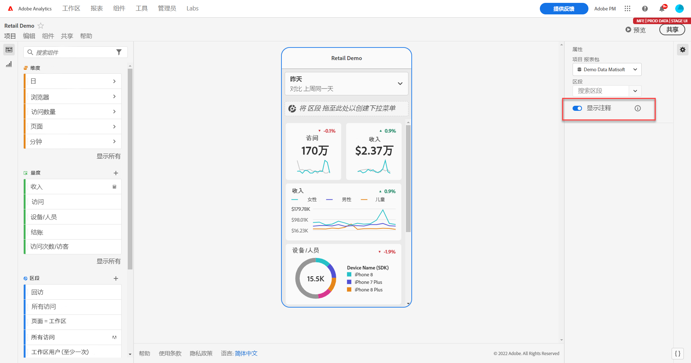
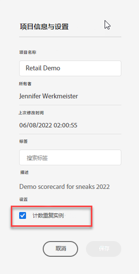

# 在移动记分卡中共享注释

您可以在移动记分卡中显示在工作区中创建的注释。这允许您直接在移动记分卡项目中共享有关您的组织和活动的上下文数据细微差别和见解，可在 Analytics 功能板移动应用程序中查看。

## 移动记分卡中的表面注释

要在移动记分卡中显示注释，请首先从工作区项目或组件菜单中创建注释。

有关创建注释的信息，请参阅[创建注释](create-annotations.md)。默认情况下，移动记分卡中的注释处于关闭状态，并且必须为要在移动记分卡中显示的每个记分卡启用。

1. 打开注释。要打开注释，请参阅[打开或关闭注释](overview.md#annotations-on-off)。

1. 创建注释并确保将其共享给您的所有项目。要在工作区中创建注释，请参阅[创建注释](create-annotations.md)。

1. 选择&#x200B;**[!UICONTROL 显示注释]**&#x200B;可在移动记分卡中显示注释。

   

1. 确认选择了显示注释，转到&#x200B;**[!UICONTROL 项目]** > **[!UICONTROL 项目信息和设置]**。

   

## 在移动记分卡中查看注释

启用注释后，注释图标在记分卡生成器中可见。注释仅出现在详细视图的图表和表格中。从记分卡的主图块视图中看不到注释。

当注释图标可见时，您无法在生成器画布中完全查看注释或与之交互。使用预览模式查看应用程序中出现的注释并与之交互。

在工作区中创建注释时选择注释颜色。灰色注释表示存在多个注释。 

## 查看图表注释

| 日期 | 外观 |
| --- | --- |
| **[!UICONTROL 单日]** |    |
| **[!UICONTROL 日期范围]** |  |
| **[!UICONTROL 重叠注释]** |   要在 Analytics 功能板应用程序中查看注释详细信息，请点击注释图标。  查看图表中的注释时，您可以左右滑动以浏览图表中存在的所有注释。查看表格中的注释时，左右滑动可导航与表格中该行项目关联的所有注释。     在没有基于时间的 *x 轴*&#x200B;的图表中，例如圆环图或水平条形图，可以通过点击位于右下角的图标来查看适用于图表的注释。    |
