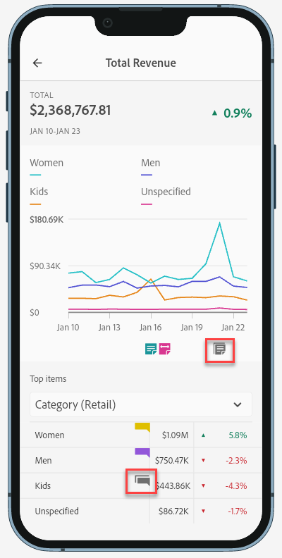

# 在移动记分卡中共享批注

您可以在移动记分卡中显示在工作区中创建的批注。这允许您直接在移动记分卡项目中共享有关您的组织和活动的上下文数据细微差别和见解，可在 Analytics 功能板移动应用程序中查看。

## 移动记分卡中的表面批注

要在移动记分卡中显示批注，请首先从工作区项目或组件菜单中创建批注。

有关创建批注的信息，请参阅[创建批注](create-annotations.md)。默认情况下，移动记分卡中的批注处于关闭状态，并且必须为要在移动记分卡中显示的每个记分卡启用。

1. 打开批注。要打开批注，请参阅[打开或关闭批注](overview.md#annotations-on-off)。

1. 创建批注并确保将其共享给您的所有项目。要在工作区中创建批注，请参阅[创建批注](create-annotations.md)。

1. 选择&#x200B;**[!UICONTROL 显示批注]**&#x200B;可在移动记分卡中显示批注。

   

1. 确认选择了显示批注，转到&#x200B;**[!UICONTROL 项目]** > **[!UICONTROL 项目信息和设置]**。

   

## 在移动记分卡中查看批注

启用批注后，批注图标在记分卡生成器中可见。批注仅出现在详细视图的图表和表格中。从记分卡的主图块视图中看不到批注。

当批注图标可见时，您无法在生成器画布中完全查看批注或与之交互。使用预览模式查看应用程序中出现的批注并与之交互。 

在工作区中创建批注时选择批注颜色。灰色批注表示存在多个批注。  

## 查看图表批注

| 日期 | 外观 |
| --- | --- |
| **[!UICONTROL 单日]** |    |
| **[!UICONTROL 日期范围]** |  |
| **[!UICONTROL 重叠批注]** |   要在 Analytics 功能板应用程序中查看批注详细信息，请点击批注图标。  查看图表中的批注时，您可以左右滑动以浏览图表中存在的所有批注。查看表格中的批注时，左右滑动可导航与表格中该行项目关联的所有批注。     在没有基于时间的 *x 轴*&#x200B;的图表中，例如圆环图或水平条形图，可以通过点击位于右下角的图标来查看适用于图表的批注。    |
