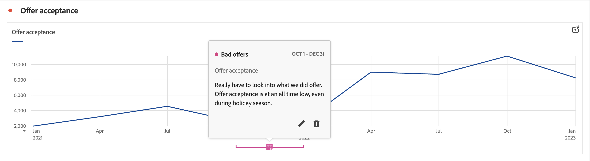

# 注释概述

通过注释，您可以将上下文数据的细微差别和洞察有效地传达给组织中的其他利益相关者。 通过注释，您可以将日程表活动与特定的维度和量度关联起来。 您可以对已知数据问题、公共假日、活动启动等注释日期或日期范围。然后，您可以以图形方式显示事件并查看促销活动或其他事件是否影响了您的网站流量、移动设备应用程序使用情况、收入或任何其他量度。

例如，您正与您的组织共享项目。 如果您在产品建议接受程度方面出现了重大下滑，则您可以创建一项&#x200B;**不良产品建议**&#x200B;注释，并将其范围扩展到您的整个数据视图。 当您的用户查看任何包括该日期的数据集时，他们会在其项目中与其数据一起看到该注释。

注释可应用于：

* 单个日期或日期范围。

* 您的整个数据集或特定量度、维度或区段。

* 创建注释的项目（默认）或所有项目。

* 创建注释的数据视图（默认）或所有数据视图。

请参阅[创建注释](/help/components/annotations/create-annotations.md)，了解可用于创建注释的各种选项。 然后，您可以在[注释构建器](create-annotations.md#annotation-builder)中构建、修改和保存注释。

您可以使用[注释管理器](manage-annotations.md)来管理注释。

## 启用或禁用注释

可以在多个级别上启用或禁用注释：

| 级别 | 如何…… |
|---|---|
| **可视化内容** | 启用或禁用 > **[!UICONTROL 设置]** > **[!UICONTROL 显示注释]**。  |
| **项目** | 从 Workspace 项目菜单中，选择&#x200B;**[!UICONTROL 项目]** > **[!UICONTROL 项目信息和设置]**，并启用或禁用&#x200B;**[!UICONTROL 显示注释]**。  |
| **用户** | 从&#x200B;**[!UICONTROL 组件]**&#x200B;选项卡中选择&#x200B;**[!UICONTROL 偏好设置]**，或从 Workspace 项目菜单中选择&#x200B;**[!UICONTROL 项目]** > **[!UICONTROL 用户偏好设置]**。  在&#x200B;**[!UICONTROL 偏好设置]**&#x200B;中，选择&#x200B;**[!UICONTROL 项目与分析]**。 从左侧选项卡栏中选择&#x200B;**[!UICONTROL 数据]**。 在底部，启用或禁用&#x200B;**[!UICONTROL 显示注释]**（位于&#x200B;**[!UICONTROL 自由格式表]**&#x200B;标题下方）。  |
