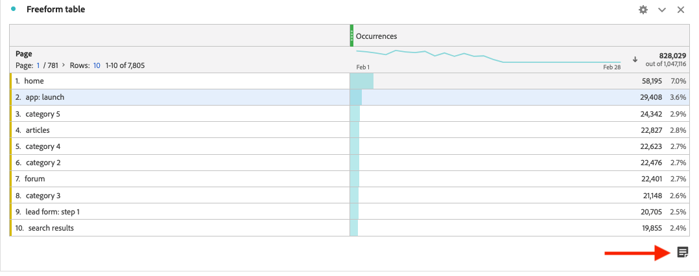

# 查看注释

注释的显示方式略有不同，具体取决于它们是跨越一天还是跨越一个日期范围。

## 在折线图或表中查看注释

| 日期 | 外观 |
| --- | --- |
| **一天** | 
将鼠标悬停在注释上时，可以查看其详细信息，通过选择钢笔图标进行编辑，或者删除注释：
  |
| **日期范围** | 图标会发生变化，当您将鼠标悬停在它上面时，会显示日期范围。

在折线图中选择注释时，将显示注释元数据，您可以进行编辑或删除：
在表中，会在日期范围内的每个日期上显示一个图标。
 |
| **重叠注释** | 在有多个注释与其关联的日期上，图标将为灰色。

将鼠标悬停在灰色图标上时，将显示所有重叠的注释：
 |

{style="table-layout:auto"}

## 在 .pdf 文件中查看注释

由于您无法将鼠标悬停在 .pdf 文件中的图标上，因此该文件（导出后）在面板底部提供了注释或说明。示例如下：

## 查看带有非趋势数据的注释

有时，注释与非趋势数据一起显示，但与特定维度相关联。在这种情况下，此类注释仅显示在右下角的摘要注释中。示例如下：

摘要图表出现在角落的所有可视化类型中，而不仅仅是非趋势自由表格和摘要数字中。它也出现在例如 [!UICONTROL Donut]、[!UICONTROL Flow]、[!UICONTROL Fallout]、[!UICONTROL Cohort] 等可视化中。

