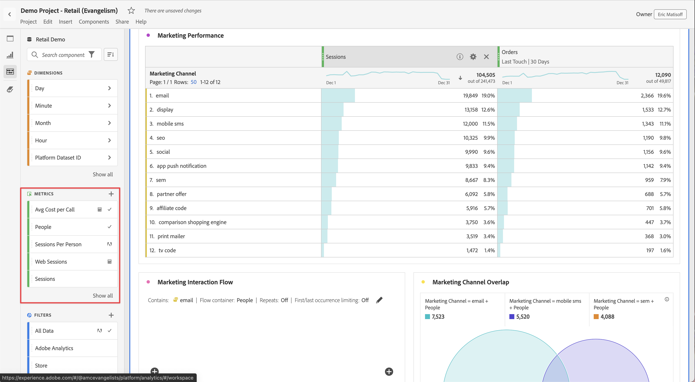

# 量度

量度允许您量化Analysis Workspace中的数据点。 它们最常用作可视化图表中的列，并与维度关联。

## 量度类型

Adobe提供了多种类型的量度以用于Analysis Workspace：

* **标准量度**：标准量度的示例包括人员、会话、事件。

* **计算量度** ：基于标准指标、静态数字或算法函数的用户定义指标。

* **计算量度模板**   ：Adobe定义的指标，其行为与计算指标类似。 您可以在工作区项目中按原样使用它们，也可以保存副本以自定义其逻辑。

您可以查看某个量度是否获得批准   还是不行。 如果您想了解有关某个量度的更多详细信息，请将指针悬停在该量度上，然后选择 .

量度在Analysis Workspace中的使用非常灵活。 将量度拖动到空的自由格式表中，可查看在项目的日期时段内该量度的趋势。 当存在维度时，您还可以拖动量度，以查看该量度与每个维度项目的比较。 将量度拖动到现有量度标题之上会替换该量度，将量度拖动到标题旁会让您并排查看这两个量度。

## 计算量度

计算量度允许您使用简单的运算符或统计函数轻松查看量度之间的相互关系。 可通过以下几种方式创建计算量度：

您可以选择 **[!UICONTROL 组件]** > **[!UICONTROL 计算量度]**. 这会将您转到 [计算指标生成器](/help/components/calc-metrics/calc-metr-overview.md)，您可以从现有量度构建自定义量度。

为了更便于快速创建计算量度，**[!UICONTROL 从所选内容创建量度]**&#x200B;已添加到自由格式表中的列右键单击菜单。在选定一个或多个标头列单元格时，会显示该选项。

[计算量度：无实施量度](https://experienceleague.adobe.com/docs/analytics-learn/tutorials/components/calculated-metrics/calculated-metrics-implementationless-metrics.html?lang=zh-Hans) (3:42)

## 比较不同归因模型的量度

如果您希望快速轻松地将一个归因模型与另一个归因模型进行比较，请右键单击某个量度并选择 **[!UICONTROL 比较归因模型]**：

此快捷键可让您快速、轻松地将一个归因模型与另一个归因模型进行比较，而无需将归因模型拖动到某个量度中且不必对其进行两次配置。
