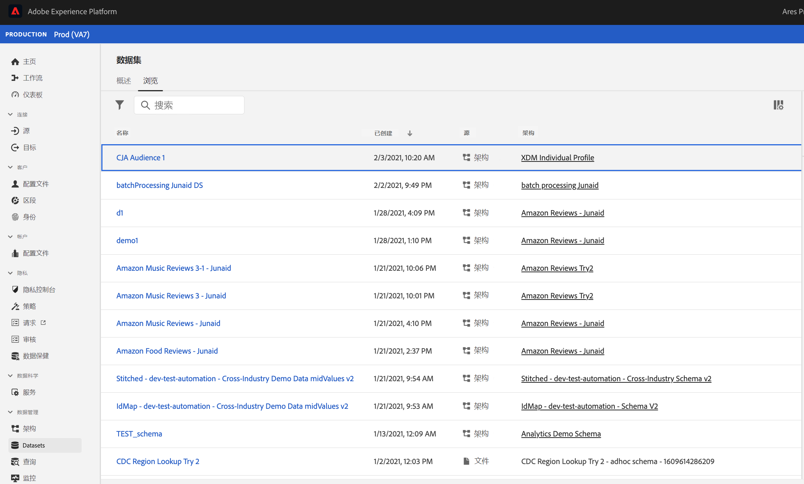

# 管理在Customer Journey Analytics中创建的受众

通过管理以前创建的受众，您可以

* **计划或取消计划** 自动受众刷新/更新。 计划的最长过期时间为1年。
* **续订受众刷新计划** 即将过期。 过期受众的处理方式与过期的计划报表类似 — 管理员会在计划过期前一个月收到一封电子邮件。
* **查看上次更新受众的时间**
* 深入了解 **制作受众所花费的时间** 从Customer Journey Analytics(CJA)，以及出于激活目的而在实时客户资料中显示受众所花费的时间。
* 查看CJA中的受众是否 **正在被实时客户用户档案积极使用** 或（理想情况下）任何使用CJA创建的受众的Experience Platform应用程序。

## 管理UI

屏幕快照

| UI设置 | 定义 |
| --- | --- |
| 隐藏/显示过滤器 | 允许您在左边栏中显示或隐藏以下过滤器： <ul><li>数据视图</li><li>所有者</li><li>刷新频率</li><li>标记</li></ul> |
| 标题和描述 |  |
| Data View |
| 受众规模 |  |
| 所有者 |  |
| 刷新频率 |  |
| 标记 |  |
| 上次刷新 |  |
| 上次修改时间 |  |

{style=&quot;table-layout:auto&quot;}

## 在Experience Platform中查看和使用CJA受众

您可以转到 [!UICONTROL 区段] > [!UICONTROL 创建区段] > [!UICONTROL 受众] 选项卡> [!UICONTROL CJA受众].

如果您选择将此受众导出到AEP数据湖，它将显示为符合XDM个人配置文件架构类的数据集：

