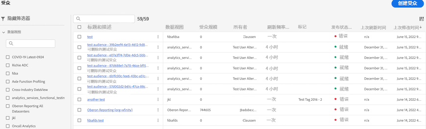

# 管理在 Customer Journey Analytics 中创建的受众

>[!NOTE]
>
>此功能当前正在进行[小范围测试](/help/release-notes/releases.md)。

通过管理以前创建的受众，您可以

* **计划或取消计划**&#x200B;自动受众刷新/更新。计划的最长有效期为 1 年。
* 即将到期时&#x200B;**续订受众刷新计划**。即将过期的受众的处理方式与即将过期的计划报表的处理方式类似 - 管理员会在计划过期前一个月收到一封电子邮件。
* 查看 **刷新间隔** 和 **上次更新受众的时间**
* 深入了解从 Customer Journey Analytics (CJA) **生成受众所需的时间**，以及为激活目的而让受众出现在实时客户档案中所需的时间。
* 查看 CJA 中的受众是&#x200B;**被实时客户档案主动使用**，还是（理想情况下）被任何使用 CJA 创建的受众的 Experience Platform 应用程序积极使用。

## 管理 UI

| UI 设置 | 定义 |
| --- | --- |
| 隐藏/显示过滤器 | 允许您在左边栏中显示或隐藏以下过滤器： <ul><li>[!UICONTROL 数据视图]</li><li>[!UICONTROL 所有者]</li><li>[!UICONTROL 刷新频率]</li><li>[!UICONTROL 标记]</li></ul> |
| [!UICONTROL 标题和描述] | 创建受众时为受众提供的标题和描述。 |
| [!UICONTROL 数据视图] | 创建此受众的数据视图。 |
| [!UICONTROL 受众大小] | 此受众的总人数。 |
| [!UICONTROL 所有者] | 受众的所有者 — 创建受众的人。 |
| [!UICONTROL 刷新频率] | 创建受众时配置的刷新间隔。 |
| [!UICONTROL 标记] | 应用于此受众的任何标记。 |
| [!UICONTROL 发布状态] | 可以显示 [!UICONTROL 就绪], [!UICONTROL 正在进行]或 [!UICONTROL 错误]. |
| [!UICONTROL  上次刷新时间] | 上次刷新受众的时间。 |
| [!UICONTROL 上次修改时间] | 上次编辑或修改受众的时间。 |

{style=&quot;table-layout:auto&quot;}
