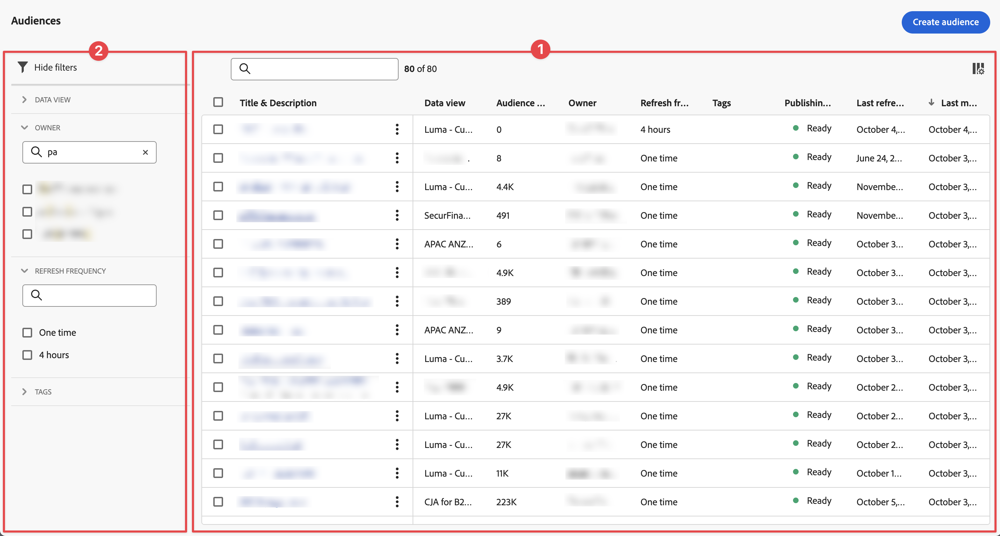

# 管理受众

可以使用 **[!UICONTROL 组件]** > **[!UICONTROL 受众]**&#x200B;在 Customer Journey Analytics 中管理受众。

## 了解受众管理任务

通过管理以前创建的受众，您可以：

* **计划或取消计划**&#x200B;自动受众刷新/更新。计划的最长有效期为 1 年。
* 即将到期时&#x200B;**续订受众刷新计划**。针对即将过期的受众的处理方式与针对即将过期的计划报告的处理方式类似 - 管理员会在计划过期前一个月收到一封电子邮件。
* 查看&#x200B;**刷新间隔**&#x200B;和&#x200B;**上次更新受众的时间**
* 通过 Customer Journey Analytics 深入了解&#x200B;**产生一个受众所花的时间**。以及在实时客户平台中显示受众以进行激活所需的时间。
* 查看&#x200B;**实时客户平台是否正在积极使用** Customer Journey Analytics 中的受众。或者（理想情况下）任何使用由 Customer Journey Analytics 创建的受众的 Experience Platform 应用程序。

如果您具有[受众视图](/help/technotes/access-control.md#user-level-access)访问权限，那么您可以查看受众。如果您有[受众创建](/help/technotes/access-control.md#user-level-access)访问权限，您可以编辑和删除受众。

## 在“受众”列表中查看受众

受众列表 ➊ 显示现有的受众。

查看受众列表：

1. 在 Customer Journey Analytics 中选择&#x200B;**[!UICONTROL 组件]** > **[!UICONTROL 受众]**。

1. （可选）使用  可以配置要显示的列。

1. （可选）使用可以搜索受众。

   以下各列提供有关每个受众的信息：

   | 列 | 描述 |
   | --- | --- |
   |  | 当选择一个或多个受众时，受众界面底部会出现一个蓝色操作栏。有关更多详细信息，请参阅[操作](#actions)。 |
   | **[!UICONTROL 标题和描述]** | 您在创建受众时输入的标题和描述。 |
   | **[!UICONTROL 数据视图]** | 创建此受众的数据视图。 |
   | **[!UICONTROL 受众规模]** | 该受众中的总人数。 |
   | **[!UICONTROL 所有者]** | 受众的所有者，即受众创建人。 |
   | **[!UICONTROL 刷新频率]** | 创建受众时配置的刷新间隔。 |
   | **[!UICONTROL 标记]** | 应用于此受众的所有标记。 |
   | **[!UICONTROL 发布状态]** | 可以显示  **[!UICONTROL 就绪]**， **[!UICONTROL 进行中]**，或者  **[!UICONTROL 错误]**。 |
   | **[!UICONTROL 上次刷新时间]** | 受众最后一次刷新的时间戳。 |
   | **[!UICONTROL 上次修改时间]** | 受众最后一次编辑或修改的时间戳。 |

## 编辑受众

您可以随时编辑受众的设置。编辑受众（一次性受众或定期受众）后，需要重新发布。

若要编辑受众：

1. 在 Customer Journey Analytics 中选择&#x200B;**[!UICONTROL 组件]** > **[!UICONTROL 受众]**。

   现在显示“受众”页面。

1. 选择您想要编辑的受众的标题。

   现在显示&#x200B;**[!UICONTROL 编辑受众]**&#x200B;对话框。

1. 您可以为此受众更新任何可用的字段。有关可更新字段的信息，请参阅[受众生成器](/help/components/audiences/publish.md#audience-builder)的文章[创建并发布受众](/help/components/audiences/publish.md)。

1. 选择&#x200B;**[!UICONTROL 重新发布]**。

## 操作

以下是计划项目管理器中的常见操作。您可以从上下文菜单中选择操作：

| 图标 | 操作 | 描述 |
|:---:|---|---|
|  | **[!UICONTROL 标记]** | 标记选定的受众。在&#x200B;**[!UICONTROL 更新标记：*受众名称&#x200B;*]**对话框中，从下拉菜单中选择标记或键入一个或多个新标记。 选择**[!UICONTROL 保存&#x200B;]**以保存。 |
|  | **[!UICONTROL 删除]** | 删除选定的受众。 |
|  | **[!UICONTROL 重命名]** | 重命名选定的受众。使用&#x200B;**[!UICONTROL 重命名：*受众名称&#x200B;*]**对话框来重命名受众，并选择**[!UICONTROL 保存&#x200B;]**以保存。 |

选择一个或多个计划项目时，可以从蓝色操作栏中执行以下操作。

| 图标 | 操作 | 描述 |
|:---:|---|---|
|  | **[!UICONTROL *x *已选择]** | 选择此选项可取消选择您已选定的受众。 |
|  | **[!UICONTROL 删除]** | 删除选定的受众。 |
|  | **[!UICONTROL 导出至 CSV]** | 将选定的受众导出到名为 `audiences.csv` 的文件中。 |

## 过滤受众列表

您可以使用过滤器面板 ➋ 来过滤[受众名单](#audiences-list)。要显示或隐藏过滤器面板，请使用。

过滤器面板由以下部分组成。

### 数据视图

| 数据视图 | 描述 |
|---|---|
| {width="300"} | 您可以使用&#x200B;**[!UICONTROL 数据视图]**&#x200B;部分来过滤数据视图。 <ul><li>您使用来搜索您想要用于过滤的数据视图。</li><li>您可以选择多个数据视图。</li></ul> |

### 所有者

| 所有者 | 描述 |
|---|---|
| {width="300"} | **[!UICONTROL 所有者]**&#x200B;部分允许您过滤所有者。 <ul><li>您使用来搜索您想要用于过滤的所有者。</li><li>您可以选择多个所有者。 </li></ul> |

## 刷新频率

| 刷新频率 | 描述 |
|---|---|
| {width="300"} | **[!UICONTROL 刷新频率]**&#x200B;部分允许您根据刷新频率进行过滤。 <ul><li>您可以使用来搜索您想要用于过滤的刷新频率。</li><li>只有为[受众列表](#audiences-list)中的受众 定义的刷新频率才会显示为可用选项。</li></ul> |

### 标记

| 标记 | 描述 |
|---|---|
| {width="300"} | 您可以使用&#x200B;**[!UICONTROL 标记]**&#x200B;部分按标记进行过滤。 <ul><li>您使用来搜索您想要用于过滤的标记。 |
