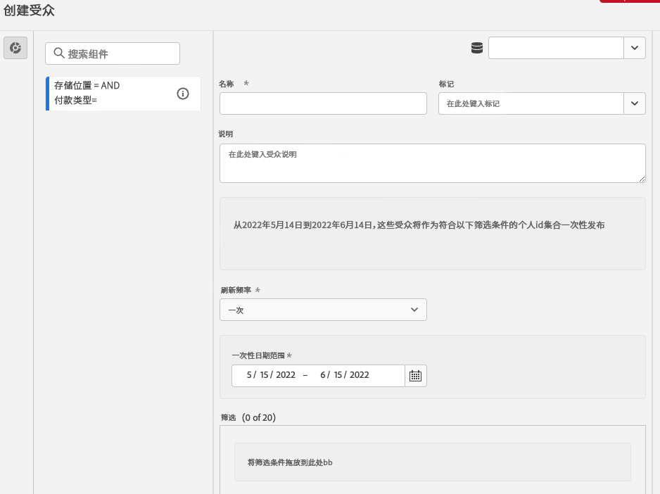
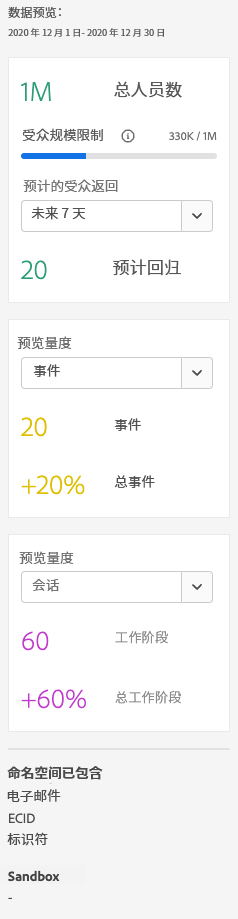
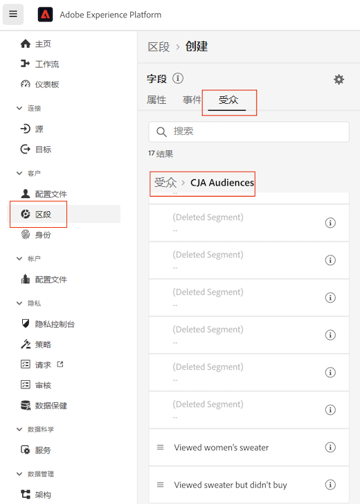

# 创建并发布受众

>[!NOTE]
>
>此功能当前正在进行[小范围测试](/help/release-notes/releases.md)。

本主题讨论如何创建和发布在Customer Journey Analytics(CJA)中标识的受众，并将其发布到 [实时客户资料](https://experienceleague.adobe.com/docs/experience-platform/profile/home.html?lang=zh-Hans) ，用于客户定位和个性化。

阅读此内容 [概述](/help/components/audiences/audiences-overview.md) 了解CJA受众的概念。

## 创建受众

1. 要创建受众，有三种方法可使用：

   | 创建方法 | 详细信息 |
   | --- | --- |
   | 从主 **[!UICONTROL 组件] > [!UICONTROL 受众]** 菜单 | “受众管理器”页面将打开。单击&#x200B;**[!UICONTROL 创建受众]**，然后将打开[!UICONTROL 受众生成器]。 |
   | 通过自由格式表 | 右键单击自由格式表中的项目并选择&#x200B;**[!UICONTROL 根据选定内容创建受众]**。使用此方法时会用您在表中选择的维度或维度项目预填充过滤器。 |
   | 在过滤器创建/编辑UI中 | 选中显示&#x200B;**[!UICONTROL 从此过滤器创建受众]**&#x200B;的框。使用此方法时会预填充过滤器。 |

   {style=&quot;table-layout:auto&quot;}

1. 构建受众。

   在发布受众之前，请配置这些设置。

   

   | 设置 | 描述 |
   | --- | --- |
   | [!UICONTROL 名称] | 受众的名称。 |
   | [!UICONTROL 标记] | 出于组织目的而要分配给受众的任何标记。您可以使用预先存在的标记或输入新标记。 |
   | [!UICONTROL 描述] | 添加合适的受众描述以将受众与其他人区分开来。 |
   | [!UICONTROL 刷新频率] | 您刷新受众所要采用的频率。<ul><li>您可以选择创建一次性受众（默认），该受众无需刷新。 例如，这可能有助于进行特定的一次性营销活动。</li><li>您可以选择其他刷新间隔。对于4小时的频度，受众数量限制为75或150个，具体取决于您的CJA权利。 对于其他间隔，没有最大受众数。</li></ul> |
   | 过期日期 | 当受众将停止刷新时。默认值为创建日期开始 1 年。过期受众的处理方式与过期的计划报表类似 — 管理员会在受众过期前一个月收到一封电子邮件。 |
   | 刷新回顾时段 | 指定创建此受众时要在数据窗口中返回多远。最高为90天。 |
   | [!UICONTROL 一次性日期范围] | 您希望在其中发布一次性受众的日期范围。 |
   | [!UICONTROL 过滤器] | 过滤器是受众的主要输入。您最多可以添加 20 个过滤器。这些过滤器可以与 `And` 或 `Or` 运算符相连。 |
   | [!UICONTROL 查看样本 ID] | 此受众中的ID示例。 使用搜索栏搜索示例ID。 |

   {style=&quot;table-layout:auto&quot;}

1. 解释数据预览。

   受众预览显示在右边栏中。它允许对您创建的受众进行汇总分析。

   

   | 预览设置 | 描述 |
   | --- | --- |
   | [!UICONTROL 数据预览窗口] | 受众的日期范围。 |
   | [!UICONTROL 总人数] | 此受众中总人数的概要数。 可能高达2亿人。 如果您的受众人数超过2亿，则必须先缩小受众规模，然后才能发布。 |
   | [!UICONTROL 受众规模限制] | 显示此受众的2亿限制距离此限制有多远。 |
   | [!UICONTROL 预计的受众返回] | 此设置对于重新定位此受众中返回您网站的客户非常有用。 （换言之，此数据集中会再次显示这些内容。） 
在此，您可以为预计可返回的客户数量选择时间范围（后7天、后2周、下月）。 |
   | [!UICONTROL 预计的返回] | 此数字可显示从下拉列表中选择的预计回访客户数量。 我们会查看此受众的历史流失率来预测此数字。 |
   | [!UICONTROL 预览量度] | 此设置允许您查看特定量度，以查看此受众对此量度的贡献是否过大，如“[!UICONTROL 收入]&#39;或&#39;[!UICONTROL 网站平均逗留时间]&#39;。 它会为您提供量度的聚合计数以及它所代表的总量百分比。 您可以选择数据视图中可用的任何量度。 |
   | [!UICONTROL 命名空间已包含] | 与受众中的人员关联的特定命名空间。 示例包括ECID、CRM ID、电子邮件地址等。 |
   | [!UICONTROL 沙盒] | 的 [Experience Platform沙盒](https://experienceleague.adobe.com/docs/experience-platform/sandbox/home.html?lang=zh-Hans) 受众所在的位置。 将此受众发布到平台后，您只能在此沙盒的范围内处理此受众。 |

   {style=&quot;table-layout:auto&quot;}

1. 仔细检查受众配置，然后单击 **[!UICONTROL 发布]**.

   如果一切正常，您将收到一条确认消息，指示受众已发布。 此受众只需一两分钟即可显示在Experience Platform中。 （即使对于拥有数百万会员的受众，也需要不到5分钟。）

1. 单击 **[!UICONTROL 在AEP中查看受众]** ，您将转到 [区段UI](https://experienceleague.adobe.com/docs/experience-platform/segmentation/ui/overview.html?lang=en) 在Adobe Experience Platform。 有关详细信息，请参阅下文。

## 在Experience Platform中使用CJA受众

现在，CJA会获取您已发布受众中的所有命名空间和ID组合，并将它们流式传输到实时客户资料(RTCP)中。 CJA将受众发送到Experience Platform，并将主标识设置为配置连接时选择的任何作为人员ID的内容。

然后，RTCP检查每个命名空间/ID组合，并查找它可能包含的配置文件。 配置文件基本上是一组链接的命名空间、ID和设备。 如果找到配置文件，则会将命名空间和ID作为区段成员资格属性添加到此配置文件中的其他ID中。 例如，现在可以跨所有设备和渠道定位“user@adobe.com”。 如果未找到用户档案，则会创建一个新用户档案。

通过转到&#x200B;**[!UICONTROL 区段]** > **[!UICONTROL 创建区段]** > **[!UICONTROL 受众]**&#x200B;选项卡 > **[!UICONTROL CJA 受众]**，您可以在 Platform 中查看 CJA 受众。

您可以将 CJA 受众拖到 AEP 区段的区段定义中。

## 如果用户不再是CJA中的受众成员，会发生什么情况？

在这种情况下，会从CJA将退出事件发送到Experience Platform。

## 后续步骤

* 要管理此受众，请转到 [管理UI](/help/components/audiences/manage.md).
