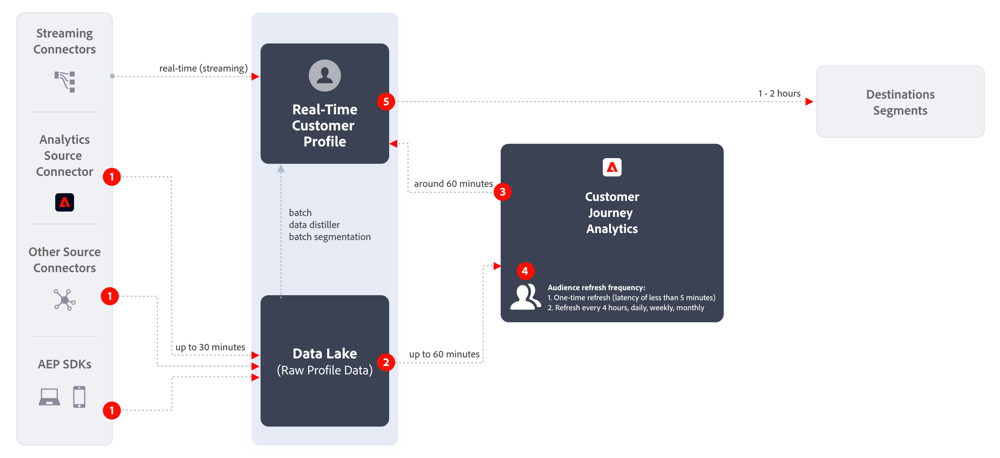

# 创建并发布受众

该主题讨论了如何在 Adobe Experience Platform 中创建并将在 Customer Journey Analytics (CJA) 中识别的受众发布到[实时客户个人资料](https://experienceleague.adobe.com/docs/experience-platform/profile/home.html?lang=zh-Hans)，以实现客户定位和个性化。

阅读本[概述](/help/components/audiences/audiences-overview.md)，了解 CJA 受众的概念。

## 创建受众 {#create}

1. 要创建受众，有三种方法可使用：

   | 创建方法 | 详细信息 |
   | --- | --- |
   | 从主要&#x200B;**[!UICONTROL 组件] > [!UICONTROL 受众]**&#x200B;菜单 | “受众管理器”页面将打开。单击&#x200B;**[!UICONTROL 创建受众]**，然后将打开[!UICONTROL 受众生成器]。 |
   | 通过自由格式表 | 右键单击自由格式表中的项目并选择&#x200B;**[!UICONTROL 根据选定内容创建受众]**。使用此方法时会用您在表中选择的维度或维度项目预填充过滤器。 |
   | 通过过滤器创建/编辑 UI | 选中显示&#x200B;**[!UICONTROL 从此过滤器创建受众]**&#x200B;的框。使用此方法时会预填充过滤器。 |

   {style="table-layout:auto"}

1. 生成受众。

   在发布受众之前，请配置这些设置。

   

   | 设置 | 描述 |
   | --- | --- |
   | [!UICONTROL 名称] | 受众的名称。 |
   | [!UICONTROL 标记] | 出于组织目的而要分配给受众的任何标记。您可以使用预先存在的标记或输入新标记。 |
   | [!UICONTROL 描述] | 添加合适的受众描述以将受众与其他人区分开来。 |
   | [!UICONTROL 刷新频率] | 您刷新受众所要采用的频率。<ul><li>您可以选择创建不需要刷新的一次性受众（默认）。例如，这可能有助于特定的一次性营销活动。</li><li>您可以选择其他刷新间隔。对于每 4 小时进行一次的频率，根据您的 CJA 权限，受众限制为 75 或 150 人。</li></ul> |
   | 过期日期 | 当受众将停止刷新时。默认值为创建日期开始 1 年。对过期受众的处理方法与过期的计划报告类似——管理员在受众过期前一个月会收到一封电子邮件。 |
   | 刷新回顾时段 | 指定创建此受众时要在数据窗口中返回多远。最多为 90 天。 |
   | [!UICONTROL 一次性日期范围] | 您希望在其中发布一次性受众的日期范围。 |
   | [!UICONTROL 过滤器] | 过滤器是受众的主要输入。您最多可以添加 20 个过滤器。这些过滤器可以与 `And` 或 `Or` 运算符相连。 |
   | [!UICONTROL 查看样本 ID] | 受众中的 ID 示例。使用搜索栏搜索 ID 示例。 |

   {style="table-layout:auto"}

1. 解释数据预览。

   受众预览显示在右边栏中。它允许您对所创建的受众进行总结分析。

   

   | 预览设置 | 描述 |
   | --- | --- |
   | [!UICONTROL 数据预览]窗口 | 受众的日期范围。 |
   | [!UICONTROL 总人数] | 该受众中总人数的汇总。可高达 20 亿人。 如果您的受众超过 20 亿人，则必须先缩小受众规模，然后才能发布。 |
   | [!UICONTROL 受众规模限制] | 显示该受规模众与 20 亿人上限的差距。 |
   | [!UICONTROL 预计会返回的受众] | 此设置对于重新定位该受众中会返回网站的客户非常有用。（换句话说，就是在这个数据集中可以再次看到的客户。） 
在这里，您可以为可能返回的估计客户数选择时间范围（未来 7 天、未来 2 周、下个月）。 |
   | [!UICONTROL 预计会返回] | 该数字为您提供了在您从下拉列表中选择的时间范围内返回的客户的估计数量。我们通过观察该受众的历史流失率来预测这一数字。 |
   | [!UICONTROL 预览量度] | 通过此设置，您可以查看特定量度，以查看该受众为此量度做出的贡献是否不成比例，例如[!UICONTROL 收入]或[!UICONTROL 平均网站逗留时间。]它提供了度量的聚合计数，以及它所代表的总数的百分比。您可以选择数据视图中可用的任何量度。 |
   | [!UICONTROL 命名空间包含] | 与受众中的人关联的特定命名空间。例如 ECID、CRM ID、电子邮件地址等。 |
   | [!UICONTROL 沙盒] | 受众所在的 [Experience Platform sandbox](https://experienceleague.adobe.com/docs/experience-platform/sandbox/home.html?lang=zh-Hans) 沙盒。当您将此受众发布到平台时，您只能在这个沙盒的范围内使用它。 |

   {style="table-layout:auto"}

1. 双击受众配置，然后单击&#x200B;**[!UICONTROL 发布]**。

   如果一切顺利，您会收到一条确认消息，确认已发布受众。这些观众只需一两分钟就能出现在 Experience Platform 中。（即使是拥有数百万成员的受众，也不会超过 5 分钟的时间。）

1. 在同一条消息中单击&#x200B;**[!UICONTROL 在 AEP 中查看受众]**，则可进入 Adobe Experience Platform 中的 [Segment UI](https://experienceleague.adobe.com/docs/experience-platform/segmentation/ui/overview.html?lang=zh-Hans)。有关详细信息，请参阅下文。

## 创建受众后会发生什么? {#after-audience-created}

在您创建受众后，Adobe 为每个新的 CJA 受众创建一个 Experience Platform 流式区段。只有您的组织设置了流式分段，才会创建 AEP 流式区段。

* AEP 区段与 CJA 受众共用相同的名称/描述，但将在名称后附加 CJA 受众 ID 以确保其唯一。
* 如果 CJA 受众名称/描述发生变化，则 AEP 区段名称/描述也将反映该变化。
* 如果用户删除 CJA 受众，则并不删除 AEP 区段。原因是以后可能会取消删除 CJA 受众。

## 延迟注意事项 {#latency}

在受众发布之前、期间和之后的几个时间点，可能会发生延迟。 以下是对可能出现的延迟情况的概述。

| # | 延迟点 | 延迟持续时间 |
| --- | --- | --- |
| 未显示 | Adobe Analytics到Analytics源连接器(A4T) | 最多 30 分钟 |
| 1 | 数据摄取到数据湖（从Analytics源连接器或其他源） | 最多 90 分钟 |
| 2 | 从Experience Platform数据湖向CJA中摄取数据 | 最多 90 分钟 |
| 3 | 受众发布到实时客户配置文件，包括自动创建流式区段，并可让区段准备好接收数据。 | 约 60 分钟 |
| 4 | 受众的刷新频率 | <ul><li>一次性刷新（延迟小于 5 分钟）</li><li>每 4 小时、每天、每周、每月刷新一次（延迟与刷新率密切相关） |
| 5 | 在 AEP 中创建目标：激活新的区段 | 1-2 小时 |

{style="table-layout:auto"}

## 在 Experience Platform 中使用 CJA 受众 {#audiences-aep}

CJA 可以从您发布的受众中获取所有的命名空间和 ID 组合，并将其以流式传输到实时客户配置文件 (RTCP) 中。CJA 会将受众发送到 Experience Platform，并根据配置连接时选择的[!UICONTROL 人员 ID] 设置主要标识。

然后，RTCP 会检查每个命名空间/ID 组合，并查找可能包含它的个人资料。个人资料其实就是由所链接的命名空间、ID 和设备组成的集群。如果它找到一份相关的个人资料，则会将命名空间和 ID 作为区段会员资格属性添加到此个人资料中的其他 ID。例如，现在”user@adobe.com“可以成为所有设备和渠道的目标。如果未找到相关的个人资料，则会创建一份新的个人资料。

通过转到&#x200B;**[!UICONTROL 区段]** > **[!UICONTROL 创建区段]** > **[!UICONTROL 受众]**&#x200B;选项卡 > **[!UICONTROL CJA 受众]**，您可以在 Platform 中查看 CJA 受众。

您可以将 CJA 受众拖到 AEP 区段的区段定义中。

## 常见问题解答 {#faq}

关于受众发布的常见问题。

+++**如果用户不再是 CJA 中的受众，会发生什么？**

在这种情况下，系统会从 CJA 将退出事件发送给 Experience Platform。

+++

+++**如果删除 CJA 中的受众会发生什么？**

删除 CJA 受众后，该受众将不再出现在 Experience Platform UI 中。 然而，在 Platform 中并没有删除和该受众相关联的个人资料。

+++

+++**如果 RTCDP 中不存在相应的配置文件，是否会创建新的配置文件？**

是的，会的。

+++

+++**CJA会将受众数据作为管道事件还是作为也会发送到数据湖的平面文件发送？**

CJA 通过管道将数据流式传输到 RTCP 中，这些数据也被收集到数据湖中的系统数据集中。

+++

+++**CJA 发送了哪些身份？**

在 [连接设置](https://experienceleague.adobe.com/docs/analytics-platform/using/cja-connections/create-connection.html?lang=zh-Hans#create-connection). 具体来说，用户选择要用作其“个人 ID”的字段时的步骤。

+++

+++**选择什么 ID 作为主要标识？**

请参阅上面的内容。每个 CJA“人”只发送一个身份。

+++

+++**RTCP 是否也处理 CJA 消息？CJA 是否可以通过受众共享将身份添加到个人资料身份图中？**

否。我们只为每个“人”发送一个标识，因此 RTCP 不会使用任何图边。

+++

+++**每天、每周和每月的刷新发生在一天中的哪个时间？ 每周刷新在一周的哪一天发生？**

刷新的时间取决于原始受众的发布时间，以及该时间（以及每周或月中的某天）的锚点。

+++

+++**用户是否可以配置每日、每周和每月的刷新时间？**

不能，用户无法配置它们。

+++

## 后续步骤

* 若要管理该受众，请转到[管理 UI](/help/components/audiences/manage.md)。
