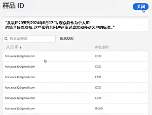

# 创建和发布受众

>[!NOTE]
>
>此功能当前位于 [有限测试](/help/release-notes/releases.md).

本主题讨论如何将在Customer Journey Analytics(CJA)中发现的受众发布到 [实时客户资料](https://experienceleague.adobe.com/docs/experience-platform/profile/home.html?lang=cn) ，用于客户定位和个性化。

阅读此内容 [概述](/help/components/audiences/audiences-overview.md) 了解CJA受众的概念。

## 创建受众

1. 要创建受众，您可以通过三种方式开始操作：

   | 创建方法 | 详细信息 |
   | --- | --- |
   | 从主 **[!UICONTROL 组件] > [!UICONTROL 受众]** 菜单 | 此时将打开“受众管理器”页面。 单击 **[!UICONTROL 创建受众]** 和 [!UICONTROL 受众生成器] 打开。 |
   | 从自由格式表中 | 右键单击自由格式表中的项目，然后选择 **[!UICONTROL 从选定范围中创建受众]**. 使用此方法可使用您在表格中选择的维度或维度项目预填充过滤器。 |
   | 在过滤器创建/编辑UI中 | 选中显示 **[!UICONTROL 从此过滤器创建受众]**. 使用此方法可预填充过滤器。 |

   {style=&quot;table-layout:auto&quot;}

1. 构建受众。

   在发布受众之前，请配置这些设置。

   

   | 设置 | 描述 |
   | --- | --- |
   | [!UICONTROL 名称] | 受众的名称。 |
   | [!UICONTROL 标记] | 您希望为组织目的分配给受众的任何标记。 您可以使用预先存在的标记或输入新标记。 |
   | [!UICONTROL 描述] | 添加对受众的良好描述，以便将其与其他受众区分开来。 |
   | [!UICONTROL 刷新频率] | 要刷新受众的频率。<ul><li>您可以选择创建一次性受众（默认），该受众无需刷新，例如，这将有助于创建特定的一次性营销活动。</li><li>您可以选择其他刷新间隔。 对于4小时频率，受众数量限制为150个，因为此刷新率非常需要处理。 对于其他间隔，没有最大受众数。</li></ul> |
   | 过期日期 | 受众将停止刷新的时间。 默认为自创建日期起1年。 过期受众的处理方式与过期的计划报表类似 — 管理员会在受众过期前一个月收到一封电子邮件。 |
   | 刷新回顾时段 | 指定创建此受众时要在数据窗口中返回的距离。 最大值。 90天。 |
   | [!UICONTROL 一次性日期范围] | 希望发布一次性受众的日期范围。 |
   | [!UICONTROL 过滤器] | 过滤器是受众的主要输入。 您最多可以添加20个过滤器。 这些过滤器可以使用 `And` 或 `Or` 运算符。 |
   | [!UICONTROL 查看样本 ID] | 此受众中的ID示例。 使用搜索栏搜索示例ID。
! |

   {style=&quot;table-layout:auto&quot;}

1. 解释数据预览。

   受众预览将显示在右边栏中。 它允许对您创建的受众进行高级分析。

   

   | 预览设置 | 描述 |
   | --- | --- |
   | [!UICONTROL 数据预览] 窗口 | 受众的日期范围。 |
   | [!UICONTROL 总人数] | 此受众中总人数的概要数。 它可以高达1亿人。 如果您的受众人数超过1亿，则必须先缩小受众规模，然后才能发布。 |
   | [!UICONTROL 受众规模限制] | 显示此受众的1亿限制还有多远。 |
   | [!UICONTROL 预计的受众返回] | 此设置对于重新定位此受众中返回您网站的客户非常有用。 （换言之，此数据集中会再次显示这些内容。） 
在此，您可以为预计可返回的客户数量选择时间范围（后7天、后2周、下月）。 |
   | [!UICONTROL 预计的返回] | 此数字可显示从下拉列表中选择的预计回访客户数量。 我们会查看此受众的历史流失率来预测此数字。 |
   | [!UICONTROL 预览量度] | 此设置允许您查看特定量度，以查看此受众对此量度的贡献是否过大，如“[!UICONTROL 收入]&#39;或&#39;[!UICONTROL 网站平均逗留时间]&#39;。 它会为您提供量度的聚合计数以及它所代表的总量百分比。 您可以选择数据视图中可用的任何量度。 |
   | 命名空间已包含 | 与受众中的人员关联的特定命名空间。 示例包括ECID、CRM ID、电子邮件地址等。 |
   | 沙盒 | 此受众所在的Experience Platform沙盒。 将此受众发布到平台后，您只能在此沙盒的范围内处理此受众。 |

   {style=&quot;table-layout:auto&quot;}

1. 如果一切正常，请单击 **[!UICONTROL 发布]**.

## 后续步骤

* 要管理此受众，请转到 [管理UI](/help/components/audiences/manage.md).
* 要在Adobe Experience Platform中与此受众合作，请转到此处。
