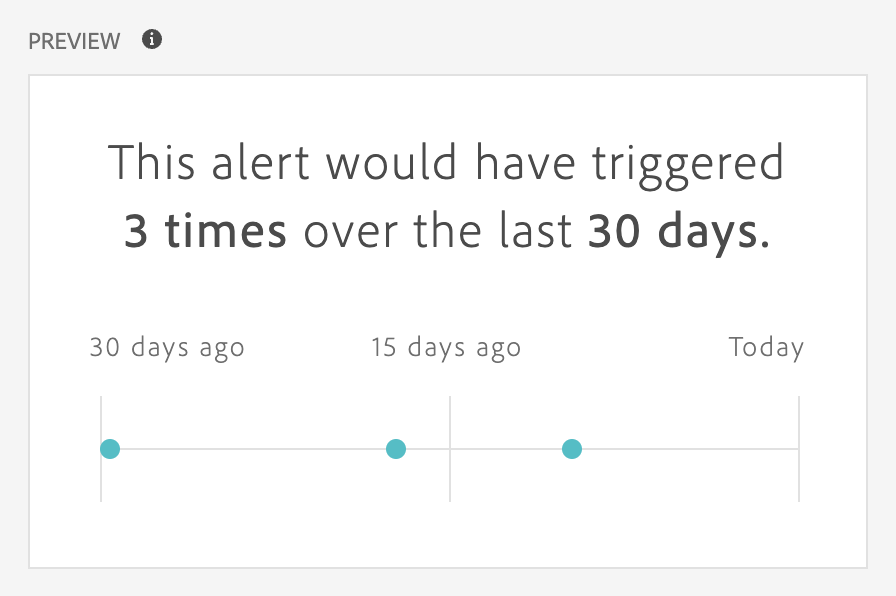

# 创建警报 {#create-alerts}

>[!NOTE]
>
>使用具有异常检测（也称为&#x200B;_智能警报_）的警报仅适用于具有Select、Prime或UltimateCustomer Journey Analytics包的组织。

Customer Journey Analytics中的警报允许您根据更改的百分比或特定数据点接收通知。 根据您的Customer Journey Analytics包，您还可以使用要基于异常阈值触发的警报。

有关警报的更多详细概述信息，请参阅[警报概述](/help/components/c-intelligent-alerts/intelligent-alerts.md)。

要创建警报，请执行以下操作：

1. 在Customer Journey Analytics<!-- add this back in after the other methods are available like in AA and make a bulleted list: "You can access the alert builder in any of the following ways:" -->中，选择&#x200B;**[!UICONTROL 组件]** > **[!UICONTROL 警报]**。 在[警报管理器](alert-manager.md)中，选择 **[!UICONTROL Add]**&#x200B;以创建新警报，或选择列出的任何警报以修改现有警报。

   此时将显示[警报生成器](#alert-builder)界面。

1. 选择&#x200B;**[!UICONTROL 保存]**&#x200B;以保存警报。 选择&#x200B;**[!UICONTROL 另存为]**&#x200B;以保存警报的副本。

## 警报生成器

警报生成器界面与Customer Journey Analytics中具有生成过滤器或计算量度的界面相似：

在警报生成器中为警报指定以下详细信息：

| 元素 | 描述 |
|---------|----------|
| **[!UICONTROL 标题]** | 指定警报的名称。警报名称可能包含报表名称或指标阈值。 |
| **[!UICONTROL 描述（可选）]** | 指定警报的说明。 |
| **[!UICONTROL 时间粒度]** | 选择您希望检查指标的频率：每日、每周或每月。
<b>注意：</b>对于使用自定义日历的数据视图，警报生成器不支持每月粒度。<!--true?-->
 |
| **[!UICONTROL 收件人]** | 指定警报的发送地址。可以将警报发送给 Analytics 用户、Analytics 组、原始电子邮件地址或电话号码。
<b>重要信息：</b>电话号码前面必须加上“+”和[国家/地区代码](https://countrycode.org/)。

触发警报后用户收到的电子邮件类似于以下内容：

 |
| **[!UICONTROL 过期日期]** | 设置希望警报到期的日期和时间。 |
| **[!UICONTROL 延迟]** | 完成数据并可以在Customer Journey Analytics中报告之前所需的时间因组织而异，通常比数据事件时间晚3到9个小时。 要获得准确的警报，给定事件范围的事件数据必须完整，这意味着Adobe不再接收指定事件范围的任何事件数据。
考虑到摄取时间的这种延迟，警报的默认延迟为9小时，之后才发送。

您可以将默认延迟9小时调整为0到24小时之间的任何时间。 但是，将延迟降低到9小时以下可能意味着您报告的数据不完整，这会导致警报信息不准确。

在减少延迟时间时，请考虑以下事项：
<ul><li>**了解数据可用性与数据完整性**：虽然某些数据可能会更快地可用于报告，但所有批次数据仅在3到9小时后摄取到Platform数据集中。 要获得准确的警报，必须完成数据摄取，并在数据集中提供所有批次数据。</li><li>**确定完成数据并在数据集中提供数据所需的时间**：数据摄取时间因组织而异。 请确保您为警报投放选择的延迟时间与批次数据在Platform数据集<!--add link? -->中可用所需的时间相同或更短。</li>
**提示：**&#x200B;要了解完成所有批处理数据并将其摄取到Platform数据集所需的时间，最准确的方法是咨询组织中的数据工程师。

或者，通过在Analysis Workspace中创建以下自由格式表，大致了解组织中的批量投放在Platform数据集中可用需要多长时间：
<ol><li>在Analysis Workspace的自由格式表中，添加&#x200B;[!UICONTROL **Events**]&#x200B;指标和&#x200B;[!UICONTROL **Day**]&#x200B;维度。</li><li>使用&#x200B;[!UICONTROL **小时**]&#x200B;维度划分&#x200B;[!UICONTROL **天**]&#x200B;维度。
没有数据的小时数将显示为0。
</li></ol><li>**考虑计算中的错误**：如果减少默认延迟时间，我们建议配置延迟的时间至少比您的组织完成数据引入所需的时间长一小时。 例如，如果在数据摄取完成之前延迟3小时，则应将延迟设置为4小时。</li></ul>
有关详细信息，请参阅[警报功能比较：Customer Journey Analytics和Adobe Analytics](/help/components/c-intelligent-alerts/alerts-feature-comparison.md)一文中的[Customer Journey Analytics摄取时间不同](/help/components/c-intelligent-alerts/alerts-feature-comparison.md#data-ingestion-times-vary-in-customer-journey-analytics)。 |
| **[!UICONTROL 发送警报时间]** | [!UICONTROL **以下任何一个量度触发器**]：将量度（包括计算量度）拖放到此处以创建警报的触发器。
如果警报中并非所有量度、维度或区段都与当前所选的数据视图兼容，则会显示&#x200B;**“组件不兼容”**&#x200B;消息。

确定触发警报前指标必须超过的阈值。您可以将此值设置为一个阈值，然后设置为下列条件之一：
<ul><li>异常已存在</li><li>异常高于预期</li><li>异常低于预期</li><li>大于或等于</li><li>小于或等于</li><li>更改百分比</li><li>您可以将阈值设置为 90%、95%、99%、99.75% 或 99.9%。</li></ul>
[!UICONTROL **使用所有这些筛选器**]：拖放区段或维度以添加筛选器。 例如，添加“仅限移动设备”区段意味着规则仅针对移动设备触发。 您可以使用AND语句添加其他过滤器。 您可以通过单击齿轮图标添加 AND 或 OR 规则。

查看[警报 — 用例](/help/components/c-intelligent-alerts/alerts-use-cases.md)查看示例用例。
 |
| **[!UICONTROL 预览]** | 交互式警报预览可根据过去的经验显示警报大致的触发频率。
例如，如果将时间粒度设置为每天，则预览会显示某个指标在过去 30 或 31 天中触发了 x 次警报。

如果您发现触发的警报数量过多，则可以在[管理警报](/help/components/c-intelligent-alerts/alert-manager.md)中调整阈值。

{width="50%"}
 |

