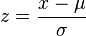

# 参考——高级功能

Access these functions by checking **[!UICONTROL Show Advanced]** in the **[!UICONTROL Functions]** drop-down list.

## table 函数与 row 函数

表函数是表中每行的输出相同的函数。 行函数是表中每行的输出不同的函数。

## Include-Zeros参数意味着什么？

它告诉计算中是否包含零。 有时零表示“无”，但有时它很重要。

例如，如果您有一个“收入”量度，然后向报表中添加一个“页面视图”量度，则您的收入会突然出现更多行，这些行均为零。 您可能不希望这影响任何MEAN、MIN、QUARTILE等。 您在收入列中的计算。 在这种情况下，您应检查include-zeros参数。

另一方面，如果您有两个您感兴趣的指标，那么说一个的平均值或最小值可能不公平，因为它的一些行是零，所以您不会检查参数以包含零。

## 和

返回其参数的值。 使用“不”(NOT)确保值不等于一个特定值。

>[!NOTE] 0（零）表示 False，而任何其他值均表示 True。

```
AND(logical_test1,[logical_test2],...)
```

| 参数 | 描述 |
|---|---|
| *logical_test1* | 必需。任意值或者可以计算为 TRUE 或 FALSE 的表达式。 |
| *logical_test2* | 可选。要求计算为TRUE或FALSE的附加条件 |

## 非重复近似计数（维度）

针对所选维度，返回其维度项目的非重复近似计数。该函数使用HyperLogLog(HLL)方法逼近不同计数。  它配置为保证该值在实际值的5%以内，即95%的时间。

```
Approximate Count Distinct (dimension)
```

| 参数 |  |
|---|---|
| *维度* | 要求其大致不同项目计数的尺寸。 |

## 示例用例

Approximate Count Distinct (customer ID eVar) 是此函数的常见用例。

新“近似客户”计算量度的定义：


以下表示在报告中使用“近似客户”量度的方式：


## 超出的唯一值

与Count()和RowCount()一样，Approximate Count Distinct()受“超出 [唯一值”限制](https://marketing.adobe.com/resources/help/zh_CN/reference/metrics_uniques_high_numbers.html)。 如果某个维的“超出的唯一值”限制在某个特定月份内达到，则该值计为1个维项。

## 比较计数函数

Approximate Count Distinct() 是对 Count() 和 RowCount() 函数所做出的改进，因为创建的量度可用于任何维度报表，以呈现单独维度项目的近似计数。例如，在“移动设备类型”报告中使用的客户ID计数。

此函数的精确度会略低于Count()和RowCount()，因为它使用HLL方法，而Count()和RowCount()是精确计数。

## 反余弦 (Row)

返回一个数的反余弦值。反余弦是余弦值等于该数字的角。返回的角以弧度表示，位于区间 0（零）到 π 之间。若要将结果从弧度转换为角度，则将结果乘以 180/π( )。

```
ACOS(metric)
```

| 参数 |  |
|---|---|
| *量度* | 您希望其介于 -1 到 1 之间的角余弦值。 |

## 反正弦 (Row)

返回一个数的反正弦值。反正弦是正弦值等于该数字的角。返回的角以弧度表示，位于区间 -π/2 到 π/2。若要以角度表示反正弦值，则将结果乘以 180/π( )。

```
ASIN(metric) 
```

| 参数 |  |
|---|---|
| *量度* | 您希望其介于 -1 到 1 之间的角余弦值。 |

## 反正切 (Row)

返回一个数的反正切值。反正切是正切值等于该数字的角。返回的角以弧度表示，位于区间 -π/2 到 π/2。若要以角度表示反正切值，则将结果乘以 180/π( )。

```
ATAN(metric)
```

| 参数 |  |
|---|---|
| *量度* | 您希望其介于 -1 到 1 之间的角余弦值。 |

## 指数回归：预测的 Y (Row)

计算预测的 y 值 (metric_Y)，假定已知的 x 值 (metric_X) 使用“最小二乘法”计算基于以下方程式的最佳拟合直线。

```
ESTIMATE.EXP(metric_X, metric_Y)
```

| 参数 | 描述 |
|---|---|
| *metric_X* | 要指定为相关数据的量度。 |
| *metric_Y* | 要指定为独立数据的量度。 |

## Cdf-T

返回在 n 自由度的学生 t 分布下，其 Z 分数小于 x 的值的百分比。

```
cdf_t( -∞, n ) = 0 
cdf_t(  ∞, n ) = 1 
cdf_t( 3, 5 ) ? 0.99865 
cdf_t( -2, 7 ) ? 0.0227501 
cdf_t( x, ∞ ) ? cdf_z( x )
```

## Cdf-Z

返回在正态分布下，其 Z 分数小于 x 的值的百分比。

```
cdf_z( -∞ ) = 0 
cdf_z( ∞ ) = 1 
cdf_z( 0 ) = 0.5 
cdf_z( 2 ) ? 0.97725 
cdf_z( -3 ) ? 0.0013499 
 
```

## 向上取整 (Row)

返回不小于给定值的最小整数。例如，如果您要避免在报告收入时出现货币小数位数，而某产品的收入为 $569.34，则使用公式 CEILING(*Revenue*) 可将收入向上舍入为最接近的美元数 $570。

```
CEILING(metric)
```

| 参数 | 描述 |
|---|---|
| *量度* | 您希望将其四舍五入的量度。 |

## 余弦 (Row)

返回给定角的余弦值。如果该角以度数表示，则将该角度乘以 π( )/180。

```
COS(metric)
```

| 参数 | 描述 |
|---|---|
| *量度* | 您希望求得其余弦的角弧度。 |

## 立方根

返回一个数的正立方根。一个数字的立方根是该数字 1/3 次幂的值。

```
CBRT(metric)
```

| 参数 | 描述 |
|---|---|
| *量度* | 您希望求得其立方根的量度。 |

## 累积

返回最后N行的x和（按维排序，使用基于字符串的字段的哈希值）。

如果N &lt;= 0，则它使用所有以前的行。 由于它按维排序，因此它仅对具有自然顺序（如日期或路径长度）的维有用。

```
| Date | Rev  | cumul(0,Rev) | cumul(2,Rev) | 
|------+------+--------------+--------------| 
| May  | $500 | $500         | $500         | 
| June | $200 | $700         | $700         | 
| July | $400 | $1100        | $600         | 
 
```

## 累积平均数

返回最后N行的平均值。

如果N &lt;= 0，则它使用所有以前的行。 由于它按维排序，因此它仅对具有自然顺序（如日期或路径长度）的维有用。

>[!NOTE] 使用收入/访客之类的比率量度时，它可能不会按预期工作：它会计算比率的平均值，而不是总计最后 N 行的收入并总计最后 N 行的访客数，然后将二者相除。它使用的是

```
cumul(revenue)/cumul(visitor)
```

## 等于

返回与某一数字或字符串值完全匹配的项目。

## 指数回归_ 相关系数 (Table)

返回相关系数 *r*，它介于回归方程式的两个量度列（*metric_A* 和 *metric_B*）之间。

```
CORREL.EXP(metric_X, metric_Y)
```

| 参数 | 描述 |
|---|---|
| *metric_X* | A metric that you would like to correlate with *metric_Y*. |
| *metric_Y* | A metric that you would like to correlate with *metric_X*. |

## 指数回归：截距 (Table)

返回截距 *b*，它介于以下方程式的两个量度列（*metric_X* 和 *metric_Y*）之间。

```
INTERCEPT.EXP(metric_X, metric_Y)
```

| 参数 | 描述 |
|---|---|
| *metric_X* | 要指定为相关数据的量度。 |
| *metric_Y* | 要指定为独立数据的量度。 |

## 指数回归：斜率 (Table)

返回斜率 *a*，它介于以下方程式的两个量度列（*metric_X* 和 *metric_Y*）之间。

```
SLOPE.EXP(metric_X, metric_Y)
```

| 参数 | 描述 |
|---|---|
| *metric_X* | 要指定为相关数据的量度。 |
| *metric_Y* | 要指定为独立数据的量度。 |

## 向下取整 (Row)

返回不大于给定值的最大整数。例如，如果您要避免在报告收入时出现货币小数位数，而某产品的收入为 $569.34，则使用公式 FLOOR(*Revenue*) 可将收入向下舍入为最接近的美元数 $569。

```
FLOOR(metric)
```

| 参数 | 描述 |
|---|---|
| *量度* | 要舍入的度量。 |

## 大于

返回数字计数大于输入值的项目。

## 大于或等于

返回数字计数大于或等于输入值的项目。

## 双曲余弦 (Row)

返回一个数的双曲余弦值。

```
COSH(metric)
```

| 参数 | 描述 |
|---|---|
| *量度* | 您希望求得其双曲余弦的角弧度。 |

## 双曲正弦 (Row)

返回一个数的双曲正弦值。

```
SINH(metric)
```

| 参数 | 描述 |
|---|---|
| *量度* | 您希望求得其双曲正弦的角弧度。 |

## 双曲正切 (Row)

返回一个数的双曲正切值。

```
TANH(metric)
```

| 参数 | 描述 |
|---|---|
| *量度* | 要查找其双曲切线的角度（以弧度为单位）。 |

## IF (Row)

如果您指定的条件的计算结果为TRUE，则IF函数返回一个值；如果该条件的计算结果为FALSE，则返回另一个值。

```
IF(logical_test, [value_if_true], [value_if_false])
```

| 参数 | 描述 |
|---|---|
| *logical_test* | 必需。任意值或者可以计算为 TRUE 或 FALSE 的表达式。 |
| *[value_if_true]* | The value that you want to be returned if the *logical_test* argument evaluates to TRUE. (This argument defaults to 0 if not included.) |
| *[value_if_false]* | The value that you want to be returned if the *logical_test* argument evaluates to FALSE. (This argument defaults to 0 if not included.) |

## 小于

返回数字计数小于输入值的项目。

## 小于或等于

返回数字计数小于或等于输入值的项目。

## 线性回归_ 相关系数

Y = a X + b。返回相关系数

## 线性回归_ 截距

Y = a X + b。返回 b。

## 线性回归_ 预测的 Y

Y = a X + b。返回 Y。

## 线性回归_ 斜率

Y = a X + b。返回 a。

## 以 10 为底的对数 (Row)

返回一个数以 10 为底的对数值。

```
LOG10(metric)
```

| 参数 | 描述 |
|---|---|
| *量度* | 您希望求得其以 10 为底的对数的正实数。 |

## 对数回归：相关系数 (Table)

返回相关系数 *r*，它介于回归方程式 [!DNL Y = a ln(X) + b] 的两个量度列（*metric_X* 和 *metric_Y*）之间。它是使用 CORREL 方程式计算的。

```
CORREL.LOG(metric_X,metric_Y)
```

| 参数 | 描述 |
|---|---|
| *metric_X* | A metric that you would like to correlate with *metric_Y*. |
| *metric_Y* | A metric that you would like to correlate with *metric_X*. |

## 对数回归：截距 (Table)

返回截距 *b* 作为最小二乘法回归，它介于回归方程式 [!DNL Y = a ln(X) + b] 的两个量度列（*metric_X* 和 *metric_Y*）之间。它是使用 INTERCEPT 方程式计算的。

```
INTERCEPT.LOG(metric_X, metric_Y)
```

| 参数 | 描述 |
|---|---|
| *metric_X* | 要指定为相关数据的量度。 |
| *metric_Y* | 要指定为独立数据的量度。 |

## 对数回归：预测的 Y（行）

计算预测的 [!DNL y] 值 (metric_Y)，假定已知的 [!DNL x] 值 (metric_X) 使用“最小二乘法”计算基于 [!DNL Y = a ln(X) + b] 的最佳拟合直线。该值使用 ESTIMATE 方程式进行计算。

在回归分析中，此函数计算预测的 [!DNL y] 值 (*metric_Y*)，假定已知的 [!DNL x] 值 (*metric_X*) 使用对数计算 [!DNL Y = a ln(X) + b] 的最佳拟合直线。[!DNL a] 值对应每个 x 值，而 [!DNL b] 则是一个常数值。

```
ESTIMATE.LOG(metric_X, metric_Y)
```

| 参数 | 描述 |
|---|---|
| *metric_X* | 要指定为相关数据的量度。 |
| *metric_Y* | 要指定为独立数据的量度。 |

## 对数回归：斜率 (Table)

返回斜率 *a*，它介于回归方程式 [!DNL Y = a ln(X) + b] 的两个量度列（*metric_X* 和 *metric_Y*）之间。它是使用 SLOPE 方程式计算的。

```
SLOPE.LOG(metric_A, metric_B)
```

| 参数 | 描述 |
|---|---|
| *metric_A* | 要指定为相关数据的量度。 |
| *metric_B* | 要指定为独立数据的量度。 |

## 自然对数

Returns the natural logarithm of a number. Natural logarithms are based on the constant *e* (2.71828182845904). LN is the inverse of the EXP function.

```
LN(metric)
```

| 参数 | 描述 |
|---|---|
| *量度* | 您希望求得其自然对数的正实数。 |

## NOT

如果数字为0，则返回1；如果另一个数字，则返回0。

```
NOT(logical)
```

| 参数 | 描述 |
|---|---|
| *逻辑* | 必需。一个值或者可以计算为 TRUE 或 FALSE 的表达式。 |

使用NOT需要知道表达式（&lt;、>、=、&lt;>等）返回0或1个值。

## 不等于

返回不包含输入值的完全匹配项的所有项目。

## 或 (Row)

如果有任何参数为 TRUE，则返回 TRUE；如果所有参数均为 FALSE，则返回 FALSE。

>[!NOTE] 0（零）表示 False，而任何其他值均表示 True。

```
OR(logical_test1,[logical_test2],...)
```

| 参数 | 描述 |
|---|---|
| *logical_test1* | 必需。任意值或者可以计算为 TRUE 或 FALSE 的表达式。 |
| *logical_test2* | 可选。要求计算为TRUE或FALSE的附加条件 |

## Pi

返回常数 PI (3.14159265358979)，精确到 15 位数字。

```
PI()
```

[!DNL PI] 函数没有参数。

## 幂回归：相关系数 (Table)

返回相关系数 *r*，它介于 [!DNL Y = b*X] 的两个量度列（*metric_X* 和 *metric_Y*）之间。

```
CORREL.POWER(metric_X, metric_Y)
```

| 参数 | 描述 |
|---|---|
| *metric_X* | A metric that you would like to correlate with *metric_Y*. |
| *metric_Y* | A metric that you would like to correlate with *metric_X*. |

## 幂回归：截距 (Table)

返回截距 *b*，它介于 [!DNL Y = b*X] 的两个量度列（*metric_X* 和 *metric_Y*）之间。

```
 INTERCEPT.POWER(metric_X, metric_Y)
```

| 参数 | 描述 |
|---|---|
| *metric_X* | 要指定为相关数据的量度。 |
| *metric_Y* | 要指定为独立数据的量度。 |

## 幂回归：预测的 Y (Row)

计算预测的 [!DNL y] 值 ([!DNL metric_Y])，假定已知的 [!DNL x] 值 ([!DNL metric_X]) 使用“最小二乘法”计算 [!DNL Y = b*X] 的最佳拟合直线。

```
 ESTIMATE.POWER(metric_X, metric_Y)
```

| 参数 | 描述 |
|---|---|
| *metric_X* | 要指定为相关数据的量度。 |
| *metric_Y* | 要指定为独立数据的量度。 |

## 幂回归：斜率 (Table)

返回斜率 *a*，它介于 [!DNL Y = b*X] 的两个量度列（*metric_X* 和 *metric_Y*）之间。

```
SLOPE.POWER(metric_X, metric_Y)
```

| 参数 | 描述 |
|---|---|
| *metric_X* | 要指定为相关数据的量度。 |
| *metric_Y* | 要指定为独立数据的量度。 |

## 二次回归：相关系数 (Table)

返回相关系数 *r*，它介于 [!DNL Y=(a*X+b)]**** 的两个量度列（*metric_X* 和 *metric_Y*）之间。

```
CORREL.QUADRATIC(metric_X, metric_Y)
```

| 参数 | 描述 |
|---|---|
| *metric_X* | A metric that you would like to correlate with *metric_Y*. |
| *metric_Y* | A metric that you would like to correlate with *metric_X*. |

## 二次回归：截距 (Table)

返回截距 *b*，它介于 [!DNL Y=(a*X+b)]**** 的两个量度列（*metric_X* 和 *metric_Y*）之间。

```
INTERCEPT.POWER(metric_X, metric_Y)
```

| 参数 | 描述 |
|---|---|
| *metric_X* | 要指定为相关数据的量度。 |
| *metric_Y* | 要指定为独立数据的量度。 |

## 二次回归：预测的 Y (Row)

计算预测的 [!DNL y] 值 (metric_Y)，假定已知的 [!DNL x] 值 (metric_X) 使用最小二乘法计算使用 [!DNL Y=(a*X+b)]**** 的最佳拟合直线。

```
ESTIMATE.QUADRATIC(metric_A, metric_B)
```

| 参数 | 描述 |
|---|---|
| *metric_A* | 要指定为相关数据的量度。 |
| *metric_B* | 要指定为相关数据的量度。 |

## 二次回归：斜率 (Table)

返回斜率 *a*，它介于 [!DNL Y=(a*X+b)]**** 的两个量度列（*metric_X* 和 metric_Y）之间。

```
SLOPE.QUADRATIC(metric_X, metric_Y)
```

| 参数 | 描述 |
|---|---|
| *metric_X* | 要指定为相关数据的量度。 |
| *metric_Y* | 要指定为独立数据的量度。 |

## 倒数回归：相关系数 (Table)

返回相关系数 *r*，它介于 [!DNL Y = a/X+b] 的两个量度列（*metric_X* 和 *metric_Y*）之间。

```
CORREL.RECIPROCAL(metric_X, metric_Y)
```

| 参数 | 描述 |
|---|---|
| *metric_X* | A metric that you would like to correlate with *metric_Y*. |
| *metric_Y* | A metric that you would like to correlate with *metric_X*. |

## 倒数回归：截距 (Table)

返回截距 *b*，它介于 [!DNL Y = a/X+b] 的两个量度列（*metric_X* 和 *metric_Y*）之间。

```
INTERCEPT.RECIPROCAL(metric_A, metric_B)
```

| 参数 | 描述 |
|---|---|
| *metric_X* | 要指定为相关数据的量度。 |
| *metric_Y* | 要指定为独立数据的量度。 |

## 倒数回归：预测的 Y (Row)

计算预测的 [!DNL y] 值 (metric_Y)，假定已知的 [!DNL x] 值 (metric_X) 使用最小二乘法计算使用 [!DNL Y = a/X+b] 的最佳拟合直线。

```
ESTIMATE.RECIPROCAL(metric_X, metric_Y)
```

| 参数 | 描述 |
|---|---|
| *metric_X* | 要指定为相关数据的量度。 |
| *metric_Y* | 要指定为独立数据的量度。 |

## 倒数回归：斜率 (Table)

返回斜率 *a*，它介于 [!DNL Y = a/X+b] 的两个量度列（*metric_X* 和 *metric_Y*）之间。

```
SLOPE.RECIPROCAL(metric_X, metric_Y)
```

| 参数 | 描述 |
|---|---|
| *metric_X* | 要指定为相关数据的量度。 |
| *metric_Y* | 要指定为独立数据的量度。 |

## 正弦 (Row)

返回给定角的正弦值。如果该角以度数表示，则将该角度乘以 π( )/180。

```
SIN(metric)
```

| 参数 | 描述 |
|---|---|
| *量度* | 您希望求得其正弦的角弧度。 |

## T 分数

Z 分数的别名，即由平均值偏差除以标准偏差

## T 测试

通过 col 的 t 分数和 n 自由度，执行以 m 结尾的 t 测试。

签名为 `t_test( x, n, m )`。在下面，它只是调用 `m*cdf_t(-abs(x),n)`。（这类似于运行 `m*cdf_z(-abs(x))` 的 z 测试函数。）

其中，`m` 为尾数，`n` 为自由度。这些应为数字（整个报表的常量，即不按行发生变化）。

`X` 为 t 测试统计数据，通常是基于量度的公式（例如 zscore），每行都将对其进行评估。

返回值是在给定自由度和尾数的情况下查看测试统计量的概率x。

**示例：**

1. 用其查找离群值：

   ```
   t_test( zscore(bouncerate), row-count-1, 2)
   ```

1. 将其与 `if` 结合使用，以忽略过高或过低的跳出率，并对其他内容的访问次数进行计数：

   ```
   if ( t_test( z-score(bouncerate), row-count, 2) < 0.01, 0, visits )
   ```

## 正切

返回给定角的正切值。如果该角以度数表示，则将该角度乘以 π( )/180。

```
TAN (metric)
```

| 参数 | 描述 |
|---|---|
| *量度* | 您希望求得其正切的角弧度。 |

## Z 分数 (Row)

根据正常分布返回Z得分或正常得分。 Z得分是与平均值相比的标准偏差数。 Z得分为0（零）表示得分与平均值相同。 Z分数可以是正数还是负数，表示该分数是高于还是低于平均值以及标准偏差的多少。

Z得分的等式是：



其中，[!DNL x] 为原始分数，[!DNL μ] 为群体平均值，[!DNL σ] 为群体标准偏差。

>[!NOTE][!DNL μ]  (mu) 和 [!DNL σ] (sigma) 会使用该量度自动计算。

Z 分数（量度）

<table id="table_AEA3622A58F54EA495468A9402651E1B"> 
 <thead> 
  <tr> 
   <th colname="col1" class="entry"> 参数 </th> 
   <th colname="col2" class="entry"> 描述 </th> 
  </tr> 
 </thead>
 <tbody> 
  <tr> 
   <td colname="col1"> <i>量度</i> </td> 
   <td colname="col2"> <p> 返回其第一个非零参数的值。 </p> </td> 
  </tr> 
 </tbody> 
</table>

## Z 测试

使用A的Z得分执行n尾Z测试。

返回当前行在列中偶然可见的概率。

>[!NOTE] 假定值为正态分布。

