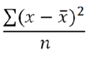

# 引用 - 基本函数

计算指标生成器允许您将统计和数学函数应用于生成高级计算指标。

这里有一个按字母顺序排列的函数及其定义列表。

>[!NOTE]
>
>当 [!DNL metric] 被标识为函数中的参数时，还允许使用其他量度表达式。例如，[!DNL MAXV(metrics)] 还允许使用 [!DNL MAXV(PageViews + Visits).]

## table 函数与 row 函数

在 table 函数中，输出对于表中的每一行都是相同的。在 row 函数中，输出对于表中的每一行都是不同的。

## 绝对值 (Row)

返回某数字的绝对值。某数字的绝对值是一个具有正值的数字。

```
ABS(metric)
```

| 参数 | 描述 |
|---|---|
| *metric* | 您希望求绝对值的指标。 |

## 列最大值

返回某指标列的一组维度元素中的最大值。MAXV 可以在一个列（指标）内跨维度元素垂直估值。

```
MAXV(metric)
```

| 参数 | 描述 |
|---|---|
| *metric* | 您希望计算的指标。 |

## 列最小值

返回某指标列的一组维度元素中的最小值。MINV 可以在一个列（指标）内跨维度元素垂直估值。

```
MINV(metric)
```

| 参数 | 描述 |
|---|---|
| *metric* | 您希望计算的指标。 |

## 列总和

添加列中某指标的所有数字值（跨维度元素）。

```
SUM(metric)
```

| 参数 | 描述 |
|---|---|
| *metric* | 您希望求总值或总和的指标。 |

## 计数 (Table)

返回列中某指标的非零值的数量或计数（某个维度内报告的独特元素数）。

```
COUNT(metric)
```

| 参数 | 描述 |
|---|---|
| *metric* | 您希望计数的指标。 |

## 指数 (Row)

返回 *e* 的给定次幂。常数 *e* 等于 2.71828182845904，它是自然对数的底数。EXP 是 LN 的反函数，LN 是某数字的自然对数。

```
EXP(metric)
```

| 参数 | 描述 |
|---|---|
| *metric* | 应用于底数 *e* 的指数。 |

## 求幂

幂运算符

<pre>
pow(x,y) = x<sup>y</sup> = x*x*x*… (y 次)
</pre>

## 平均值 (Table)

返回列中某指标的算术平均值或平均数。

```
MEAN(metric)
```

| 参数 | 描述 |
|---|---|
| *metric* | 您希望求平均数的指标。 |

## 中间值 (Table)

返回列中某指标的中间值。中间值是指位于一组数字正中间的那个数字，也就是说有一半数字的值大于或等于该中间值，还有一半数字的值小于或等于该中间值。

```
MEDIAN(metric)
```

| 参数 | 描述 |
|---|---|
| *metric* | 您希望求中间值的指标。 |

## 取模

使用欧几里得除法求得 col1 / col2 的余数。

返回 x 除以 y 之后的余数。

```
x = floor(x/y) + modulo(x,y)
```

返回值具有与输入值相同的符号（或为零）。

```
modulo(4,3) = 1 
modulo(-4,3) = -1 
modulo(-3,3) = 0
```

要始终获得正数，请使用

```
modulo(modulo(x,y)+y,y)
```

## 百分位数 (Table)

返回某指标的 k-th 百分位数形式的值。您可以使用此函数确立一个接受阈值。例如，您可以决定检查其分数大于第 90 个百分位数的维度元素。

```
PERCENTILE(metric,k)
```

<table id="table_35CD840ACFB44CD9979881DB8823CC53"> 
 <thead> 
  <tr> 
   <th colname="col1" class="entry"> 参数 </th> 
   <th colname="col2" class="entry"> 描述 </th> 
  </tr> 
 </thead>
 <tbody> 
  <tr> 
   <td colname="col1"> <i>metric</i> </td> 
   <td colname="col2"> 用于定义相对位置的指标列。 </td> 
  </tr> 
  <tr> 
   <td colname="col1"> <p>k </p> </td> 
   <td colname="col2"> 介于 0 到 100 之间（包括 0 和 100）的百分位数值。 </td> 
  </tr> 
 </tbody> 
</table>

## 四分位数 (Table)

返回某指标的四分位数形式的值。例如，四分位数可用于查找在获得的收入方面排名前 25% 的产品。当 quart 分别等于 0（零）、2 和 4 时，MINV、MEDIAN 和 MAXV 可返回与 QUARTILE 相同的值。

```
QUARTILE(metric,quart)
```

<table id="table_64EA3DAAE77541439D59FAF0353F83A2"> 
 <thead> 
  <tr> 
   <th colname="col1" class="entry"> 参数 </th> 
   <th colname="col2" class="entry"> 描述 </th> 
  </tr> 
 </thead>
 <tbody> 
  <tr> 
   <td colname="col1"> <i>metric</i> </td> 
   <td colname="col2"> 您希望求四分位数值的指标。 </td> 
  </tr> 
  <tr> 
   <td colname="col1"> <p>quart </p> </td> 
   <td colname="col2"> 指示要返回哪个*值。 </td> 
  </tr> 
 </tbody> 
</table>

&#42;如果 *quart* = 0，则 QUARTILE 会返回最小值。如果 *quart* = 1，则 QUARTILE 返回第一个四分位数（第 25 个百分位数）。如果 *quart* = 2，则 QUARTILE 返回第一个四分位数（第 50 个百分位数）。如果 *quart* = 3，则 QUARTILE 返回第一个四分位数（第 75 个百分位数）。如果 *quart* = 4，则 QUARTILE 返回最大值。

## 轮次

返回给定值的最接近整数。例如，如果您要避免在报告收入时出现货币小数位数，而某产品的收入为 $569.34，则使用公式 Round(*Revenue*) 可将收入四舍五入为最接近的美元数 $569。报告 $569.51 的产品将四舍五入为最接近的美元数 $570。

```
ROUND(metric)
```

| 参数 | 描述 |
|---|---|
| *数字* | 您希望舍入的指标。 |

在没有位数参数的情况下四舍五入，与在位数参数为 0 的情况下四舍五入是相同的，都会四舍五入为最接近的整数。使用位数参数，可在小数点右侧返回多位数字。如果位数为负，则在小数点左侧返回 0。

```
round( 314.15, 0) = 314 
round( 314.15, 1) = 314.1 
round( 314.15, -1) = 310 
round( 314.15, -2) = 300
```

## 行计数

返回给定列的行数（某个维度内报告的独特元素数）。“超出的独特数”将记为 1。

## 行最大值

每行列数的最大值。

## 行最小值

每行列数的最小值。

## 行总和

每行列数的总值。

## 平方根 (Row)

返回某数字的正平方根。某数字的平方根是该数字二分之一次幂的值。

```
SQRT(metric)
```

| 参数 | 描述 |
|---|---|
| *数字* | 您希望求平方根的指标。 |

## 标准偏差 (Table)

基于数据的抽样群体，返回变量的标准偏差或平方根。

STDEV 的方程式为：


其中，x 为抽样平均值 (*metric*)，*n* 为抽样大小。

```
STDEV(metric)
```

<table id="table_8BCF2E4B02434AABAAD026FB3C4E8B2F"> 
 <tbody> 
  <tr> 
   <td> <b> 参数</b> </td> 
   <td> <b> 描述</b> </td> 
  </tr> 
  <tr> 
   <td> <b> <i> metric</i> </b> </td> 
   <td> <p> 您希望求标准偏差的量度。 </p> </td> 
  </tr> 
 </tbody> 
</table>

## 变量 (Table)

基于数据的抽样群体返回变量。

VARIANCE 的方程式为：



其中，x 为抽样平均值 MEAN(*metric*)，*n* 为抽样大小。

```
VARIANCE(metric)
```

| 参数 | 描述 |
|---|---|
| *metric* | 您希望求变量的指标。 |

为了计算变量，需要查看整列数字。首先，从该数字列表计算平均值。得出平均值后，浏览每个条目，然后执行以下操作：

1. 从数字中减去平均值。

2. 将结果求平方。

3. 再相加求和。

对整列进行迭代后，您将得到一个总数。然后，将该总数除以列中的项目数。得出的数值就是列变量。它是单个数字。但它会显示为一列数字。

例如，假定有一列，其中包含三个项目：

1

2

3

此列的平均值为 2。此列的变量将为 ((1 - 2)² + (2 - 2)² + (3 - 2)²/3 = 2/3。
