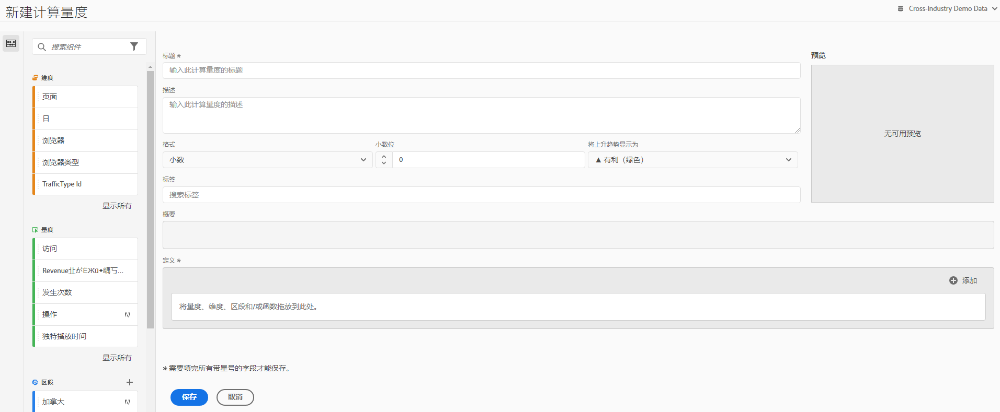

# 生成指标

计算量度生成器提供一个画布，可以将维度、量度、筛选器和函数拖放到画布上，以基于容器层次结构逻辑、规则和运算符创建自定义量度。通过这个集成的开发工具，可生成并保存简单的计算指标或复杂的高级计算指标。

可通过以下几种方式访问计算指标生成器：

* 在 Analysis Workspace 中，打开一个项目然后单击 **[!UICONTROL + 新建]** > **[!UICONTROL 创建指标]**。
* 在 [!DNL Analytics] 中，转到&#x200B;**[!UICONTROL 组件]** > **[!UICONTROL 计算指标]**。

* 单击&#x200B;**[!UICONTROL 计算指标管理器]**&#x200B;顶部的 [+ 添加](/help/components/calc-metrics/cm-workflow/cm-manager.md)，或者

* 前往 **[!UICONTROL 分析]** > **[!UICONTROL 報表]**，開啟任一報表並按一下「量度」圖示   以開啟「量度」邊欄，然後按一下 **[!UICONTROL 新增]**.

## UI 组件 {#ui-components}

| 字段 | 描述 |
| --- | --- |
| 标题 | 必须为指标命名。如果没有命名，则无法保存指标。 |
| 描述 | 为量度提供用户友好的描述，以显示该量度的用途，并将其与类似的量度区分开。该描述还会显示在报表内。最好不要在描述中放入公式，而是描述此指标应当用于哪些方面，不应当用于哪些方面。（公式会在您创建指标时生成，它位于“摘要”标题的下面。因此，无需将公式添加到描述中。） |
| 格式 | 选项包括“小数”、“时间”、“百分比”和“货币”。 |
| 小数位数 | 显示将在报表中显示的小数位数。您可以指定的最大小数位数为 10。 |
| 将上升趋势显示为... | 此指标极性设置显示 Analytics 应当将指标中的上升趋势视为有利（绿色）还是不利（红色）。最终，报表中的图表将在上升时显示为绿色或红色。 |
| 货币 | 此数据视图的基础货币。 |
| 标记 | 标记是一种用于组织指标的好方法。所有用户均可创建标记，并将一个或多个标记应用于指标。但是，您只能查看您所拥有的或与您共享的那些区段的标记。应创建哪种类型的标记？以下是对实用标记的一些建议：<ul><li>基于团队名称的标记，如社交营销、移动营销。</li><li>项目标记（分析标记），如登录页面分析。</li><li>类别标记：男士；地理位置。</li><li>工作流程标记：待批准；策划（为特定的业务部门）</li></ul> |
| 概要 | 无论您何时对量度定义进行更改，[!UICONTROL 概要]公式都会随之发生更新。当您将光标悬停在量度上方并单击图标时，此公式还会显示在左侧的量度边栏中。 |
| 定义 | 您应将量度/计算量度、筛选器和/或函数拖放到此处来构建计算量度。如果拖入计算量度，它将自动展开其量度定义。您可以通过容器嵌套定义。但是，与区段容器不同的是，这些容器的作用类似于数学表达式，它们决定着运算的顺序。 |
| 运算符 | [!UICONTROL 除以]是默认运算符，此外还有 +、- 和 x 运算符。 |
| 预览 | 提供对可能存在的任何错误的快速阅览。预览涵盖过去 90 天的范围。这种方式可用于初步评估您是否为指标选择了正确的组件。出现意外结果表示您需要重新检查指标定义。 |
| 产品兼容性 | 产品兼容性向您显示量度是否与完全处理数据兼容。 |
| 添加 | 对于所有类型的计算量度，您可以向定义中添加容器和静态数字。对于高级计算量度，您还可以添加筛选器和函数。<ul><li>容器的作用类似于数学表达式，它们决定着运算的顺序。因此，容器中的任何内容都将在下次运算前得到处理。</li><li>将区段拖到容器上，会将该容器中的所有内容分段。（仅限高级计算指标）</li><li>您可以在一个容器中堆叠多个筛选器。</li></ul> |
| 齿轮图标（量度类型、归因） | 通过选择量度旁边的齿轮图标，您可以指定量度类型和归因模型。 |
| + 新建 | 让您能够创建新组件，例如新筛选器（这会将您转到筛选器生成器）。 |
| 搜索组件 | 通过此搜索栏，您可以搜索维度、指标、区段（仅限高级计算指标）和函数（仅限高级计算指标）。 |
| 维度列表 | 要在筛选器生成器中构建一个简单的筛选器（例如“页面 = 主页”，），您不需要离开计算量度生成器，而是可以在“页面”中拖动并直接从计算量度生成器中选择“主页”。这可以极大地简化用于创建筛选计算量度的工作流程。 |
| 指标列表 | 指标有以下 3 种类别：<ul><li>标准量度</li><li>计算量度</li><li>量度模板 - 位于列表底部。</li></ul>将光标悬停在量度上时，您可以在其右侧看到信息图标。单击此图标会显示以下信息：<ul><li>有关如何计算指标的公式。</li><li>指标的预览趋势。</li><li>位于右上角的编辑（铅笔）图标可使您转到计算指标生成器，以便在其中编辑此计算指标。</li></ul> |
| 筛选器列表 | （仅限高级计算量度）作为管理员，此列表显示在您的登录公司中创建的所有筛选器。如果您是非管理员用户，则此列表显示您拥有的筛选器以及与您共享的筛选器。 |
| 函数列表 | （仅限高级计算指标）函数将分为两个列表：基本（最常用）和高级。 |
| 数据视图选择器 | 此选择器（位于右上角）让您可以切换到不同的数据视图。 |
