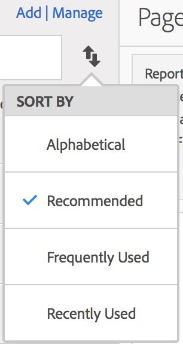

# 查找量度

描述用于查找量度的两种主要方式：排序和过滤。

## 排序 {#sorting}

当您打开报表并单击报表左侧的“量度”图标  以调出“量度”边栏时，“量度选择器”中的&#x200B;**[!UICONTROL 排序方式]**&#x200B;下拉菜单中会选择四个排序选项：

| 选项 | 何时使用 |
|---|---|
| 按字母顺序 | 当您知道名称时，此选项非常有用。 |
| 建议 | 报表中的常用量度 - 它由后端从用户经常在此报表中使用的量度收集而来。 |
| 经常使用 | 当您是新用户并需要查看报表中经常使用的量度时，此选项非常有用。 |
| 最近使用 | 当您正在处理项目且反复使用相同的量度集时，此选项非常有用。 |

## 过滤 - 高级选择 {#filtering-advanced}

当您打开报表时，单击“量度”图标，然后单击&#x200B;**[!UICONTROL 管理]**。现在，单击“过滤器”图标。您可以通过多种方式进行过滤。

| 如果您希望 | 则按以下方式排序 |
| --- | --- |
| 显示此数据视图中的所有量度。 | 其他筛选器 > 显示所有 |
| 仅显示您拥有的量度 | 其他筛选器 > 我的 |
| 显示他人与我共享的量度 | 所有者，或其他筛选器 > 与我共享 |
| 仅显示已获公司批准的量度 | 已批准 |
| 筛选您正在处理的项目的量度 | 标记之一 |
