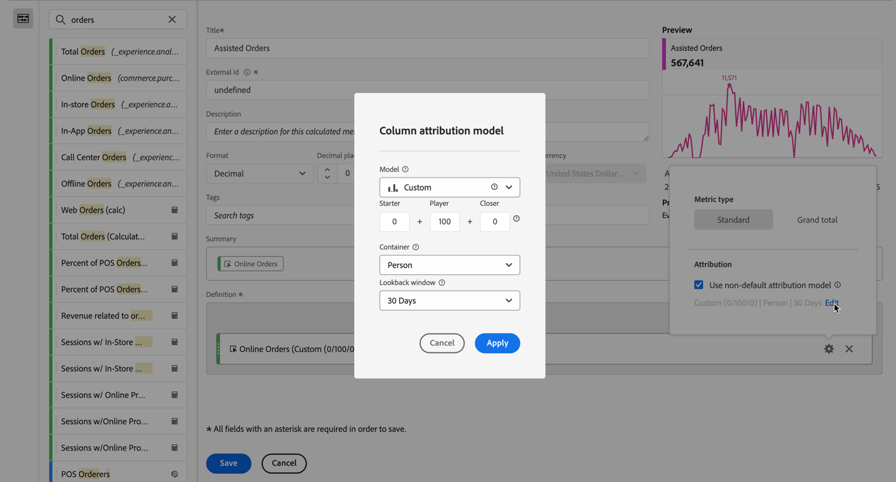

# 构建更复杂的计算量度

本文介绍了计算指标的更复杂示例。 此计算量度显示哪些营销渠道有助于推动订单。 此类计算量度可适用于任何维度或成功事件。

1. 开始生成计算量度，如[生成量度](/help/components/calc-metrics/cm-workflow/cm-build-metrics.md)中所述。

1. 在计算量度生成器中，将量度命名为`Assisted Online Orders`或类似名称。

1. 从&#x200B;**[!UICONTROL Metrics]**&#x200B;组件中选择&#x200B;**[!UICONTROL 在线订单]**&#x200B;量度，并将该量度拖动到&#x200B;**[!UICONTROL Definition]**&#x200B;区域。

   1. 为量度选择。
   1. 选择&#x200B;**[!UICONTROL 使用非默认归因模型]**。
   1. 调整&#x200B;**[!UICONTROL 列归因模型]**&#x200B;中的归因模型。
      1. 为&#x200B;**[!UICONTROL 模型]**&#x200B;选择&#x200B;**[!UICONTROL 自定义]**。 将&#x200B;**[!UICONTROL Starter]**&#x200B;设置为`0`，将&#x200B;**[!UICONTROL Player]**&#x200B;设置为`100`，将&#x200B;**[!UICONTROL Closer]**&#x200B;设置为`0`。
      1. 为&#x200B;**[!UICONTROL 容器]**&#x200B;选择&#x200B;**[!UICONTROL 访客]**。
      1. 为&#x200B;**[!UICONTROL 回顾时间范围]**&#x200B;选择&#x200B;**[!UICONTROL 30天]**。

      1. 选择&#x200B;**[!UICONTROL 应用]**。

      

1. 选择&#x200B;**[!UICONTROL 保存]**&#x200B;以保存计算量度。

要使用计算量度，请执行以下操作：

1. 在Analysis Workspace中，创建一个包含&#x200B;**[!UICONTROL 营销渠道]**&#x200B;维度、**[!UICONTROL 在线订单]**&#x200B;和新&#x200B;**[!UICONTROL 辅助在线订单]**&#x200B;量度的自由格式表。

   

1. （可选）与组织中的其他用户共享该量度，如[共享计算量度](/help/components/calc-metrics/cm-workflow/cm-sharing.md)中所述。

这是分辨哪些营销渠道有助于提升订单的简单方法。 或者，从自由格式表中，您可以选择任何量度，然后从上下文菜单中直接从表中调整归因模型。
