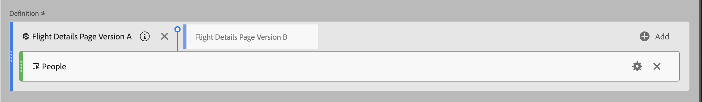
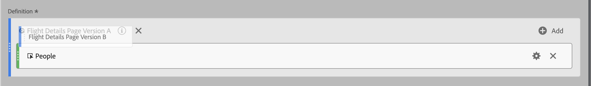

# 堆叠和替换区段

您可以在计算量度生成器中栈叠和替换区段。

## 堆叠区段 {#stack-segment}

1. 开始生成量度，如[生成计算量度](/help/components/calc-metrics/cm-workflow/cm-build-metrics.md)中所述。

1. 在“定义”画布中，将新区段拖放到现有区段旁边：

   

## 使用一个区段替换另一个 {#replace-segment}

1. 开始生成量度，如[生成量度](/help/components/calc-metrics/cm-workflow/cm-build-metrics.md)中所述。

1. 在“定义”画布中，将新区段拖放到现有区段上方：

   
