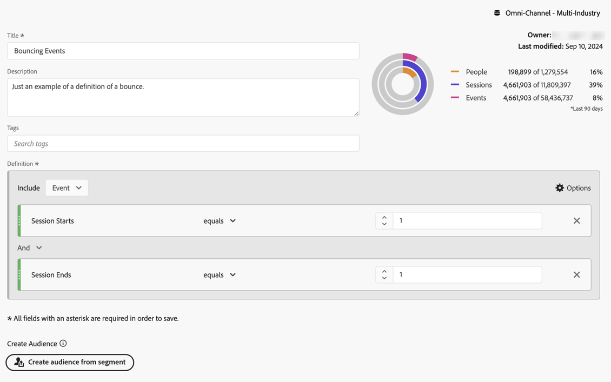
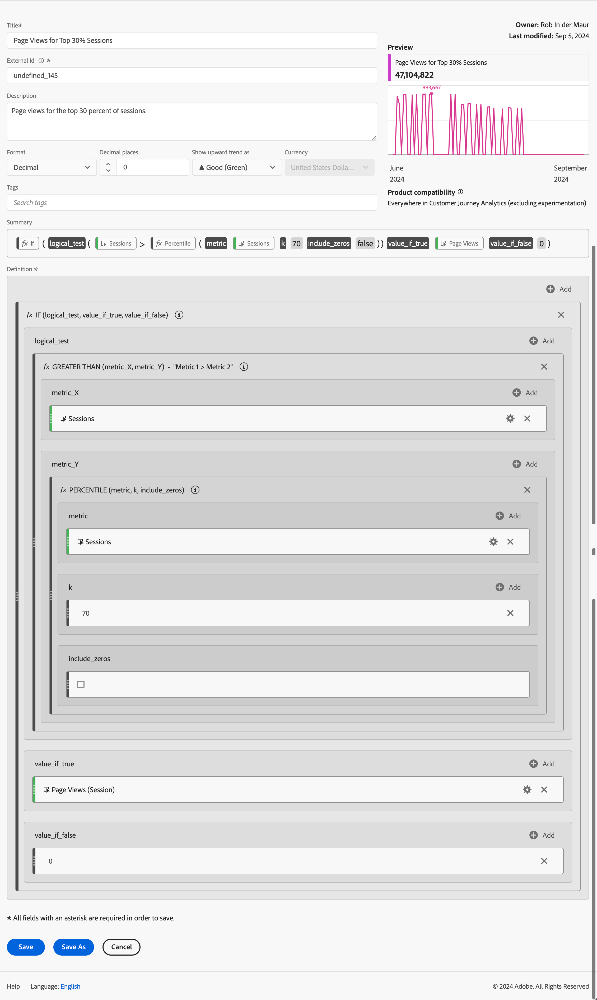

# 计算量度示例

本文举例说明如何定义更高级的计算指标。

## 跳出率

您希望计算跳出率。

+++ 详细信息

跳出的定义将在另一篇讨论中讨论，但在本例中，您定义了一个“跳出”事件区段，其中会话开始等于1，会话结束等于1。 使用此区段可以定义会话的退回率。

### 区段

### 计算量度

### 派生字段

或者，您可以使用派生字段[&#128279;](/help/data-views/derived-fields/derived-fields.md#bounces)定义跳出率。

派生字段是数据视图的一部分，其优点是并非每个用户都可以覆盖或修改跳出率量度的定义。 这一优势也带来了局限性。 无权访问数据视图的用户无法使用派生字段，并且必须依靠区段和计算量度来定义跳出率。

有关如何在Customer Journey Analytics中计算跳出率和跳出率的更多背景信息，请参阅此[博客帖子](https://experienceleaguecommunities.adobe.com/t5/adobe-analytics-blogs/calculating-bounces-amp-bounce-rate-in-adobe-customer-journey/ba-p/706446)。

+++

## 条件页面查看次数

您要定义一个计算度量，该度量只计算100多个会话中已访问页面的页面查看次数。

+++ 详细信息 

+++

## 前30%会话的页面查看次数

您要定义一个计算度量，该度量只计算前30%会话的页面查看次数。

+++ 详细信息

+++
