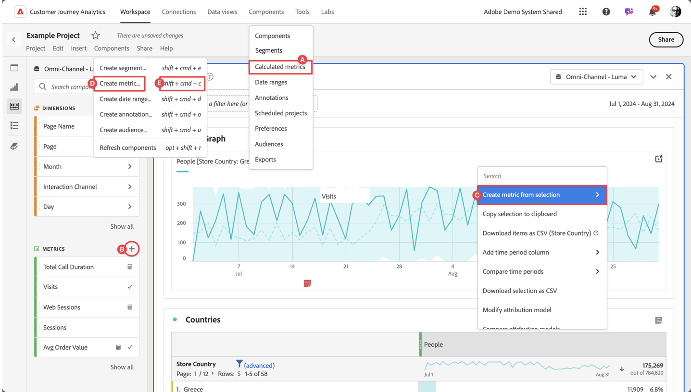

# 创建计算量度

默认情况下，只有管理员才能创建计算指标。 用户有权查看计算量度，这与用户查看其他组件（如区段、注释等）的方式类似。

但是，管理员可以通过[Admin Console](/help/technotes/access-control.md#user-level-access)向用户授予&#x200B;**[!UICONTROL 编辑CJA Workspace访问权限]**&#x200B;中&#x200B;**[!UICONTROL 报表工具]**&#x200B;的&#x200B;**[!UICONTROL 计算度量创建]**&#x200B;权限。

您可以通过以下方式创建计算量度：

* **A**。在主界面中，选择&#x200B;**[!UICONTROL 组件]**&#x200B;并选择&#x200B;**[!UICONTROL 计算量度]**。 从[[!UICONTROL 计算量度]管理器](/help/components/calc-metrics/cm-workflow/cm-manager.md)中选择 [!UICONTROL **[!UICONTROL Add]**]。
* **B**。在Workspace项目中，从“组件”左侧面板中选择 （位于 **量度**）。
* **C**。在Workspace项目中，从指标列标题的上下文菜单中，选择&#x200B;**[!UICONTROL 从所选内容创建指标]**。 从子菜单中，您可以选择函数，或者选择&#x200B;**[!UICONTROL 在计算指标生成器中打开]**。  如果选择函数，则计算量度定义为仅用于项目的量度。 当您稍后通过[组件信息](/help/components/use-components-in-workspace.md#component-info)弹出窗口编辑此量度时，会在[计算量度生成器](/help/components/calc-metrics/cm-workflow/cm-build-metrics.md)中看到通知。
* **D**。在Workspace项目中，从菜单中选择&#x200B;**[!UICONTROL 组件]**，然后选择&#x200B;**[!UICONTROL 创建指标]**。
* **E**。 在Workspace项目中，使用快捷键&#x200B;**[!UICONTROL shift+cmd+c]** (macOS)或&#x200B;**[!UICONTROL shift+ctrl+c]** (Windows)。

要定义新的计算量度，请使用[计算量度生成器](/help/components/calc-metrics/cm-workflow/cm-build-metrics.md)。

了解创建计算量度所需执行的步骤。

| 工作流程任务 | 描述 |
| --- | --- |
| 规划计算量度 | 特别是对于将被正式“批准”的量度，合理的做法是概述哪些计算量度将被广泛使用，以及它们将被如何定义。 |
| [生成](/help/components/calc-metrics/cm-workflow/cm-build-metrics.md)计算量度 | 生成并编辑计算量度和高级计算量度，以在 [!DNL Customer Journey Analytics] 组件中使用。 |
| 标记计算量度 | 标记计算量度以便进行组织和共享。请参阅如何规划和分配标记以进行简单和高级搜索和组织。 |
| 批准计算量度 | 批准计算量度以将其作为规范。 |
| 应用计算指标 | 您可以应用直接来自报表和量度选择器的量度（要访问量度选择器，请单击[!UICONTROL 显示量度]）。 |
| 筛选计算量度 | 在量度选择器中，单击[!UICONTROL 高级选择]，并按标记、所有者和其他过滤器（“显示所有”、“我的”、“与我共享”、“收藏夹”和“已批准”）过滤。 |
| 将计算量度标记为[收藏](cm-finding.md) | 将量度标记为收藏是另一种组织量度以便进行使用的方式。 |

