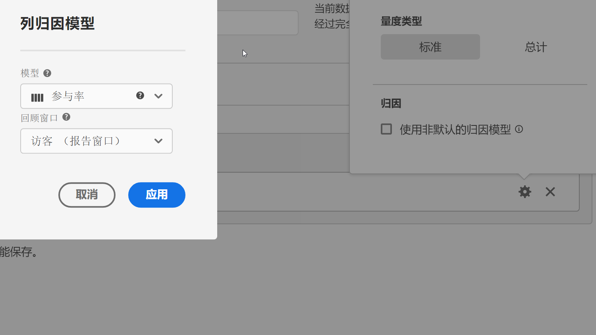

# 指标类型和归因

选择指标旁边的齿轮图标允许您指定指标类型和归因模型。

## 指标类型

要在构建计算量度时指定量度类型，请执行以下操作：

1. 选择要选择其类型的量度旁边的齿轮图标。

   

1. 从以下选项中进行选择：

   | 指标类型 | 定义 |
   |---|---|
   | 标准 | 这些指标是在标准 [!DNL Analytics] 报表中使用的相同指标。如果公式包含一个标准指标，它会显示与其相对的非计算指标的相同数据。标准指标可用于创建特定于每个单独行项目的计算指标。例如，[订购次数]/[访问次数]是将特定行项目的订购次数除以特定行项目的访问次数。 |
   | 总计 | 在每个行项目中使用报告期间的总计。 如果配方包含单个“总计”量度，则它会在每个行项目上显示相同的总计。 总计量度可用于创建与网站总计数据相比较的计算量度。 例如，[订购次数]/[总访问次数]会显示订购次数与网站所有访问次数的比例，而不只是与特定行项目访问次数的比例。 |

## 归因

有关CJA中的归因的信息，请参阅 [归因组件设置](/help/data-views/component-settings/attribution.md).
