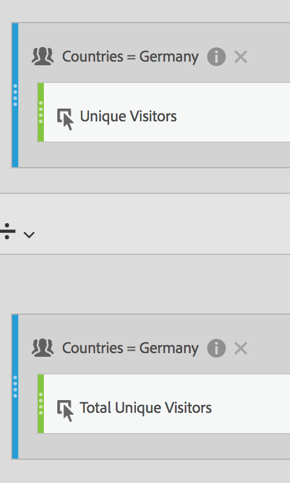

# 过滤量度

在计算量度生成器中，您可以在量度定义中应用过滤器。 如果要推导新指标以便在分析中使用，则这样做很有帮助。请记住，过滤器定义可以通过过滤器生成器进行更新。 如果进行了更改，则过滤器将在应用该过滤器的任意位置自动更新，包括该过滤器是否属于计算量度定义的一部分。

## 创建过滤的量度 {#create}

假设您要将“德国访客”过滤器的不同方面与“国际访客”过滤器的不同方面进行比较。 您可以创建指标为您提供如下分析：

* 两个群组之间的内容浏览行为是如何比较的？(另一个示例是：这两个过滤器之间的转化率有何异同？)
* 浏览某些页面的德国访客与国际访客各占总访客数的多少百分比？
* 这些不同过滤器访问哪些内容存在最大差异？

1. 如果您没有类似的过滤器，请在计算量度生成器中创建一个名为“德国访客”的临时区段，其中“国家/地区”等于“德国”。 只需将“国家/地区”维度拖入“定义”画布，并选择“德国”作为其值：

   

   >[!NOTE]
   >
   >您还可以在 [过滤器生成器](/help/components/filters/create-filters.md)，但我们已通过在计算量度生成器中提供维度来简化工作流。 “临时”表示该区段在 **[!UICONTROL 过滤器]** 列表。 但是，您可以将鼠标悬停在该列表旁边的“i”图标上，然后单击&#x200B;**[!UICONTROL 设为公用]**。

1. 如果您没有类似的过滤器，请创建一个名为“国际访客”的过滤器，其中“国家/地区”不等于“德国”。
1. 通过将德国过滤器拖到“定义”画布中，并在其中拖动独特访客量度，可生成并保存名为“德国访客”的量度：

   

1. 对国际访客区段和独特访客指标重复执行步骤 3，以便创建“国际访客”指标。
1. 在 Analysis Workspace 中，将&#x200B;**[!UICONTROL 页面]**&#x200B;维度拖动到自由格式表中，并将两个新的计算指标拖动到顶部且使它们彼此相邻：

   

以下是一段视频概述：

>[!VIDEO](https://video.tv.adobe.com/v/25407/?quality=12)

## 占总指标的百分比 {#percent-total}

您可以通过比较过滤器与总群体，来进一步了解上面的示例。 为此，请创建两个新指标，“德国访客总数的百分比”和“国际访客总数的百分比”：

1. 将“德语（或国际）访客”过滤器放入画布中。
1. 在下面放置另一个德语（或国际）访客过滤器。 但这一次，请单击其配置（齿轮）图标以选择指标类型“合计”。格式应当为“百分比”。运算符应当为“除以”。您最终会获得以下指标定义：

   

1. 将此指标应用于您的项目：

   
