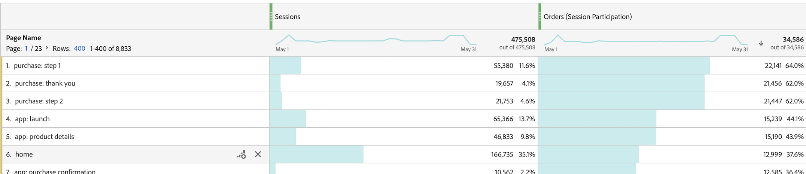

# 构建“参与率”量度

以下信息介绍了如何创建一个量度，以显示哪些页面促成了（或参与了）包含订单的会话。

此类信息对任何内容所有者都很有用。

>[!NOTE]
>
>您可以在管理工具中启用参与率量度，但仅限于自定义事件1 - 100。

1. 开始构建量度，如中所述 [生成量度](/help/components/calc-metrics/cm-workflow/cm-build-metrics.md).
1. 在计算量度生成器中，将量度命名为“参与率”或类似名称
1. 将成功事件“订购”拖到“定义”画布。
1. 在[设置](/help/components/calc-metrics/cm-workflow/m-metric-type-alloc.md)齿轮下，将该事件的&#x200B;**[!UICONTROL 归因模型]**&#x200B;更改为&#x200B;**[!UICONTROL 参与率]**。选择 **[!UICONTROL 会话]** 回顾。 定义应该类似于：

   

1. 选择 [!UICONTROL **保存**] 以保存指标。
1. 在&#x200B;**[!UICONTROL 页面]**&#x200B;报表中使用计算量度。

   

1. （可选）与组织中的其他用户共享量度，如中所述 [共享计算量度](/help/components/calc-metrics/cm-workflow/cm-sharing.md).
