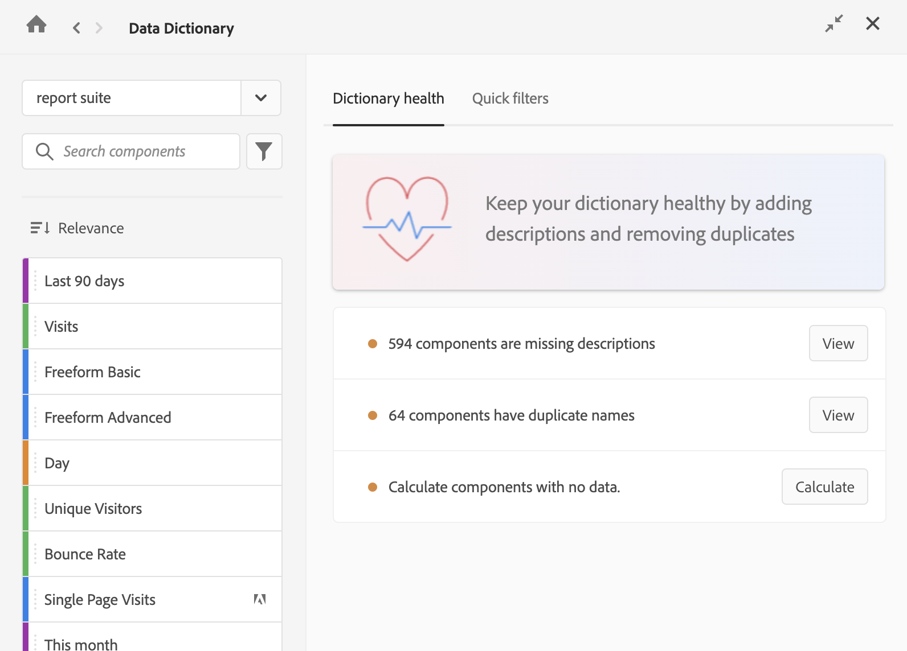

# 编辑组件条目

Customer Journey Analytics管理员可以在数据字典中编辑给定数据视图的组件条目。 所做的任何更改均对数据视图的所有用户可见。

要编辑数据词典中的组件：

1. 前往包含要编辑组件的 Analysis Workspace 项目。

1. 在Analysis Workspace的按钮面板中选择&#x200B;**数据字典**&#x200B;图标。 （[数据字典概述](/help/components/data-dictionary/data-dictionary-overview.md)中的“访问数据字典”一节中描述了访问数据词典的其他方法。）

   显示“数据词典”窗口。

   

1. 确保在下拉菜单中选择正确的数据视图。 默认情况下，将显示您已在中的数据视图。

1. （可选）在搜索字段中，开始键入要编辑的组件的名称。

   组件的类型可以通过颜色和图标来识别。**维度**  是橙色的，**区段**  是蓝色的，**日期范围**  是紫色的，**指标**  是绿色的。Adobe 图标表示计算指标模板或区段模板，计算器图标  表示由您组织的 Analytics 管理员创建的计算指标。

1. （可选）选择&#x200B;**筛选器**&#x200B;图标，然后选择以下任何区段选项来划分组件列表：

   | 选项 | 功能 |
   |---------|----------|
   | [!UICONTROL **已批准**] | 仅显示标记为由管理员批准的组件。 |
   | [!UICONTROL **收藏夹**] | 仅显示收藏夹列表中的组件。有关将组件添加到收藏夹列表的信息，请参阅[组件概览](/help/components/overview.md)。 |
   | [!UICONTROL **维度**] | 仅显示维度的组件。（当您首次访问数据字典时，[!UICONTROL **快速区段**]&#x200B;选项卡中也提供了此选项。） |
   | [!UICONTROL **量度**] | 仅显示量度的组件。（当您首次访问数据字典时，[!UICONTROL **快速区段**]&#x200B;选项卡中也提供了此选项。） |
   | [!UICONTROL **区段**] | 仅显示区段的组件。（当您首次访问数据字典时，[!UICONTROL **快速区段**]&#x200B;选项卡中也提供了此选项。） |
   | [!UICONTROL **日期范围**] | 仅显示日期范围的组件。（当您首次访问数据字典时，[!UICONTROL **快速区段**]&#x200B;选项卡中也提供了此选项。） |
   | [!UICONTROL **显示所有**] | 显示所有组件。仅管理员有此选项可用。 |
   | [!UICONTROL **未批准**] | 仅显示未标记为由管理员批准的组件。作为管理员，这有助于确定需要您审阅和批准的组件。仅管理员有此选项可用。 |
   | [!UICONTROL **缺少描述**] | 仅显示在“描述”字段中尚未描述的组件。仅管理员有此选项可用。 |
   | [!UICONTROL **显示重复项**] | 仅显示与选定数据视图中另一个组件具有相同名称或相同说明的组件。 其中包括您创建的组件和 Adobe 提供的组件。名称或描述必须完全匹配才能显示为重复项。 此选项仅适用于管理员。 |
   | [!UICONTROL **没有最近的数据**] | 仅显示在过去 90 天内未收集任何数据的组件。仅管理员有此选项可用。 |
   | [!UICONTROL **由Adobe创建**] <!-- I don't see this option--> | 仅显示由 Adobe 创建的组件。不会显示由管理员或您组织中的其他用户创建的组件。 |

   {style="table-layout:auto"}

1. （可选）选择&#x200B;**排序**&#x200B;图标，然后选择以下任何区段选项来排序组件列表：

{{components-sort-options}}

1. 从组件列表中，选择要编辑的组件。

1. 选择组件名称旁边的&#x200B;**编辑**&#x200B;图标，即。

1. 编辑有关组件的以下任何信息：

   | 选项 | 功能 |
   |---------|----------|
   | [!UICONTROL **已批准**] | 
表示该组件已获管理员审阅和批准。

管理员会看到&#x200B;[!UICONTROL **取消批准**]&#x200B;选项。选择此选项会为用户将组件标记为“未批准”。
 |
   | [!UICONTROL **未批准**] | 
表示该组件尚未获得管理员审阅和批准。

管理员会看到&#x200B;[!UICONTROL **批准**]&#x200B;选项。 选择此选项会为用户将组件标记为“已批准”。
 |
   | [!UICONTROL **描述**] | 描述组件的预期功能。（此信息由 Analytics 管理员添加，如[添加组件描述](/help/components/add-component-descriptions.md)中所述。） |
   | [!UICONTROL **常常与以下组件一同使用**] | 
显示最常与您正在查看的组件一起使用的组件。

在 5 种主要组件类型中，最多显示 5 个组件：量度、计算量度、维度、区段和日期范围。

此列表基于过去 90 天的数据。其中仅列出您有权查看的组件。

管理员可通过在&#x200B;[!UICONTROL **始终包括**]&#x200B;和&#x200B;[!UICONTROL **始终排除**]&#x200B;下拉字段中选择所需的组件而编排用户可在此部分中看到的组件。在您组织用户看到的组件之前，请首先应用&#x200B;**显示全部**&#x200B;区段，以确保您看到任何未与您共享的组件，这些组件可能已由其他管理员添加。<!-- Soon we will make it so any fields that an admin doesn't have access to will be greyed out, and then they can enable the Show all segment to make it editable. -->
 |
   | [!UICONTROL **类似于**] | 
显示与您正在查看的组件名称类似的组件。

在 5 种主要组件类型中，最多显示 5 个组件：量度、计算量度、维度、区段和日期范围。

其中仅列出您有权查看的组件。

数据视图中的任何重复组件都将显示在此处。 Analytics 管理员应识别并删除所有重复的组件，如[监视数据词典运行状况](/help/components/data-dictionary/monitor-data-dictionary-health.md)中所述。

管理员可通过在&#x200B;[!UICONTROL **始终包括**]&#x200B;和&#x200B;[!UICONTROL **始终排除**]&#x200B;下拉字段中选择所需的组件而编排用户可在此部分中看到的组件。在您组织用户看到的组件之前，请首先应用&#x200B;**显示全部**&#x200B;区段，以确保您看到任何未与您共享的组件，这些组件可能已由其他管理员添加。<!-- Soon we will make it so any fields that an admin doesn't have access to will be greyed out, and then they can enable the Show all segment to make it editable. -->

**注意：****类似于**&#x200B;部分当前仅包括您创建的组件，而不包括 Adobe 提供的组件。将在未来的版本中添加 Adobe 提供的组件。
 |
   | [!UICONTROL **产品兼容性**] | 指示Customer Journey Analytics中可以使用此计算量度的位置。 
可能的值包括：
<ul><li>[!UICONTROL **Customer Journey Analytics中的所有位置**]：计算指标可在所有Customer Journey Analytics中使用，包括在Analysis Workspace、Report Builder等中。</li><li>[!UICONTROL **Customer Journey Analytics 中的所有地方（不包括实验）**]：计算量度可用于除实验面板之外的所有 Customer Journey Analytics 部分。</li> 
有关确定计算量度是否可用于试验的标准的信息，请参阅[试验面板](/help/analysis-workspace/c-panels/experimentation.md)中的[在试验面板中使用计算量度](/help/analysis-workspace/c-panels/experimentation.md#use-calculated-metrics-in-the-experimentation-panel)。
</ul> |
   | [!UICONTROL **标记**] | 显示应用于组件的所有标记。具有管理员访问权限的用户可以在编辑组件时添加标记。 |
   | [!UICONTROL **组件类型**] | 列出组件的类型，无论是维度、量度、区段还是日期范围。 |
   | [!UICONTROL **创建者**] | 显示创建组件的用户名称。 |
   | [!UICONTROL **预览**] | 显示组件在 Analysis Workspace 中的外观预览。 |
   | [!UICONTROL **上次修改日期**] | 显示上次修改组件的日期。查看区段、量度、计算量度和日期范围时，将显示此部分。 |

   {style="table-layout:auto"}

1. 单击&#x200B;**保存**&#x200B;图标，即来保存您的更改。
