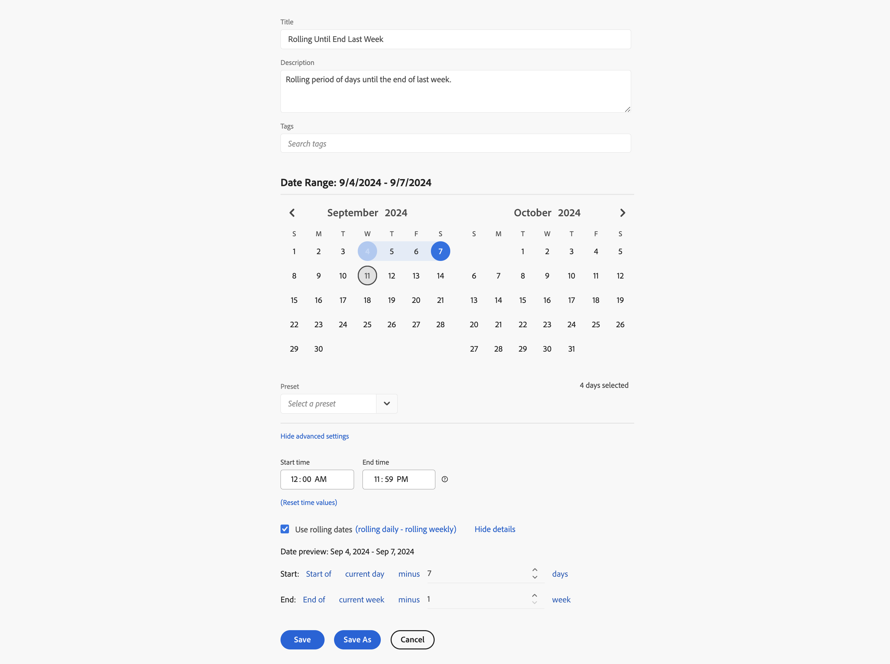
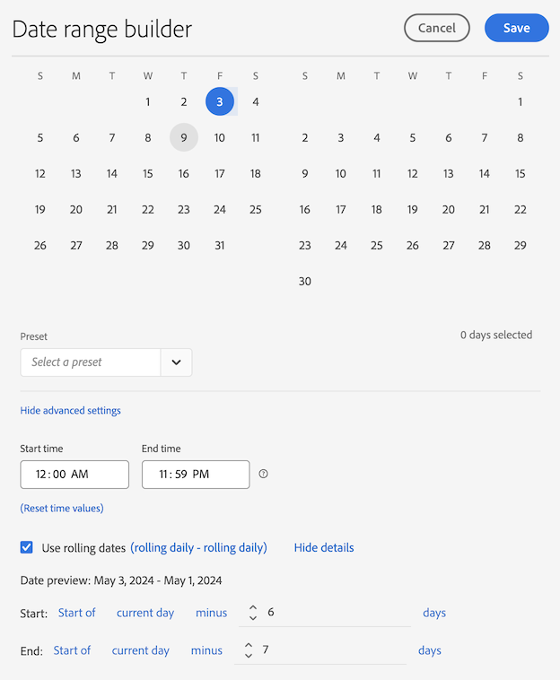

# 自定义日期范围示例

本文展示了更多自定义日期范围的示例。

## 两个月前

+++ 详细信息

您希望定义一个自定义日期范围，用于表示“两个月前”。 您可以使用其中一个预设选项。

+++

## 滚动至上周末

+++ 详细信息

您要定义一个日期范围，表示从当前日期的前一周起，一直到该周的结束日期（即上周末）这一时间段。 例如，如果今天是 2024 年 9 月 11 日星期三。 您要定义的日期范围是从 2024 年 9 月 4 日（星期三）至 2024 年 9 月 7 日（星期六）。

+++ 

<!--
## Example: Use a 7-day rolling date range

You can create a date range that specifies a 7-day rolling window that ends one week ago:

Use *`rolling daily`*.

* The Start settings would be *`current day minus 6 days`*.

* The End settings would be *`current day minus 7 days`*.

This date range can be a component that you drag onto any freeform table.
-->