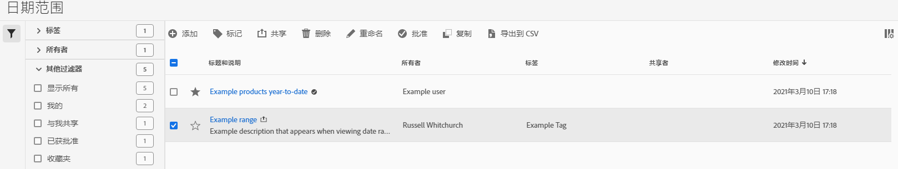

# 管理日期范围

使用日期范围管理器共享、重命名或删除日期范围。进入日期管理器：

1. 使用您的 Adobe ID 凭据登录 [analytics.adobe.com](https://analytics.adobe.com)。
1. 依次转到[!UICONTROL 组件] > [!UICONTROL 日期范围]。

## 界面

日期范围管理器包括以下选项：

* **添加**：创建新日期范围。有关详细信息，请参阅[创建日期范围](create.md)。
* **按标题搜索**：按标题搜索日期范围。根据此处输入的文本过滤结果。
* **过滤器**：使用左列过滤日期范围。您可以按自定义标记、所有者、由您创建、您的收藏、已批准或与您共享等条件进行过滤。您也可以搜索所需的过滤器。
* **收藏**：单击日期范围旁的图标以将其添加到您的收藏。
* **自定义列**：单击图标以在日期范围管理器中显示或隐藏列。

单击一个或多个日期范围旁的复选框以查看更多选项。

* **标记**：将标记应用于所有选定的日期范围。标记可帮助您整理日期范围，并让您使用左列过滤它们。
* **共享**：与其他 Experience Cloud 用户共享日期范围。如果您是产品管理员，还可以与整个组织或群组共享。与您组织中的其他用户共享的日期范围在标题旁有一个图标。
* **删除**：永久删除选定的日期范围。
* **重命名**：如果选择了单个日期范围，您可以更改其标题。
* **批准**：如果您是产品管理员，则可以向日期范围添加一个批准图章。批准的日期范围向您组织中的用户表明它们是“官方的”，从而与您组织中其他用户创建的日期范围区分开来。批准的日期范围在标题旁有一个图标。
* **取消批准**：如果您是产品管理员，并选择一个已批准的日期范围，则可以取消批准该日期范围。
* **复制**：创建选定日期范围的副本。复制日期范围可将 `(Copy)` 附加到新复制的日期范围标题的末尾。
* **导出至 CSV**：将所有选定的日期范围导出至一个 CSV 文件。生成的 CSV 文件中的列包括日期范围管理器中的所有可见列。
