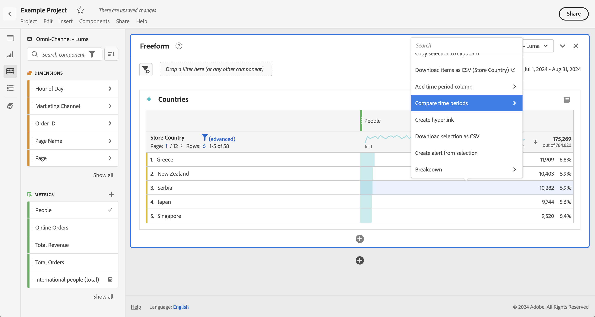
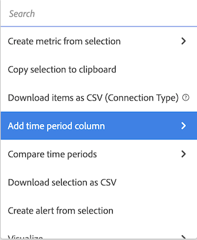
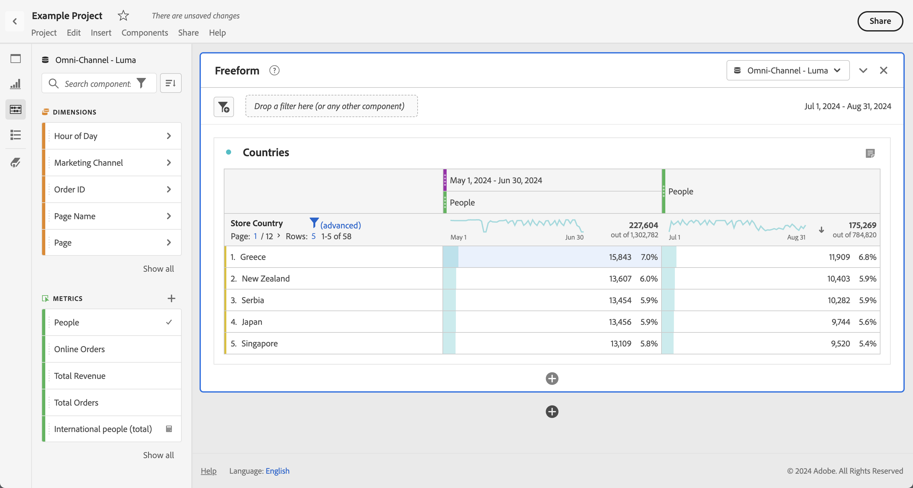
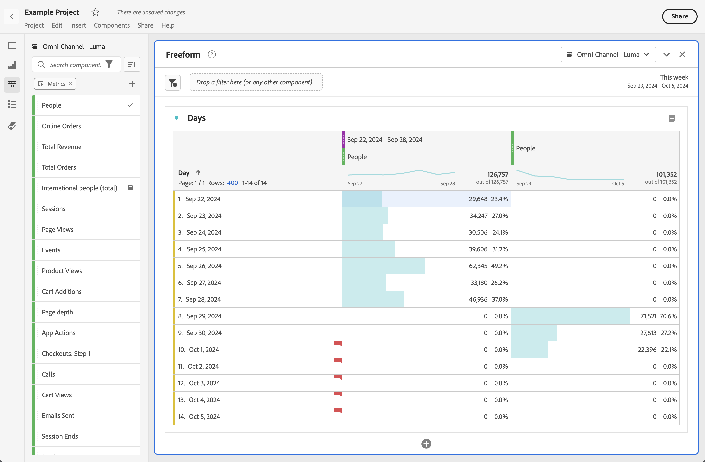
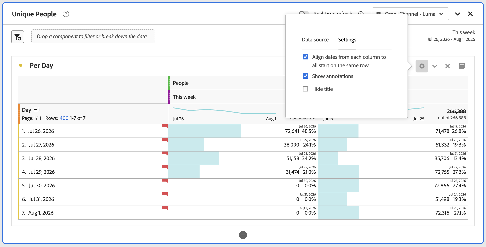

# 日期比较

Analysis Workspace中的日期比较允许您采用包含日期范围的任何列来创建常见的日期比较，例如：年同比、季度同比、月同比，等等。

## 比较时段

分析需要上下文，而这种上下文往往来自前一个时段。 例如，问题&#x200B;*与去年的这个时候相比，您现在的表现好或坏多少？* 对于了解您的业务至关重要。 日期对比功能会自动包含一个&#x200B;*差异*&#x200B;列，用于显示与指定时段相比的百分比变化。

1. 创建一个[自由格式表格](/help/analysis-workspace/visualizations/freeform-table/freeform-table.md)，自由选择您希望在指定时段内进行对比的维度和量度。
1. 在面板或列中设置时间范围，以确定比较的时间周期，并指定是滚动时间比较还是固定时间比较。

   要创建滚动时间比较，请将面板或列的日期范围设置为滚动日期范围（例如&#x200B;**[!UICONTROL 最近 7 天]**、**[!UICONTROL 最近 30 天]**&#x200B;等）。

   要创建固定时间比较，请将面板或列的日期范围设置为自定义日期范围。

1. 打开表格行的上下文菜单，然后选择&#x200B;**[!UICONTROL 比较时段]**。

   

   >[!NOTE]
   >
   >此上下文菜单选项在量度行、日期范围行和时间维度行中被禁用。

1. 根据您为表格设置的日期范围，您可以选择以下比较方式：

   | 选项 | 描述 |
   |---|---|
   | **[!UICONTROL 相对于该日期范围的前 *x* 周／月／季／年]** | 与紧邻该日期范围之前的所选日期范围进行比较。 |
   | **[!UICONTROL 去年与该日期范围对应的 x 周／月／季／年]** | 与一年前的相同日期范围进行比较。 |
   | **[!UICONTROL 将日期范围自定义为该日期范围]** | 允许您自定义日期范围。 |

   >[!NOTE]
   >
   >如果您选择自定义天数，例如 10 月 7 日至 10 月 20 日（14 天范围），您将只获得 2 个选项：**[!UICONTROL 在此日期范围之前的 14 天]**&#x200B;和&#x200B;**[!UICONTROL 将日期范围自定义为此日期范围]**。

1. 生成的对比结果如下所示：

   

   “百分比变化”列中的数值为负时显示为红色，为正时显示为绿色。

## 添加用于对比的时段列

您现在可以为表格中的每一列添加一个时间段，此操作允许您添加一个不用于日程表设置的时段。

1. 右键单击表格中的列并选择&#x200B;**[!UICONTROL 添加时间段列]**。

   

1. 根据您为表格设置的日期范围，您可以选择以下比较方式：

   | 选项 | 描述 |
   |---|---|
   | **[!UICONTROL 相对于该日期范围的前 *x* 周／月／季／年]** | 在此日期范围之前添加具有周/月/等的列。 |
   | **[!UICONTROL 去年与该日期范围对应的 *x* 周／月／季／年]** | 添加一年前的同一日期范围。 |
   | **[!UICONTROL 将日期范围自定义为此日期范围]** | 允许您创建自定义日期范围。 |

   >[!NOTE]
   >
   >如果您选择自定义天数，例如 10 月 7 日至 10 月 20 日（14 天范围），您将只获得 2 个选项：**[!UICONTROL 在此日期范围之前的 14 天]**&#x200B;和&#x200B;**[!UICONTROL 将日期范围自定义为此日期范围]**。

1. 时段会被插入到选定列的顶部：

   

1. 您可以根据需要添加任意数量的时间列，还可以混合和匹配不同的日期范围：

1. 此外，您还可以对各列进行排序，排序依据的不同会改变日期的排列顺序。

## 将列日期调整为从同一行开始

您可以将每列的日期调整为全部从同一行开始。

例如，您可以对上一周（截至 2024 年 10 月 5 日）与前一周进行按日对比分析。 默认情况下，左侧列将从 9 月 22 日开始，右侧列将从 9 月 29 日开始。

您可以在自由格式表格可视化的[设置](/help/analysis-workspace/visualizations/freeform-table/freeform-table.md#settings-1)中启用&#x200B;**[!UICONTROL 对齐日期，使各列的日期从同一行开始]**，从而实现日期对齐。

使用此选项时，请考虑以下事项：

* 所有新项目均默认启用此设置。

* 此设置适用于整个表格。 例如，如果您在表格中的某个细分中更改此设置，该设置将应用于整个表格。

