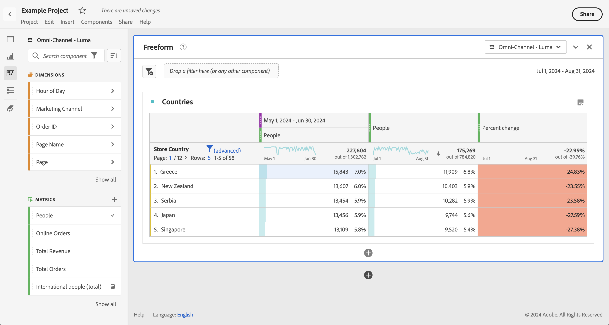

# 日期比较

Analysis Workspace中的日期比较允许您采用包含日期范围的任何列来创建常见的日期比较，例如：年同比、季度同比、月同比，等等。

## 比较时间段

分析需要上下文，通常这类上下文是由前一时间段提供的。例如，问题&#x200B;*与去年的这个时候相比，您现在的表现要好多少或坏多少？*&#x200B;是了解您的业务的基础。 日期比较自动包括&#x200B;*差异*&#x200B;列，该列显示与指定时间段相比的百分比变化。

1. 创建一个[自由格式表](/help/analysis-workspace/visualizations/freeform-table/freeform-table.md)，其中包含您要在一个时间段内比较的任何维度和量度。
1. 打开表格行的上下文菜单，然后选择&#x200B;**[!UICONTROL 比较时间段]**。

   

   >[!NOTE]
   >
   >对于量度行、日期范围行和时间维度行，此上下文菜单选项处于禁用状态。

1. 根据您设置表格日期范围的具体方式，您可以使用以下选项进行比较：

   | 选项 | 描述 |
   |---|---|
   | **[!UICONTROL 在此日期范围&#x200B;*之前的*x]**&#x200B;周/月/季度/年 | 与此日期范围之前的选定日期范围进行比较。 |
   | **[!UICONTROL 去年到此日期范围的x周/月/季度/年]** | 与一年前的同一日期范围进行比较。 |
   | **[!UICONTROL 将日期范围自定义为此日期范围]** | 允许您定义自定义日期范围。 |

   >[!NOTE]
   >
   >如果您选择自定义天数，例如 10 月 7 日至 10 月 20 日（14 天范围），您将只获得 2 个选项：**[!UICONTROL 在此日期范围之前的 14 天]**&#x200B;和&#x200B;**[!UICONTROL 将日期范围自定义为此日期范围]**。

1. 得出的比较与下图类似：

   

   “百分比变化”列中的行在负值时显示为红色，在正值时显示为绿色。

## 添加时间段列以进行比较

您现在可以向表中的每一列添加一个时间段，从而添加与日历所设置的时间段不同的时间段。

1. 右键单击表格中的列并选择&#x200B;**[!UICONTROL 添加时间段列]**。

   

1. 根据您设置表格日期范围的具体方式，您可以使用以下选项进行比较：

   | 选项 | 描述 |
   |---|---|
   | **[!UICONTROL 在此日期范围&#x200B;*之前的*x]**&#x200B;周/月/季度/年 | 添加具有周/月/等的列。 紧邻此日期范围之前。 |
   | **[!UICONTROL 去年至此日期范围的这&#x200B;*x*周/月/季度/年]** | 添加一年前的同一日期范围。 |
   | **[!UICONTROL 将日期范围自定义为此日期范围]** | 允许您创建自定义日期范围。 |

   >[!NOTE]
   >
   >如果您选择自定义天数，例如 10 月 7 日至 10 月 20 日（14 天范围），您将只获得 2 个选项：**[!UICONTROL 在此日期范围之前的 14 天]**&#x200B;和&#x200B;**[!UICONTROL 将日期范围自定义为此日期范围]**。

1. 此时段插入在您选择的列的顶部：

   

1. 您可以根据需要添加任意数量的时间列，还可以混合和匹配不同的日期范围：

1. 此外，您可以对每个列进行排序，这根据排序所在的列更改天顺序。

## 将列日期调整为从同一行开始

您可以将每列的日期调整为全部从同一行开始。

例如，您会对上周（截至2024年10月5日）和前一周进行逐日比较。 默认情况下，左列将从9月22日开始，右列将从9月29日开始。

对于自由格式表可视化图表，您可以在&#x200B;**[!UICONTROL 设置]**&#x200B;中启用[将每列的日期调整为全部从同一行](/help/analysis-workspace/visualizations/freeform-table/freeform-table.md#settings-1)开始，将列日期调整为从同一行开始。

使用此选项时，请考虑以下事项：

* 所有新项目均默认启用此设置。

* 此设置适用于整个表格。例如，如果更改表中划分的此设置，则该设置将应用于整个表。

