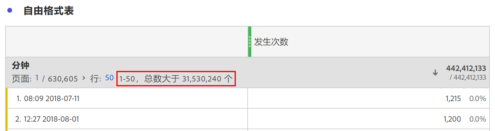

# Dimension基数很高

Customer Journey Analytics(CJA)不对可在单个维度中报告的唯一值或维度项目数量设置限制。 但是，在某些情况下，具有极大数量唯一项的维度（也称为高基数维度）可能会影响可报告的内容。

## 限制

根据特定CJA连接中的事件数，在高基数维度时可能会出现以下两种限制：

### 1.行计数可能不能精确报告

高基数维度的行计数可能无法精确报告。 发生这种情况时，自由格式表将提供如下指示：

### 2.计算量度可能使用某些函数的估计值和排序顺序

当与高度基本的维度一起使用时，某些计算量度函数可能会返回估计，包括：“列最大值”、“列最小值”、“行计数”、“平均值”、“中值”、“百分点”、“四分位”、“标准偏差”、“方差”、“回归函数”以及“T和Z函数”。

此外，使用计算量度对表列排序可以基于估计，并且不一定总是反映确切的排序顺序。 将显示一条警告消息，提醒您可能已使用了估计。

请注意，即使计算量度有时可能返回估计，列总计也始终准确，且从不基于估计。 同样，在使用标准量度时，从不使用评估，并始终反映准确的排序顺序。

### 考虑所有维度值

尽管某些计算量度和维度行计数存在限制，但请注意，无论维度是否高度主要，以下功能始终会考虑任何维度中的所有唯一值：

* 量度归因和维度分配
* 应用于自由格式表的行项搜索
* 过滤器使用维或维项
* 计算量度中的近似计数独特函数
* 包含/排除应用于数据视图中任何量度或维度的逻辑
* 已添加到连接的查找数据集

## 处理高度维度的最佳实践

为了消除使用高基数维度时可能出现的警告或估计，我们建议您使用以下方法之一来缩小报表中考虑的行数：

* 向受影响的列或面板添加过滤器。
* 将搜索应用于自由格式表。
* 将划分应用于感兴趣的行，或将高度基本的维用作划分维
* 将包含/排除条件添加到维的数据视图配置中，以缩小维中存在的唯一值数。

使用这些技术通常可以消除您在使用高基本维度时遇到的任何不期望的估计或警告。
