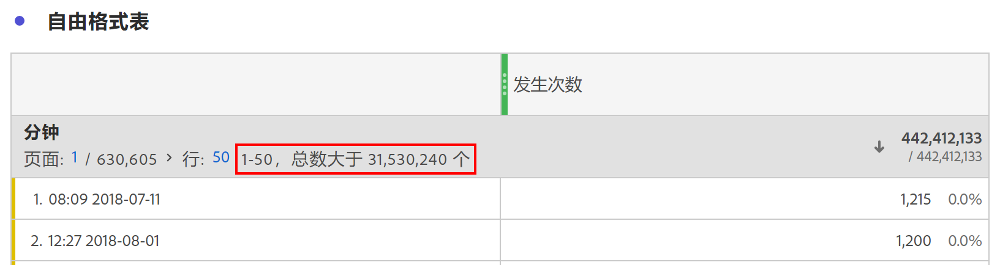

# 高基数维度

使用包含许多唯一值的维度时，生成的报表可能包含太多要显示或计算的唯一维度项。 通过删除被认为最不重要的维度项目，截断结果。 这些优化是为了保持项目和产品性能。

当您请求包含具有过多唯一值的维度的报告时，Analysis Workspace 会在维度标题中显示一个指示器，表明并非所有维度项都包含在内。 例如，**[!UICONTROL 行：超过22,343,156]**&#x200B;的1-50。 **[!UICONTROL 大于]**&#x200B;关键字表示已对报表应用了一些优化，以返回最重要的维度项。

## 确定要显示的维度项目

Customer Journey Analytics在运行报表时对其进行处理，将组合数据集分发到多台服务器。 数据请求的大小和可用Adobe硬件的数量是许多因素中的两个，这些因素有助于确定分配给处理报告的服务器数量。 由于服务器是动态分配的，在界面中不可见，因此无法查看或控制处理报告的服务器数量。

每个处理服务器的数据按人员ID分组，这意味着单个处理服务器包含给定人员的所有数据。 一旦服务器完成处理，它就会将其处理过的数据的子集交给聚合器服务器。 所有已处理数据的子集都以工作区报表的形式组合并返回。

如果任何单个服务器处理的数据超过唯一阈值，它将先截断结果，然后再返回已处理的数据子集。 已截断的维度项目是根据用于排序的量度确定的。

如果排序量度是计算量度，则服务器使用计算量度中的量度来确定要截断的维度项目。 由于计算量度可以包含多个具有不同重要性的量度，因此结果的准确性可能会降低。 例如，在计算“每人收入”时，会返回总收入金额和人数，并在进行分配前进行汇总。 因此，每个单独的处理服务器都会选择删除哪些项目，而不知道它们的结果如何影响整体排序。

尽管高基数报表中可能缺少某些个别维度项，但列总数是准确的，且并非基于截断的数据。 [[!UICONTROL 近似非重复计数]](/help/components/calc-metrics/cm-adv-functions.md#approximate-count-distinct)计算量度函数也不受截断维度项的影响。

## 高基数维度的最佳实践

适应高基数维度的最佳方法是限制报表处理的维度项目数。 由于所有报表在请求时都会进行处理，因此您可以调整报表参数以即时获得结果。 Adobe建议对高基数维度进行以下任何优化：

* 使用[区段](/help/components/segments/seg-create.md)。 区段在每个服务器处理数据子集时应用。
* 使用搜索。 从搜索词中排除的Dimension项目将从报表结果中删除，这样您更有可能看到所需的维度项目。
* 使用查找数据集维度。 查找数据集维度将事件数据集维度项组合在一起，从而限制返回的唯一值的数量。
* 在数据视图管理器中使用[包含/排除](/help/data-views/component-settings/include-exclude-values.md)组件设置。
* 缩短请求的日期范围。 如果许多唯一值随时间累积，则缩短Workspace报表的日期范围可以限制要处理的服务器唯一值的数量。
* 考虑使用[完全表导出](/help/analysis-workspace/export/export-cloud.md)返回表的所有行。
* 如果唯一值的数量是主要焦点，请使用[[!UICONTROL 近似非重复计数]](/help/components/calc-metrics/cm-adv-functions.md#approximate-count-distinct)计算量度函数。
