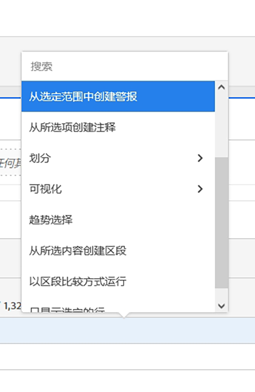

# 在 Workspace 中划分维度

>[!NOTE]
>
>您正在查看有关 Customer Journey Analytics 中 Analysis Workspace 的文档。其功能集与[传统 Adobe Analytics 中的 Analysis Workspace](https://experienceleague.adobe.com/docs/analytics/analyze/analysis-workspace/home.html) 略有不同。[了解详情...](/help/getting-started/cja-aa.md)

在 Analysis Workspace 中划分维度和维度项目。

根据您的特定需求，以无限制的方式对数据进行划分；使用相关量度、维度、过滤器、时间行和其他分析划分值生成查询。

1. [创建项目](/help/analysis-workspace/home.md)，其中包含一个数据表。
1. 在数据表中，右键单击某个行项目，然后选择&#x200B;**[!UICONTROL 划分]** > *`<item>`*。

   

   您可以按维度项目或受众过滤器在选定时间段内划分量度。 此外，您还可以进一步深入到更精细的粒度级别。

   >[!NOTE]
   >
   >数据表可显示的划分数量最多为 200 个。在导出划分时，该限额会有所增加。

**视频：Dimension在Analysis Workspace**

>[!VIDEO](https://video.tv.adobe.com/v/23971)

**视频：Dimension划分**

>[!VIDEO](https://video.tv.adobe.com/v/23969)

## 将归因模型应用于划分

也可以对表中的任何划分应用归因模型。此归因模型可能与父列相同或不同。例如，您可以对“营销渠道”维度上的线性订单进行分析，但同时将 U 型订单应用于渠道中的特定跟踪代码。要编辑已应用于划分的归因模型，只需将鼠标悬停在划分模型上，然后单击&#x200B;**[!UICONTROL 编辑]**：

