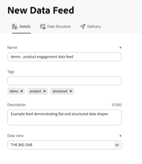
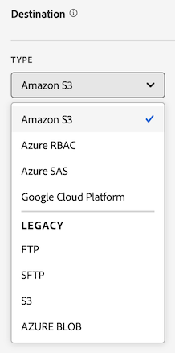
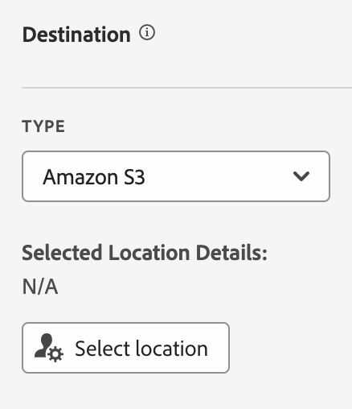
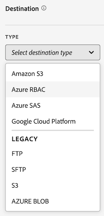
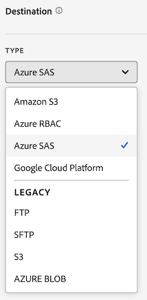

# 创建数据馈送

创建数据馈送时，您为 Adobe 提供：

* 您想将原始数据文件发送到那里的目标的信息

* 您想在每一个文件中包含的数据

* 应发送数据馈送的频率（包括捕获延迟送达点击的处理延迟）

在创建数据馈送之前，重要的是要对数据馈送有基本的了解，并确保满足所有前提条件。 更多信息请参阅[数据馈送概述](data-feed-overview.md)。

## 创建和配置数据馈送 {#create-and-configure-data-feed}

<!-- markdownlint-disable MD034 -->

>[!CONTEXTUALHELP]
>id="cja_datafeed_export_file"
>title="清单"
>abstract="选择是否在每次数据馈送传递时附带一个清单文件。 清单文件包含数据馈送中每个文件的相关信息。 如果用一个包发送数据馈送数据，您还可以选择包含一个完成文件，但建议包含清单文件。 "

<!-- markdownlint-enable MD034 -->

<!-- markdownlint-disable MD034 -->

>[!CONTEXTUALHELP]
>id="cja_datafeed_notify"
>title="完成时通知"
>abstract="指定一个或多个电子邮件地址，用于在数据馈送发送完成后接收通知。 多个电子邮件地址必须使用逗号分隔。"

<!-- markdownlint-enable MD034 -->

<!-- markdownlint-disable MD034 -->

>[!CONTEXTUALHELP]
>id="cja_datafeed_lookback_date_range"
>title="回顾日期范围"
>abstract="控制在处理数据馈送传递时 Customer Journey Analytics 回顾的时间范围。 此设置不会改变频率窗口（小时或天）。 但是，回顾日期范围可能会影响传递的数据。 区段鉴别、会话计算、某些派生字段转换和维度持久性都受回顾日期范围的影响。"

<!-- markdownlint-enable MD034 -->

1. 使用您的 Adobe ID 凭据登录 [experiencecloud.adobe.com](https://experiencecloud.adobe.com)。

1. 从界面右上角的应用切换器&#x200B;[!UICONTROL **应用程序**]&#x200B;中选择 。

1. 在顶部导航栏中前往&#x200B;[!UICONTROL **管理员**] > [!UICONTROL **数据馈送**]。

1. 选择&#x200B;[!UICONTROL **创建数据馈送**]。

   显示的页面具有以下选项卡： [!UICONTROL **详细信息**]、[!UICONTROL **数据结构**]&#x200B;和&#x200B;[!UICONTROL **投放**]。

   

1. 在&#x200B;[!UICONTROL **详细信息**]&#x200B;部分中，完成以下字段：

   | 字段 | 功能 |
   |---------|----------|
   | [!UICONTROL **名称**] | 数据馈送的名称。 名称在所选数据视图中必须是唯一的，长度最多为255个字符。<!--[Learn more](/help/export/analytics-data-feed/df-faq.md#must-feed-names-be-unique)--> |
   | [!UICONTROL **标记**] | 将任何标记应用到数据馈送以方便分类。<!--You can filter on tags as described in [Filter and search the list of data feeds](/help/export/analytics-data-feed/df-manage-feeds.md#filter-and-search-the-list-of-data-feeds) in [Manage data feeds](/help/export/analytics-data-feed/df-manage-feeds.md).--> |
   | [!UICONTROL **描述**] | 指定数据馈送的描述。 编辑数据馈送时，您添加的描述可见。 |
   | [!UICONTROL **数据视图**] | 选择包含要导出的数据的数据视图。 |

1. 在&#x200B;[!UICONTROL **数据结构**]&#x200B;部分中，确保在&#x200B;**[!UICONTROL 数据视图]**&#x200B;字段中选择了正确的数据视图。 
选择数据视图时，请考虑以下事项：
 <ul><li>如果为同一数据视图创建了多个数据馈送，则每个数据馈送必须具有不同的列定义。</li><li>可用列的列表取决于所选数据视图所属的登录公司。 如果更改数据视图，则可用列的列表可以更改。 </li></ul>

1. 向数据馈送配置添加列。 在左侧的组件边栏部分中，找到您要包含的任何列，然后将它们拖动到画布中以构建数据结构。 您可以通过按住&#x200B;**[!UICONTROL Shift]**&#x200B;或按住&#x200B;**[!UICONTROL Command]**（在macOS上）或&#x200B;**[!UICONTROL Ctrl]**（在Windows上）来选择多个列。

   使用以下信息可了解始终包含的维度、无法包含的维度以及必须替换的量度：

   +++ 始终包含在数据馈送中的维度

   默认情况下，每个数据馈送中都包含以下维度，且无法删除这些维度：

   | 维度名称 | 注释 | 数据馈送 | 其他报表 |
   |---|---|---|---|
   | 时间戳 | 事件期间的时间戳。 微秒粒度。 以UTC表示。 | 必需 | 不可用 |
   | 行Id | 唯一行标识符 | 必需 | 不可用 |
   | 会话ID | 每个会话的唯一标识符 | 必需 | 不可用 |
   | 人员 ID | 数据视图和连接的人员标识符 | 必需 | 可选标准 |
   | 帐户ID [!BADGE B2B edition]{type=Informative url="https://experienceleague.adobe.com/zh-hans/docs/analytics-platform/using/cja-overview/cja-b2b/cja-b2b-edition" newtab=true tooltip="Customer Journey Analytics B2B Edition"} | 使用帐户容器时的帐户ID | 必需 | 可选标准 |

   +++

   +++ 不能包含在数据馈送中的维度

   Customer Journey Analytics标准维度不能包含在数据馈送中。 下表列出了这些维：

   | 维度名称 | 注释 | 数据馈送 |
   |---|---|---|
   | 5 分钟 | 发生事件时的五分钟间隔（向下舍入） | 不可用 |
   | 15 分钟 | 发生事件时的15分钟间隔（向下舍入） | 不可用 |
   | 30 分钟 | 发生事件时的三十分钟间隔（向下舍入） | 不可用 |
   | 日 | 发生事件的日期 | 不可用 |
   | 每周时间 | 事件发生在一周中的哪一天 | 不可用 |
   | 月中几号 | 发生事件的日期 | 不可用 |
   | 事件深度 | 顺序数值（1、2、3等） 分配给会话中的每个事件交互 | 不可用 |
   | 小时 | 发生事件的小时（向下舍入） | 不可用 |
   | 小时 | 发生事件的一天中的第几个小时（向下舍入） | 不可用 |
   | 分钟 | 发生事件的分钟数（向下舍入） | 不可用 |
   | 一小时中的第几分钟 | 发生事件时所用的分钟（向下舍入） | 不可用 |
   | 月 | 发生事件的月份 | 不可用 |
   | 月份 | 发生事件的月份 | 不可用 |
   | 季度 | 发生事件的季度 | 不可用 |
   | 季度 | 发生事件的季度 | 不可用 |
   | Second | 发生事件后（向下舍入） | 不可用 |
   | 周 | 发生事件的周 | 不可用 |
   | 一年中的第几周 | 事件发生的一年中的第几周 | 不可用 |
   | 年 | 发生事件的年份 | 不可用 |

   +++

   +++ 必须在数据馈送中替换的量度

   必须替换以下Customer Journey Analytics指标：

   | 量度名称 | 注释 | 数据馈送 |
   |---|---|---|
   | 帐户 [!BADGE B2B Edition]{type=Informative url="https://experienceleague.adobe.com/zh-hans/docs/analytics-platform/using/cja-overview/cja-b2b/cja-b2b-edition" newtab=true tooltip="Customer Journey Analytics B2B Edition"} | 基于连接中指定的帐户ID | 不可用。 使用帐户ID的不同计数。 |
   | 购买组[!BADGE B2B edition]{type=Informative url="https://experienceleague.adobe.com/zh-hans/docs/analytics-platform/using/cja-overview/cja-b2b/cja-b2b-edition" newtab=true tooltip="Customer Journey Analytics B2B Edition"} | 基于关联中的购买群组ID购买群组 | 不可用。 使用不同于购买组ID的计数。 |
   | 事件 | 来自连接中所有事件数据集的行数 | 不可用。 使用行ID的不同计数。 |
   | 全球帐户 [!BADGE B2B Edition]{type=Informative url="https://experienceleague.adobe.com/zh-hans/docs/analytics-platform/using/cja-overview/cja-b2b/cja-b2b-edition" newtab=true tooltip="Customer Journey Analytics B2B Edition"} | 基于连接中的全局帐户ID | 不可用。 使用全局帐户ID的不同计数。 |
   | 机会 [!BADGE B2B Edition]{type=Informative url="https://experienceleague.adobe.com/zh-hans/docs/analytics-platform/using/cja-overview/cja-b2b/cja-b2b-edition" newtab=true tooltip="Customer Journey Analytics B2B Edition"} | 基于连接中的机会ID的销售机会 | 不可用。 使用不同于机会ID的计数。 |
   | 人员 | 基于连接中指定的人员ID | 不可用。 使用人员ID的不同计数。 |
   | 对话 | 对话数 | 不可用。 使用对话ID的不同计数。 |
   | 会话结束 | 会话的最后一个事件的事件数 | 不可用 |
   | 会话开始 | 会话的第一个事件的事件数 | 不可用 |
   | 会话 | 基于数据视图的会话设置 | 不可用。 使用会话ID的不同计数。 |
   | 逗留时间（秒） | 汇总两个不同维度值之间的时间 | 不可用 |

   +++

   +++ 可选标准组件

   | 组件名称 | 类型 | 注释 | 数据馈送 |
   |---|---|---|---|
   | 上午/下午 | 时间划分维度 | 上午或下午 | 不可用 |
   | 批次 ID | 维度 | Experience Platform批次的标识符 | 可用 |
   | 数据集 ID | 维度 | Experience Platform数据集的标识符 | 可用 |
   | 月中几号 | 时间划分维度 | 1-31 | 不可用 |
   | 每周时间 | 时间划分维度 | 星期一到星期日 | 不可用 |
   | 每年的某一天 | 时间划分维度 | 1-366 | 不可用 |
   | 小时 | 时间划分维度 | 0-23 | 不可用 |
   | 月份 | 时间划分维度 | 1-12月份 | 不可用 |
   | 首次会话 | 量度 | 个人在报告窗口内的首次定义的会话 | 不可用 |
   | 返回会话 | 量度 | 非个人首次会话的会话 | 不可用 |
   | 人员ID命名空间 | 维度 | 人员ID包含的ID类型（例如，电子邮件或Cookie ID） | 可用 |
   | 全局帐户ID [!BADGE B2B edition]{type=Informative url="https://experienceleague.adobe.com/zh-hans/docs/analytics-platform/using/cja-overview/cja-b2b/cja-b2b-edition" newtab=true tooltip="Customer Journey Analytics B2B Edition"} | 维度 | 使用全局帐户容器时的全局帐户ID | 可用 |
   | 机会ID [!BADGE B2B edition]{type=Informative url="https://experienceleague.adobe.com/zh-hans/docs/analytics-platform/using/cja-overview/cja-b2b/cja-b2b-edition" newtab=true tooltip="Customer Journey Analytics B2B Edition"} | 维度 | 使用Opportunity容器时的机会ID | 可用 |
   | 购买群ID [!BADGE B2B edition]{type=Informative url="https://experienceleague.adobe.com/zh-hans/docs/analytics-platform/using/cja-overview/cja-b2b/cja-b2b-edition" newtab=true tooltip="Customer Journey Analytics B2B Edition"} | 维度 | 使用购买组容器时购买组ID | 可用 |
   | 季度 | 时间划分维度 | 第一季度、第二季度、第三季度和第四季度 | 不可用 |
   | 重复会话 | 量度 | 不是个人的首次会话 | 不可用 |
   | 会话类型 | 维度 | 两个值：首次或返回 | 不可用 |
   | 每个事件逗留时间 | 维度 | 将耗时指标装入事件桶 | 不可用 |
   | 每个会话逗留时间 | 维度 | 将耗时指标装入会话桶 | 不可用 |
   | 每人逗留时间 | 维度 | 将耗时指标装入人员桶 | 不可用 |
   | 周末/工作日 | 时间划分维度 | 周末或工作日 | 不可用 |

   +++

1. 在&#x200B;[!UICONTROL **投放**]&#x200B;部分中，指定以下信息：

   | 字段 | 功能 |
   |---------|----------|
   | [!UICONTROL **馈送类型**] | 选择要创建的信息源类型：<ul><li>[!UICONTROL **实时馈送**]：导出当前和未来的数据。</li><li>[!UICONTROL **回填馈送**]：导出两个过去日期之间的历史数据。</li></ul> |
   | [!UICONTROL **开始日期**] | 指定希望数据馈送开始的日期。 要立即开始处理历史数据的数据馈送，请确保已选择&#x200B;[!UICONTROL **回填馈送**]，然后将此日期设置为收集数据时的过去任何日期。 开始日期基于数据视图的时区。 |
   | [!UICONTROL **结束日期**] | 指定您希望数据馈送结束的日期。 结束日期基于数据视图的时区。 |
   | [!UICONTROL **频率**] | 选择应发送数据馈送的频率。 时间戳位于频率范围内的事件将包含在数据馈送交付中。 [!UICONTROL **回顾日期范围**]&#x200B;和&#x200B;[!UICONTROL **处理延迟**]&#x200B;字段也会影响所选投放频率的数据中包含哪些事件。
对于实时馈送，选择以包含一小时的数据或一天的数据。 回填馈送必须为每日馈送。
<ul><li>**每日**：馈送包含一整天的数据，从数据视图时区的午夜到午夜。 此选项可用于回填馈送或实时馈送。</li><li>**小时**：馈送包含一小时的数据。 对实时馈送使用此选项。</li></ul> |
   | [!UICONTROL **回顾日期范围**] | 控制在处理数据馈送传递时 Customer Journey Analytics 回顾的时间范围。 
此设置不会更改频率窗口（小时或天），该窗口定义要包含在数据馈送输出中的事件的时间范围。 但是，回顾日期范围可能会以下列方式影响投放的数据： 
<ul><li>**区段鉴别**：将区段应用于您的数据馈送定义时，回顾日期范围内的任何事件都会确定人员是否符合条件。 区段的容器设置确定范围。 (可能的容器包括：“人员”、“会话”或“事件”。 B2B具有以下附加容器：全球客户、客户、商机、购买团体。)  
例如，如果使用了人员容器并且该人员在回顾日期范围内符合条件，则该人员在频率窗口期间的所有事件也符合条件。
</li><li>**会话计算**：会话边界是使用回顾日期范围内的数据计算的。</li><li>**派生字段转换**：引用容器的任何派生字段函数（如“摘要”、“去重”和“深度”函数）在数据馈送导出中使用回顾日期范围。</li><li>**Dimension持久性**：如果选择在单个维度上设置持久性，则还需要选择到期时间，以确定维度项在从中设置它的事件之外保持多久。 
当数据视图中的过期时间设置为以下任一选项时，回顾日期范围会影响维度持久性：
<ul><li>对于数据馈送定义中使用&#x200B;[!UICONTROL **报告窗口**]&#x200B;作为其到期时间的每个维度，回顾日期范围将成为新的报告窗口。</li><li>对于数据馈送定义中使用&#x200B;[!UICONTROL **自定义时间**]&#x200B;作为其到期时间的每个维度，如果选择的自定义时间超出回顾日期范围，则忽略自定义时间，并将回顾日期范围用于维度到期。
有关在数据视图中设置维度的持久性的详细信息，请参阅[持久性组件设置](/help/data-views/component-settings/persistence.md)。
</li></ul> |
   | [!UICONTROL **处理延迟**] | 选择在处理数据馈送文件之前等待的时间。 在处理延迟期间传入的任何迟到的点击都包含在数据馈送中。 
延迟可用于为移动设备实施提供使离线设备变为在线并发送数据的机会。 它还可用于在管理以前处理的文件时容纳组织的服务器端进程。 

馈送可能会延迟2、3、4或8小时。
会话必须在处理延迟截止之后开始才能被包含；在截止之前开始并在处理延迟内结束的会话不包含在内。
 |

1. 在&#x200B;[!UICONTROL **目标**]&#x200B;部分中，配置要将数据发送到的目标。

   >[!NOTE]
   >
   >在配置报表目标时，请考虑以下事项：
   >
   ><!--* Adobe recommends using a cloud account for your report destination. [Legacy FTP and SFTP accounts](/help/components/locations/configure-import-accounts.md) are available, but are not recommended.-->
   >* 您之前配置的任何云帐户均可用于数据馈送。 您可以从位置管理器的[组件>导出>位置帐户](/help/components/exports/cloud-export-accounts.md)中配置云帐户。
   >
   >* Cloud帐户与您的Customer Journey Analytics用户帐户相关联。 其他用户无法使用或查看您配置的云帐户，除非您将其提供给组织中的所有用户。
   >
   >* 您可以在[组件>导出>位置](/help/components/exports/cloud-export-locations.md)中编辑从“位置”管理器创建的任何位置。

   请完成以下字段：

   | 字段 | 功能 |
   |---------|----------|
   | [!UICONTROL **帐户**] | 执行以下其中一项操作：<ul><li>**使用现有帐户：**&#x200B;选择&#x200B;**[!UICONTROL 帐户]**&#x200B;字段旁边的下拉菜单。 或者，开始键入帐户名称，然后从下拉菜单中选择该名称。 
只有在配置帐户或与您所属的某个组织共享帐户后，您才可以使用帐户。
</li><li>**创建新帐户：**&#x200B;在&#x200B;**[!UICONTROL 帐户]**&#x200B;字段下选择&#x200B;**[!UICONTROL 添加新]**。 有关如何配置帐户的信息，请参阅[配置云导出帐户](/help/components/exports/cloud-export-accounts.md)。</li></ul> |
   | [!UICONTROL **位置**] | 执行以下其中一项操作：<ul><li>**使用现有位置：**&#x200B;选择&#x200B;**[!UICONTROL 位置]**&#x200B;字段旁边的下拉菜单。 或者，开始键入位置名称，然后从下拉菜单中选择该位置。</li><li>**创建新位置：**&#x200B;在&#x200B;**[!UICONTROL 位置]**&#x200B;字段下选择&#x200B;**[!UICONTROL 添加新]**。 有关如何配置位置的信息，请参阅[配置云导出位置](/help/components/exports/cloud-export-locations.md)。</li></ul> |
   | [!UICONTROL **完成时通知**] | 指定一个或多个电子邮件地址，在成功发送数据馈送或无法发送数据馈送后，应将通知发送到这些地址。 多个电子邮件地址必须使用逗号分隔。 |
   | [!UICONTROL **启用清单**] | 选择是否在每次数据馈送传递时附带一个清单文件。 清单文件包含数据馈送中包含的每个文件的信息。 |

1. 选择&#x200B;**[!UICONTROL 保存]**。

<!-- why would you want to do this? -->

<!--
I don't think we need anything after this, but saving here just in case:

1. In the [!UICONTROL **Feed Information**] section, complete the following fields:
   
   | Field | Function |
   |---------|----------|
   | [!UICONTROL **Name**] | The name of the data feed. Must be unique within the selected report suite, and can be up to 255 characters in length. [Learn more](/help/export/analytics-data-feed/df-faq.md#must-feed-names-be-unique) |
   | [!UICONTROL **Report suite**] | The report suite that the data feed is based on. If multiple data feeds are created for the same report suite, they must have different column definitions. Only source report suites support data feeds; virtual report suites are not supported. |
   | [!UICONTROL **Email when complete**] | The email address to be notified when a feed finishes processing. The email address must be properly formatted. |
   | [!UICONTROL **Feed interval**] | Select **Daily** for backfill or historical data. Daily feeds contain a full day's worth of data, from midnight to midnight in the report suite's time zone. Select **Hourly** for continuing data (Daily is also available for continuing feeds if you prefer). Hourly feeds contain a single hour's worth of data. |
   | [!UICONTROL **Delay processing**] | Wait a given amount of time before processing a data feed file. A delay can be useful to give mobile implementations an opportunity for offline devices to come online and send data. It can also be used to accommodate your organization's server-side processes in managing previously processed files. In most cases, no delay is needed. A feed can be delayed by up to 120 minutes. |
   | [!UICONTROL **Start & end dates**] | The start date indicates the date when you want the data feed to begin. To immediately begin processing data feeds for historical data, set this date to any date in the past when data is being collected. The start and end dates are based on the report suite's time zone. |
   | [!UICONTROL **Continuous feed**] | This checkbox removes the end date, allowing a feed to run indefinitely. When a feed finishes processing historical data, a feed waits for data to finish collecting for a given hour or day. Once the current hour or day concludes, processing begins after the specified delay. |
   
1. In the [!UICONTROL **Destination**] section, in the [!UICONTROL **Type**] drop-down menu, select the destination where you want the data to be sent. 

   >[!NOTE]
   >
   >Consider the following when configuring a report destination:
   >
   >* We recommend using a cloud account for your report destination. [Legacy FTP and SFTP accounts](#legacy-destinations) are available, but are not recommended.
   >* Any cloud accounts that you previously configured are available to use for Data Feeds. You can configure cloud accounts in any of the following ways:
   >
   >   * When configuring cloud accounts for [Data Warehouse](/help/export/data-warehouse/create-request/dw-request-report-destinations.md) 
   >   
   >   * When [importing Adobe Analytics classification data](/help/components/locations/locations-manager.md) (Any locations that are configured for importing classification data cannot be used.)
   >   
   >   * From the Locations manager, in [Components > Locations](/help/components/locations/configure-import-accounts.md) 
   >
   >* Cloud accounts are associated with your Adobe Analytics user account. Other users cannot use or view cloud accounts that you configure.
   >
   >* You can edit any locations that you create from the Locations manager in [Components > Locations](/help/components/locations/configure-import-accounts.md)

   

   Use any of the following destination types when creating a data feed. For configuration instructions, expand the destination type. (Additional [legacy destinations](#legacy-destinations) are also available, but are not recommended.)

   +++Amazon S3

   You can send feeds directly to Amazon S3 buckets. This destination type requires only your Amazon S3 account and the location (bucket). 

   Adobe Analytics uses cross-account authentication to upload files from Adobe Analytics to the specified location in your Amazon S3 instance.

   When using Amazon S3 with Data Feeds, only SSE-S3 encryption is supported.

   To configure an Amazon S3 bucket as the destination for a data feed:

   1. Begin creating a data feed as described in [Create and configure a data feed](#create-and-configure-a-data-feed).
   
   1. In the [!UICONTROL **Destination**] section, in the [!UICONTROL **Type**] drop-down menu, select [!UICONTROL **Amazon S3**].

      

   1. Select [!UICONTROL **Select location**].

      The Amazon S3 Export Locations page is displayed.

   1. (Conditional) If an Amazon S3 account (and a location on that account) has already been configured in Adobe Analytics, you can use it as your data feed destination: 

      >[!NOTE]
      >
      >Accounts are available to you only if you configured them or if they were shared with an organization you are a part of.
   
      1. Select the account from the [!UICONTROL **Select account**] drop-down menu.

         Any cloud accounts that were configured in any of the following areas of Adobe Analytics are available to use:
      
         * When importing Adobe Analytics classification data, as described in [Schema](/help/components/classifications/sets/manage/schema.md).
      
           However, any locations that are configured for importing classification data cannot be used. Instead, add a new destination as described below.

         * When configuring accounts and locations in the Locations area, as described in [Configure cloud import and export accounts](/help/components/locations/configure-import-accounts.md) and [Configure cloud import and export locations](/help/components/locations/configure-import-locations.md).
   
      1. Select the location from the [!UICONTROL **Select location**] drop-down menu.

      1. Select [!UICONTROL **Save**] > [!UICONTROL **Save**].

      The destination is now configured to send data to the Amazon S3 location that you specified.
   
   1. (Conditional) If you have not previously added an Amazon S3 account:

      1. Select [!UICONTROL **Add account**], then specify the following information:
   
         |Field | Function |
         |---------|----------|
         | [!UICONTROL **Account name**] | A name for the account. This can be any name you choose. |
         | [!UICONTROL **Account description**] | A description for the account. |
         | [!UICONTROL **Role ARN**] | You must provide a Role ARN (Amazon Resource Name) that Adobe can use to gain access to the Amazon S3 account. To do this, you create an IAM permission policy for the source account, attach the policy to a user, and then create a role for the destination account. For specific information, see [this AWS documentation](https://aws.amazon.com/premiumsupport/knowledge-center/cross-account-access-iam/). |
         | [!UICONTROL **User ARN**] | The User ARN (Amazon Resource Name) is provided by Adobe. You must attach this user to the policy you created. |

         {style="table-layout:auto"}

      1. Select [!UICONTROL **Add location**], then specify the following information:
   
         |Field | Function |
         |---------|----------|
         | [!UICONTROL **Name**] | A name for the account.  |
         | [!UICONTROL **Description**] | A description for the account. |
         | [!UICONTROL **Bucket**] | The bucket within your Amazon S3 account where you want Adobe Analytics data to be sent. 
Ensure that the User ARN that was provided by Adobe has the `S3:PutObject` permission in order to upload files to this bucket. This permission allows the User ARN to upload initial files and overwrite files for subsequent uploads.

Bucket names must meet specific naming rules. For example, they must be between 3 to 63 characters long, can consist only of lowercase letters, numbers, dots (.), and hyphens (-), and must begin and end with a letter or number. [A complete list of naming rules are available in the AWS documentation](https://docs.aws.amazon.com/AmazonS3/latest/userguide/bucketnamingrules.html). 
 |
         | [!UICONTROL **Prefix**] | The folder within the bucket where you want to put the data. Specify a folder name, then add a backslash after the name to create the folder. For example, `folder_name/` |

         {style="table-layout:auto"}

      1. Select [!UICONTROL **Create**] > [!UICONTROL **Save**].

         The destination is now configured to send data to the Amazon S3 location that you specified.

      1. (Conditional) If you need to manage the destination (account and location) that you just created, it is available in the [Locations manager](/help/components/locations/locations-manager.md).
   
   +++

   +++Azure RBAC

   You can send feeds directly to an Azure container by using RBAC authentication. This destination type requires an Application ID, Tenant ID, and Secret. 

   To configure an Azure RBAC account as the destination for a data feed:

   1. If you haven't already, create an Azure application that Adobe Analytics can use for authentication, then grant access permissions in access control (IAM). 
   
      For information, refer to the [Microsoft Azure documentation about how to create an Azure Active Directory application](https://learn.microsoft.com/en-us/azure/active-directory/develop/howto-create-service-principal-portal). 
   
   1. In the Adobe Analytics admin console, in the [!UICONTROL **Destination**] section, in the [!UICONTROL **Type**] drop-down menu, select [!UICONTROL **Azure RBAC**].

      

   1. Select [!UICONTROL **Select location**].

      The Azure RBAC Export Locations page is displayed.

   1. (Conditional) If an Azure RBAC account (and a location on that account) has already been configured in Adobe Analytics, you can use it as your data feed destination: 

      >[!NOTE]
      >
      >Accounts are available to you only if you configured them or if they were shared with an organization you are a part of.
   
      1. Select the account from the [!UICONTROL **Select account**] drop-down menu.

      Any cloud accounts that you configured in any of the following areas of Adobe Analytics are available to use:
      
         * When importing Adobe Analytics classification data, as described in [Schema](/help/components/classifications/sets/manage/schema.md).
      
           However, any locations that are configured for importing classification data cannot be used. Instead, add a new destination as described below.

         * When configuring accounts and locations in the Locations area, as described in [Configure cloud import and export accounts](/help/components/locations/configure-import-accounts.md) and [Configure cloud import and export locations](/help/components/locations/configure-import-locations.md).

      1. Select the location from the [!UICONTROL **Select location**] drop-down menu.

      1. Select [!UICONTROL **Save**] > [!UICONTROL **Save**].

         The destination is now configured to send data to the Azure RBAC location that you specified.

   1. (Conditional) If you have not previously added an Azure RBAC account:

      1. Select [!UICONTROL **Add account**], then specify the following information:
   
         |Field | Function |
         |---------|----------|
         | [!UICONTROL **Account name**] | A name for the Azure RBAC account. This name displays in the [!UICONTROL **Select account**] drop-down field and can be any name you choose. |
         | [!UICONTROL **Account description**] | A description for the Azure RBAC account. This description displays in the [!UICONTROL **Select account**] drop-down field and can be any name you choose.  |
         | [!UICONTROL **Application ID**] | Copy this ID from the Azure application that you created. In Microsoft Azure, this information is located on the **Overview** tab within your application. For more information, see the [Microsoft Azure documentation about how to register an application with the Microsoft identity platform](https://learn.microsoft.com/en-us/azure/active-directory/develop/quickstart-register-app). |
         | [!UICONTROL **Tenant ID**] | Copy this ID from the Azure application that you created. In Microsoft Azure, this information is located on the **Overview** tab within your application. For more information, see the [Microsoft Azure documentation about how to register an application with the Microsoft identity platform](https://learn.microsoft.com/en-us/azure/active-directory/develop/quickstart-register-app). |
         | [!UICONTROL **Secret**] | Copy the secret from the Azure application that you created. In Microsoft Azure, this information is located on the **Certificates & secrets** tab within your application. For more information, see the [Microsoft Azure documentation about how to register an application with the Microsoft identity platform](https://learn.microsoft.com/en-us/azure/active-directory/develop/quickstart-register-app). |

         {style="table-layout:auto"}

      1. Select [!UICONTROL **Add location**], then specify the following information: 
   
         |Field | Function |
         |---------|----------|
         | [!UICONTROL **Name**] | A name for the location. This name displays in the [!UICONTROL **Select location**] drop-down field and can be any name you choose. |
         | [!UICONTROL **Description**] | A description for the location. This description displays in the [!UICONTROL **Select location**] drop-down field and can be any name you choose. |
         | [!UICONTROL **Account**] | The Azure storage account. |
         | [!UICONTROL **Container**] | The container within the account you specified where you want Adobe Analytics data to be sent. Ensure that you grant permissions to upload files to the Azure application that you created earlier. |
         | [!UICONTROL **Prefix**] | The folder within the container where you want to put the data. Specify a folder name, then add a backslash after the name to create the folder. For example, `folder_name/`
Make sure the Application ID that you specified when configuring the Azure RBAC account has been granted the `Storage Blob Data Contributor` role in order to access the container (folder).
 
For more information, see [Azure built-in roles](https://learn.microsoft.com/en-us/azure/role-based-access-control/built-in-roles).
 |

         {style="table-layout:auto"}

      1. Select [!UICONTROL **Create**] > [!UICONTROL **Save**].

         The destination is now configured to send data to the Azure RBAC location that you specified.

      1. (Conditional) If you need to manage the destination (account and location) that you just created, it is available in the [Locations manager](/help/components/locations/locations-manager.md).
   
   +++

   +++Azure SAS

   You can send feeds directly to an Azure container by using SAS authentication. This destination type requires an Application ID, Tenant ID, Key vault URI, Key vault secret name, and secret. 

   To configure Azure SAS as the destination for a data feed:

   1. If you haven't already, create an Azure application that Adobe Analytics can use for authentication. 
   
      For information, refer to the [Microsoft Azure documentation about how to create an Azure Active Directory application](https://learn.microsoft.com/en-us/azure/active-directory/develop/howto-create-service-principal-portal). 
   
   1. In the Adobe Analytics admin console, in the [!UICONTROL **Destination**] section, select [!UICONTROL **Azure SAS**].

      

   1. Select [!UICONTROL **Select location**].

      The Azure SAS Export Locations page is displayed.

   1. (Conditional) If an Azure SAS account (and a location on that account) has already been configured in Adobe Analytics, you can use it as your data feed destination: 

      >[!NOTE]
      >
      >Accounts are available to you only if you configured them or if they were shared with an organization you are a part of.
   
      1. Select the account from the [!UICONTROL **Select account**] drop-down menu.

         Any cloud accounts that you configured in any of the following areas of Adobe Analytics are available to use:
      
         * When importing Adobe Analytics classification data, as described in [Schema](/help/components/classifications/sets/manage/schema.md).
      
           However, any locations that are configured for importing classification data cannot be used. Instead, add a new destination as described below.

         * When configuring accounts and locations in the Locations area, as described in [Configure cloud import and export accounts](/help/components/locations/configure-import-accounts.md) and [Configure cloud import and export locations](/help/components/locations/configure-import-locations.md).

      1. Select the location from the [!UICONTROL **Select location**] drop-down menu.

      1. Select [!UICONTROL **Save**] > [!UICONTROL **Save**].

         The destination is now configured to send data to the Azure SAS location that you specified.
   
   1. (Conditional) If you have not previously added an Azure SAS account:

      1. Select [!UICONTROL **Add account**], then specify the following information:
   
         |Field | Function |
         |---------|----------|
         | [!UICONTROL **Account name**] | A name for the Azure SAS account. This name displays in the [!UICONTROL **Select account**] drop-down field and can be any name you choose. |
         | [!UICONTROL **Account description**] | A description for the Azure SAS account. This description displays in the [!UICONTROL **Select account**] drop-down field and can be any name you choose. |
         | [!UICONTROL **Application ID**] | Copy this ID from the Azure application that you created. In Microsoft Azure, this information is located on the **Overview** tab within your application. For more information, see the [Microsoft Azure documentation about how to register an application with the Microsoft identity platform](https://learn.microsoft.com/en-us/azure/active-directory/develop/quickstart-register-app). |
         | [!UICONTROL **Tenant ID**] | Copy this ID from the Azure application that you created. In Microsoft Azure, this information is located on the **Overview** tab within your application. For more information, see the [Microsoft Azure documentation about how to register an application with the Microsoft identity platform](https://learn.microsoft.com/en-us/azure/active-directory/develop/quickstart-register-app). |
         | [!UICONTROL **Key vault URI**] | 
The path to the SAS URI in Azure Key Vault. To configure Azure SAS, you need to store an SAS URI as a secret using Azure Key Vault. For information, see the [Microsoft Azure documentation about how to set and retrieve a secret from Azure Key Vault](https://learn.microsoft.com/en-us/azure/key-vault/secrets/quick-create-portal?source=recommendations).

After the key vault URI is created:<ul><li>Add an access policy on the Key Vault in order to grant permission to the Azure application that you created.
For information, see the [Microsoft Azure documentation about how to assign a Key Vault access policy](https://learn.microsoft.com/en-us/azure/key-vault/general/assign-access-policy?tabs=azure-portal).

Or

If you want to grant an access role directly without creating an access policy, see the [Microsoft Azure documentation about how to assign Azure roles using Azure portal](https://learn.microsoft.com/en-us/azure/role-based-access-control/role-assignments-portal). This adds the role assignment for the application ID to access the key vault URI. 
</li><li>Make sure the Application ID has been granted the `Key Vault Certificate User` built-in role in order to access the key vault URI. 
For more information, see [Azure built-in roles](https://learn.microsoft.com/en-us/azure/role-based-access-control/built-in-roles).
</li></ul> |
         | [!UICONTROL **Key vault secret name**] | The secret name you created when adding the secret to Azure Key Vault. In Microsoft Azure, this information is located in the Key Vault you created, on the **Key Vault** settings pages. For information, see the [Microsoft Azure documentation about how to set and retrieve a secret from Azure Key Vault](https://learn.microsoft.com/en-us/azure/key-vault/secrets/quick-create-portal?source=recommendations). |
         | [!UICONTROL **Secret**] | Copy the secret from the Azure application that you created. In Microsoft Azure, this information is located on the **Certificates & secrets** tab within your application. For more information, see the [Microsoft Azure documentation about how to register an application with the Microsoft identity platform](https://learn.microsoft.com/en-us/azure/active-directory/develop/quickstart-register-app). |

         {style="table-layout:auto"}

      1. Select [!UICONTROL **Add location**], then specify the following information: 
   
         |Field | Function |
         |---------|----------|
         | [!UICONTROL **Name**] | A name for the location. This name displays in the [!UICONTROL **Select location**] drop-down field and can be any name you choose. |
         | [!UICONTROL **Description**] | A description for the location. This description displays in the [!UICONTROL **Select location**] drop-down field and can be any name you choose. |
         | [!UICONTROL **Container**] | The container within the account you specified where you want Adobe Analytics data to be sent. |
         | [!UICONTROL **Prefix**] | The folder within the container where you want to put the data. Specify a folder name, then add a backslash after the name to create the folder. For example, `folder_name/`
Make sure that the SAS URI store that you specified in the Key Vault secret name field when configuring the Azure SAS account has the `Write` permission. This allows the SAS URI to create files in your Azure container. 
If you want the SAS URI to also overwrite files, make sure that the SAS URI store has the `Delete` permission.

For more information, see [Blob storage resources](https://learn.microsoft.com/en-us/azure/storage/blobs/storage-blobs-introduction#blob-storage-resources) in the Azure Blob Storage documentation.
 |

         {style="table-layout:auto"}

      1. Select [!UICONTROL **Create**] > [!UICONTROL **Save**].

         The destination is now configured to send data to the Azure SAS location that you specified.

      1. (Conditional) If you need to manage the destination (account and location) that you just created, it is available in the [Locations manager](/help/components/locations/locations-manager.md).
   
   +++

   +++Google Cloud Platform

   You can send feeds directly to Google Cloud Platform (GCP) buckets. This destination type requires only your GCP account name and the location (bucket) name. 
   
   Adobe Analytics uses cross-account authentication to upload files from Adobe Analytics to the specified location in your GCP instance.

   To configure a GCP bucket as the destination for a data feed:

   1. In the Adobe Analytics admin console, in the [!UICONTROL **Destination**] section, select [!UICONTROL **Google Cloud Platform**].

      

   1. Select [!UICONTROL **Select location**].

      The GCP Export Locations page is displayed.

   1. (Conditional) If a Google Cloud Platform account (and a location on that account) has already been configured in Adobe Analytics, you can use it as your data feed destination: 

      >[!NOTE]
      >
      >Accounts are available to you only if you configured them or if they were shared with an organization you are a part of.
   
      1. Select the account from the [!UICONTROL **Select account**] drop-down menu.

         Any cloud accounts that you configured in any of the following areas of Adobe Analytics are available to use:
      
         * When importing Adobe Analytics classification data, as described in [Schema](/help/components/classifications/sets/manage/schema.md).
      
           However, any locations that are configured for importing classification data cannot be used. Instead, add a new destination as described below.

         * When configuring accounts and locations in the Locations area, as described in [Configure cloud import and export accounts](/help/components/locations/configure-import-accounts.md) and [Configure cloud import and export locations](/help/components/locations/configure-import-locations.md).

      1. Select the location from the [!UICONTROL **Select location**] drop-down menu.

      1. Select [!UICONTROL **Save**] > [!UICONTROL **Save**].

         The destination is now configured to send data to the Google Cloud Platform location that you specified.
   
   1. (Conditional) If you have not previously added a GCP account:

      1. Select [!UICONTROL **Add account**], then specify the following information:
   
         |Field | Function |
         |---------|----------|
         | [!UICONTROL **Account name**] | A name for the account. This can be any name you choose. |
         | [!UICONTROL **Account description**] | A description for the account. |
         | [!UICONTROL **Project ID**] | Your Google Cloud project ID. See the [Google Cloud documentation about getting a project ID](https://cloud.google.com/resource-manager/docs/creating-managing-projects#identifying_projects). |

         {style="table-layout:auto"}

      1. Select [!UICONTROL **Add location**], then specify the following information:
   
         |Field | Function |
         |---------|----------|
         | [!UICONTROL **Principal**] | The Principal is provided by Adobe. You must grant permission to receive feeds to this principal. |
         | [!UICONTROL **Name**] | A name for the account.  |
         | [!UICONTROL **Description**] | A description for the account. |
         | [!UICONTROL **Bucket**] | The bucket within your GCP account where you want Adobe Analytics data to be sent. 
Ensure that you have granted either of the following permissions to the Principal provided by Adobe: (For information about granting permissions, see [Add a principal to a bucket-level policy](https://cloud.google.com/storage/docs/access-control/using-iam-permissions#bucket-add) in the Google Cloud documentation.)<ul><li>`roles/storage.objectCreator`: Use this permission if you  want to limit the Principal to only create files in your GCP account.  **Important:** If you use this permission with scheduled reporting, you must use a unique file name for each new scheduled export. Otherwise, the report generation will fail because the Principal does not have access to overwrite existing files.</li><li>(Recommended) `roles/storage.objectUser`: Use this permission if you want the Principal to have access to view, list, update, and delete files in your GCP account. This permission allows the Principal to overwrite existing files for subsequent uploads, without the need to auto-generate unique file names for each new scheduled export.</li></ul>
If your organization is using [Organization policy constraints](https://cloud.google.com/storage/docs/org-policy-constraints) to allow only the Google Cloud Platform account in your allow list, you need the following Adobe-owned Google Cloud Platform organization ID: <ul><li>`DISPLAY_NAME`: `adobe.com`</li><li>`ID`: `178012854243`</li><li>`DIRECTORY_CUSTOMER_ID`: `C02jo8puj`</li></ul> 
 |
         | [!UICONTROL **Prefix**] | The folder within the bucket where you want to put the data. Specify a folder name, then add a backslash after the name to create the folder. For example, `folder_name/` |

         {style="table-layout:auto"}

      1. Select [!UICONTROL **Create**] > [!UICONTROL **Save**].

         The destination is now configured to send data to the GCP location that you specified.

      1. (Conditional) If you need to manage the destination (account and location) that you just created, it is available in the [Locations manager](/help/components/locations/locations-manager.md).
   
   +++

1. In the  [!UICONTROL **Data Column Definitions**] section, select the latest [!UICONTROL **All Adobe Columns**] template in the drop-down menu, then complete the following fields:
   
   |Field | Function |
   |---------|----------|
   | [!UICONTROL **Remove escaped characters**] | When collecting data, some characters (such as newlines) can cause issues. Check this box if you would like these characters removed from feed files. |
   | [!UICONTROL **Compression format**] | The type of compression used. **Gzip** outputs files in `.tar.gz` format. **Zip** outputs files in `.zip` format. |
   | [!UICONTROL **Packaging type**] | Select [!UICONTROL **Multiple files**] for most data feeds. This option paginates your data into uncompressed 2GB chunks. (If the [!UICONTROL **Multiple files**] option is selected and uncompressed data for the reporting window is less than 2GB, one file is sent.) Selecting **Single file** outputs the `hit_data.tsv` file in a single, potentially massive file. |
   | [!UICONTROL **Manifest**] | Determines whether Adobe should deliver a [manifest file](c-df-contents/datafeeds-contents.md#feed-manifest) to the destination when no data is collected for a feed interval. If you select **Manifest File**, you receive a manifest file similar to the following when no data is collected:
`text`

`Datafeed-Manifest-Version: 1.0`

`Lookup-Files: 0`

`Data-Files: 0`

 `Total-Records: 0`
 |
   | [!UICONTROL **Column templates**] | When creating many data feeds, Adobe recommends creating a column template. Selecting a column template automatically includes the specified columns in the template. Adobe also provides several templates by default. |
   | [!UICONTROL **Available columns**] | All available data columns in Adobe Analytics. Click [!UICONTROL Add all] to include all columns in a data feed. |
   | [!UICONTROL **Included columns**] | The columns to include in a data feed. Click [!UICONTROL Remove all] to remove all columns from a data feed. |
   | [!UICONTROL **Download CSV**] | Downloads a CSV file containing all included columns. |

1. Select [!UICONTROL **Save**] in the top-right.

    Historical data processing begins immediately. When data finishes processing for a day, the file is sent to the destination that you configured.

    For information about how to access the data feed and to get a better understanding of its contents, see [Data feed contents - overview](/help/export/analytics-data-feed/c-df-contents/datafeeds-contents.md).

## Legacy destinations

>[!IMPORTANT]
>
>The destinations described in this section are legacy, and are not recommended. Instead, use one of the following destinations when creating a data feed: Amazon S3, Google Cloud Platform, Azure RBAC, or Azure SAS. See [Create and configure a data feed](#create-and-configure-a-data-feed) for detailed information about each of these recommended destinations. 

The following information provides configuration information for each of the legacy destinations:

### FTP

Data feed data can be delivered to an Adobe or customer-hosted FTP location. Requires an FTP host, username, and password. Use the path field to place feed files in a folder. Folders must already exist; feeds throw an error if the specified path does not exist.

Use the following information when completing the available fields:

* [!UICONTROL **Host**]: Enter the desired FTP destination URL. For example, `ftp://ftp.omniture.com`.
* [!UICONTROL **Path**]: Can be left blank
* [!UICONTROL **Username**]: Enter the username to log in to the FTP site.
* [!UICONTROL **Password and confirm password**]: Enter the password to log in to the FTP site.

### SFTP

SFTP support for data feeds is available. Requires an SFTP host, username, and the destination site to contain a valid RSA or DSA public key. You can download the appropriate public key when creating the feed.

### S3

You can send feeds directly to Amazon S3 buckets. This destination type requires a Bucket name, an Access Key ID, and a Secret Key. See [Amazon S3 bucket naming requirements](https://docs.aws.amazon.com/awscloudtrail/latest/userguide/cloudtrail-s3-bucket-naming-requirements.html) within the Amazon S3 docs for more information.

The user you provide for uploading data feeds must have the following [permissions](https://docs.aws.amazon.com/AmazonS3/latest/API/API_Operations_Amazon_Simple_Storage_Service.html):

* s3:GetObject
* s3:PutObject
* s3:PutObjectAcl

  >[!NOTE]
  >
  >For each upload to an Amazon S3 bucket, [!DNL Analytics] adds the bucket owner to the BucketOwnerFullControl ACL, regardless of whether the bucket has a policy that requires it. For more information, see "[What is the BucketOwnerFullControl setting for Amazon S3 data feeds?](df-faq.md#BucketOwnerFullControl)"

The following 16 standard AWS regions are supported (using the appropriate signature algorithm where necessary):

* us-east-2
* us-east-1
* us-west-1
* us-west-2
* ap-south-1
* ap-northeast-2
* ap-southeast-1
* ap-southeast-2
* ap-northeast-1
* ca-central-1
* eu-central-1
* eu-west-1
* eu-west-2
* eu-west-3
* eu-north-1
* sa-east-1

>[!NOTE]
>
>The cn-north-1 region is not supported.

### Azure Blob

Data feeds support Azure Blob destinations. Requires a container, account, and a key. Amazon automatically encrypts the data at rest. When you download the data, it gets decrypted automatically. See [Create a storage account](https://docs.microsoft.com/en-us/azure/storage/common/storage-quickstart-create-account?tabs=azure-portal#view-and-copy-storage-access-keys) within the Microsoft Azure docs for more information.

>[!NOTE]
>
>You must implement your own process to manage disk space on the feed destination. Adobe does not delete any data from the server.

-->
