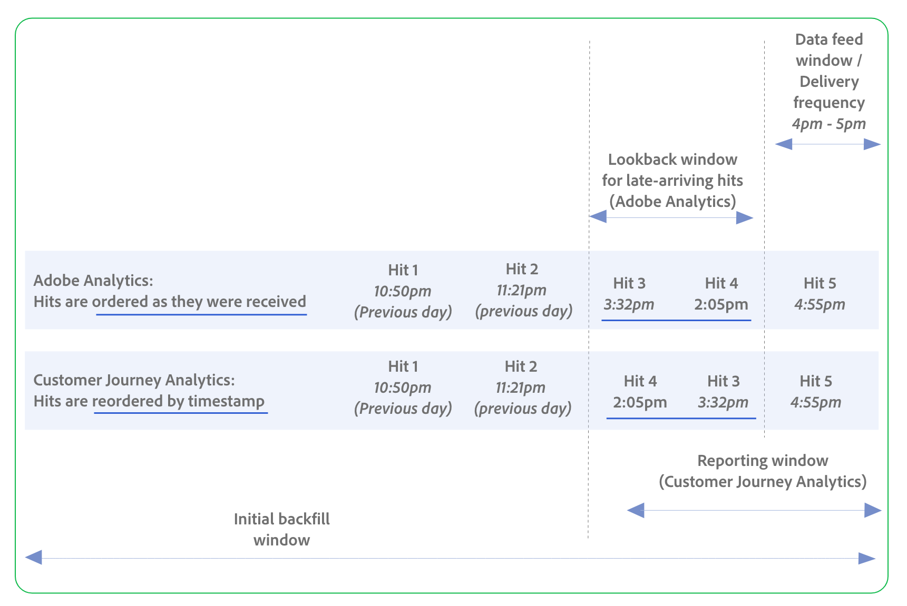

# 在Customer Journey Analytics和Adobe Analytics中比较数据馈送

Customer Journey Analytics和Adobe Analytics中的数据馈送允许您向第三方平台导出原始数据。 如果您之前在Adobe Analytics中使用过数据馈送，请使用以下信息了解可用功能、数据处理行为等之间的差异。

## 比较数据馈送功能

| **配置选项和概念** | **描述** | **Customer Journey Analytics** | **Adobe Analytics** |
|---------|----------|---------|---------|
| 数据输入 | 可以收集并包含在数据馈送中的数据类型。 | 支持跨渠道数据输入，包括Web数据、呼叫中心数据、销售点数据等。 | 仅支持Web和移动数据输入。 |
| 数据处理 | 通常需要先处理数据，然后才对报表有用，并且这种处理会影响数据馈送功能。 根据您使用的是Customer Journey Analytics还是Adobe Analytics，将在不同的阶段处理数据。 | 数据在报表时处理，因此Customer Journey Analytics中的许多报表功能可用于更改历史数据，例如拼接、派生字段、数据准备、分段和报表窗口。 | 数据在收集时进行处理，因此处理规则、VISTA规则、拼合和分段等报表功能不会影响历史数据。 |
| 数据馈送窗口/提交频率 | 确定：<ul><li>数据馈送的发送频率</li><li>数据馈送中包含的时间段
换句话说，在数据馈送窗口结束并且发送数据馈送之后，新的数据馈送窗口开始。
</li></ul>
可以使用以下选项：
<ul><li>**每日**：馈送包含一天的数据，从报表包时区的午夜到午夜。 此选项可用于回填或历史数据，或者用于连续馈送。</li><li>**小时**：馈送包含一小时的数据。 使用此选项可继续馈送。</li></ul> | 每小时和每日馈送。
数据馈送窗口包含在&#x200B;**[!UICONTROL 报告窗口]**&#x200B;中
  
示例： 1小时
 | 每小时和每日馈送。 此外，还可以15分钟馈送，但默认情况下不可用。 

可根据&#x200B;**[!UICONTROL 回顾时间范围]**&#x200B;配置迟到的点击。

示例： 1小时
 |
| 包括迟到的点击量 | 迟到的点击是指在当前数据馈送窗口期间到达，但时间戳位于之前的数据馈送窗口内的点击（例如，通过带有时间戳的点击或数据源）。 当点击迟到时，即使点击的时间戳属于较早的时间窗口，点击也会被批量发送到发送的下一个数据馈送文件中。 | 始终包括&#x200B;**[!UICONTROL 报告窗口]**&#x200B;内发生的迟到的点击。 
点击在输出中按时间戳自动重新排序（例如，如果延迟点击的时间戳更早，则延迟点击可能会显示在准时点击之前）。 没有更改信息源，因此保留原始值。 | 可包含或排除迟到的点击，并可使用&#x200B;**[!UICONTROL 迟到的点击]**&#x200B;配置选项进行配置。
通过可用于此特定用途的&#x200B;**[!UICONTROL 回顾窗口]**&#x200B;配置选项配置这些点击的回顾窗口。

点击量按其接收顺序显示；点击量不会根据时间戳重新排序。
 |
| 乱序点击 | H | 系统会为每个人评估乱序；CJA可以接受流式+批量到达模式，并在数据到达适当的时间序列后进行重新排序。 CJA在发送之前不会等待确认它是否具有报表时段的所有数据；它会发送该小时/每天到达的数据（可能包括报表时段内时间戳较早的延迟点击）。 
**重要信息**：数据馈送数据的最终使用者必须能够处理乱序的时间戳，因为数据馈送数据可能包含时间戳早于数据馈送窗口的延迟点击。
 | |
| 回顾时间范围（仅限Adobe Analytics） | 在选定的&#x200B;**[!UICONTROL 交付频率]**&#x200B;之外交付的延迟或乱序点击的截止时间（如&#x200B;**[!UICONTROL 小时]**&#x200B;或&#x200B;**[!UICONTROL 天]**）。 访问必须在此截止日期之后开始才能被包含；在截止日期之前开始并在回顾窗口内结束的访问不包含在内。
不用于持久性、会话或维度（这些包含在收集的原始数据中）。
 | 已包含在&#x200B;**[!UICONTROL 报告窗口]**&#x200B;中。 | 受支持
例如：23小时
 |
| 报表窗口（仅限Customer Journey Analytics） | 时间窗口包括：<ul><li>当前数据馈送窗口（**[!UICONTROL 提交频率]**&#x200B;字段中选择的最近小时或一天）。</li><li>在当前数据馈送窗口之前的指定时间，允许任何延迟或乱序点击。</li></ul> 
会话、持久性和区段需要。

不用于维度。 根据维度的分配和到期，按维度控制维度。 Dimension回顾不能超过报表时段。
 | 受支持
例如：24小时
 | 不适用
请参阅“回顾窗口”
 |
| 初始回填窗口 |  | 示例： 7天 | 示例： 7天 |
| 点击量 |  | 数据馈送窗口中只有点击5。 但是，由于报表窗口还包括点击4和点击3（它们是迟到的点击，带有来自上一个数据馈送窗口的时间戳），因此它们也包含在当前数据馈送窗口中。
点击在数据馈送中根据其时间戳重新排序，如下所示：点击3、点击4、点击5。
 | 数据馈送窗口中只有点击5。 但是，由于配置了回顾并且它包括点击4和点击3（它们是迟到的点击，带有来自上一个数据馈送窗口的时间戳），因此它们也包含在当前数据馈送窗口中。 （如果未配置回顾，则数据馈送中只会包含点击5。） 
点击在数据馈送中按其接收顺序显示，如下所示：点击4、点击3、点击5。
 |
| 迟到的点击量/乱序点击量 | (在AA中：数据乱序意味着：每个访客乱序。 在CJA中：这意味着每个人没有秩序。 如果您向我们发送每人乱序的数据，则会在您设置时间戳时。 您可以通过两种方式设置时间戳：让Adobe根据我们收到数据的时间设置时间戳。 或者你可以自己设置。 如果您设置了时间戳并且向我们发送了乱序数据，则会导致AA中出现问题。 在AA中，数据需要按访客排列。 我们需要正确的事件顺序。 但在CJA中，数据上的时间戳是什么无关紧要。 CJA不会为点击分配时间戳。 这是上游完成的。 CJA会在数据到达后对其进行重新排序，以使所有内容都处于正确的时间序列中。 然后进行报表时间处理。 这意味着您可以同时拥有流数据和批量数据。 没关系。 当它到达时，我们重新排序它，其结果是它变得与每个人相符了。 因此，在CJA中，我们将向您提供过去一天或一小时内收到的所有数据，但这仅限于报告窗口的开头。 最有可能的情况是，一天或一小时内获取的大量数据属于当天或一小时。 如果你只是从呼叫中心批量处理数据，那么你就只能得到这些数据。 在CJA中，数据可以输入，但何时输入并不重要。 因此数据馈送客户必须能够自行处理。 所以无论他们将数据放在哪里，都需要处理时间戳可能遍布所有位置这一事实。 对于某些客户而言，这可能是一个挑战。 他们需要知道这个。 需要能够处理每个人的乱序数据。 对人来说都无所谓。 )点击应包含在以前的数据馈送中，但由于某种原因它们迟到（例如，通过带有时间戳的点击或数据源）。 
这些迟到的点击在到达时包含在当前数据馈送中，即使其时间戳位于之前的数据馈送时段内也是如此。 每次数据馈送处理数据时，它都会查看任何已到达的迟到点击，并将它们分批放入发送的下一个数据馈送文件中。
 | 始终包括&#x200B;**[!UICONTROL 报告窗口]**&#x200B;内发生的迟到的点击。 
这些迟到的点击的回顾时间范围通过&#x200B;**[!UICONTROL 报告时间范围]**&#x200B;配置选项进行控制。

点击量会根据时间戳自动重新排序；原始值会保留（无更改馈送）。
 | 可以包含或排除。 可使用&#x200B;**[!UICONTROL 迟到的点击]**&#x200B;配置选项进行配置。
通过可用于此特定用途的&#x200B;**[!UICONTROL 回顾窗口]**&#x200B;配置选项配置这些点击的回顾窗口。

点击量按其接收顺序显示；点击量不会根据时间戳重新排序。
 |
| 分段 |   | 您在Customer Journey Analytics中配置的区段可应用于数据馈送或数据视图。
（人员、会话、事件）人员容器使用整个报告窗口；可以根据区段逻辑展开DF点击输出。
 | 无法应用区段。 |
| 拼接 | （可以改为包含在数据处理部分中） | 拼接可用于连接多个数据集（以支持跨渠道分析）。 | 不支持拼接。 |
| 架构 | （可以改为包含在数据处理部分中） | 使用结构化、分层的字段，可能在单列中包含多个维度和量度（数组；数组中的数组）。 | 使用产品列表，该产品列表具有由专有、分号分隔的字段组成的长字符串。 |
| 查找 | （可能改为包含在数据处理部分中）动态查找允许您在数据馈送中接收其他查找文件，否则这些文件不可用。 | 不需要，因为浏览器维度包含在数据视图中。 更广义的术语包括与AA相同的内容，但还包括分类、查找数据集。 您可以创建所需的任何查找数据集，并将其应用于CJA。 而且你不会得到单独的文件；它们会以尺寸显示。 您不添加查找文件，只选择要使用的维。 | 用于将数据馈送列中的数字与实际值相匹配。 特定于一组特定对象（浏览器、操作系统、移动设备，并且作为数据馈送随附的单独文件应用。） |
| 会话定义 | （可能改为包含在数据处理部分中）它不是数据馈送中的配置选项。 但您可在数据视图中定义它。 | 在数据视图中定义 | 在收藏集时定义。 |
| 计算量度 |   | 不可用 | 不可用 |
| DF输出中的报告窗口范围 — 与迟到的点击合并部分 | 在CJA中，我们在发送数据馈送之前不会跟踪是否已收到报表窗口的所有数据。 我们不需要等待数据，只需等到一小时/一天结束时，然后获取该时间段内收到的所有数据（包括迟到的点击）。  在AA中，我们会跟踪所有传入的数据，然后在知道我们拥有这些数据时发送它。 由于我们会对其进行跟踪，因此可以为客户提供包含或排除迟到的点击的选项。 | DF仅输出报告窗口的一部分（仅当前窗口），即使会话/区段逻辑可以检查更广泛的窗口。 | 整个DF输出仅限于固定时段（小时/天/15分钟）。 |
| 持久性模型 | （可以改为包含在数据处理部分中） | 支持数据视图中可用的所有维度分配设置（指向讨论这些设置的页面的链接）。 原始、最近、全部、最先知、最后知、b2b)。 灵活；基于报告窗口评估。 | 仅限“最近联系”(Last Touch)和“首次联系”(First Touch)（原创）。 |
| 输出文件格式 | 发送数据馈送数据时采用的格式。 | Parquet（支持结构化字段，为现代数据仓库所接受） | C3 |
| 投放目标 | 可发送数据馈送数据的目标。 | 云目标，包括Amazon S3、Azure RBAC、Azure SAS和Google Cloud Platform。 | 云目标，包括Amazon S3、Azure RBAC、Azure SAS和Google Cloud Platform。
还支持SFTP。
 |

AA端的图表需要显示需要按访客的顺序接收它。
