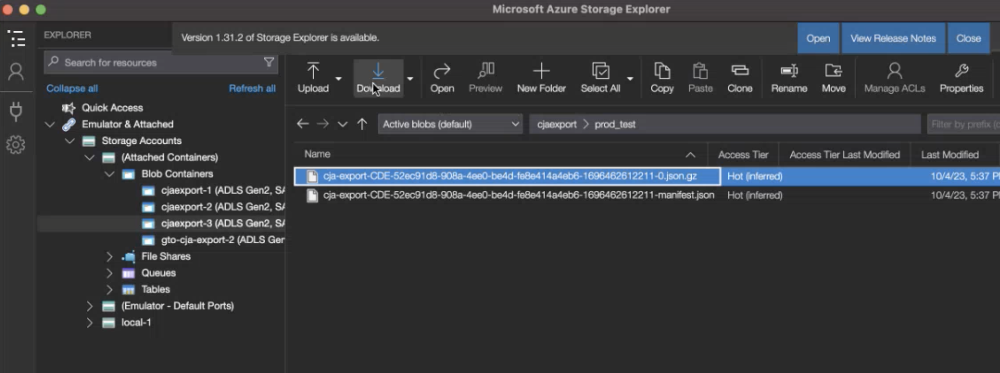

# 配置云导出位置 {#configure-cloud-export-locations}

<!-- markdownlint-disable MD034 -->

>[!CONTEXTUALHELP]
>id="cja-export-prefix"
>title="前缀"
>abstract="您希望存放数据的容器中的根文件夹。指定一个静态文件夹名称，并在名称后添加斜杠以创建该文件夹。例如，`folder_name/`"

<!-- markdownlint-enable MD034 -->

<!-- markdownlint-disable MD034 -->

>[!CONTEXTUALHELP]
>id="cja-export-file-name"
>title="文件名称和路径"
>abstract="为发送到此位置的自动导出指定一个动态自定义文件名。 您还可以在文件名前添加一个动态自定义文件路径。 在文件名和路径中使用变量使其成为动态变量。  例如，如果您指定`${yyyy}/${MM}/${dd}/my-report-${instance_id}-${idx}`，则在2026年1月15日自动发送到此目标的导出将具有以下文件路径和名称： `[prefix_folder_name]/2026/01/15/my-report-[UUID]-1.csv`  单击以下链接可查看可用变量列表。"

<!-- markdownlint-enable MD034 -->

在将Customer Journey Analytics报表导出到Cloud目标（从[Analysis Workspace](/help/analysis-workspace/export/export-cloud.md)或从[Report Builder](/help/report-builder/report-builder-export.md)）之前，您需要添加并配置希望发送数据的位置。 此过程包括：

1. 按照[配置云导出帐户](/help/components/exports/cloud-export-accounts.md)中的说明添加和配置帐户（如Amazon S3、Google Cloud Platform等）

1. 按照本文中的说明，在该帐户内添加和配置位置（如帐户内的文件夹）。

有关如何管理现有位置（包括查看、编辑和删除位置）的信息，请参阅[管理云导出位置和帐户](/help/components/exports/manage-export-locations.md)。

## 开始创建云导出位置

1. 在添加位置之前，您需要添加帐户。 如果还没有帐户，请按照[配置云导出帐户](/help/components/exports/cloud-export-accounts.md)中的说明添加帐户。

1. 在Customer Journey Analytics中，选择&#x200B;[!UICONTROL **组件**] > [!UICONTROL **导出**]。

1. 选择&#x200B;[!UICONTROL **位置**]&#x200B;选项卡，然后选择&#x200B;[!UICONTROL **添加位置**]。

   

   或

   选择&#x200B;[!UICONTROL **位置帐户**]&#x200B;选项卡，在现有帐户上选择要添加位置的3点图标，然后选择&#x200B;[!UICONTROL **添加位置**]。

   

   将显示“位置”对话框。

1. 指定以下信息：

   | 字段 | 功能 |
   |---------|----------|
   | [!UICONTROL **名称**] | 位置的名称。 |
   | [!UICONTROL **描述**] | 提供位置的简短描述，以帮助将该位置与帐户上的其他位置区分开来。 |
   | [!UICONTROL **使位置可供组织中的所有用户使用**] | 启用此选项可允许组织中的其他用户使用该位置。 
共享位置时，请考虑以下事项：
<ul><li>无法取消共享您共享的位置。</li><li>共享位置只能由位置的所有者编辑。</li><li>仅当与位置关联的帐户也共享时，才能共享位置。</li></ul> |
   | [!UICONTROL **位置帐户**] | 选择要创建位置的帐户。 有关如何创建帐户的信息，请参阅[配置云导出帐户](/help/components/exports/cloud-export-accounts.md)。 |

1. 在&#x200B;[!UICONTROL **位置属性**]&#x200B;部分中，指定特定于位置帐户的帐户类型的信息。

   继续下面与您在&#x200B;[!UICONTROL **位置帐户**]&#x200B;字段中选择的帐户类型相对应的部分。

   * [AEP 数据登陆区](#aep-data-landing-zone)
   * [Amazon S3 Role ARN](#amazon-s3-role-arn)
   * [Google Cloud Platform](#google-cloud-platform)
   * [Azure SAS](#azure-sas)
   * [Azure RBAC](#azure-rbac)
   * [Snowflake](#snowflake)

### AEP 数据登陆区

>[!IMPORTANT]
>
>将Customer Journey Analytics报告导出到Adobe Experience Platform数据登陆区时，请确保在7天内下载数据，然后从AEP数据登陆区中删除该数据。 7天后，数据会自动从AEP数据登陆区中删除。

1. 通过以下任一方式开始创建云导出位置：

   * 从如上所述“导出”页面，在[开始创建云导出位置](#begin-creating-a-cloud-export-location)

   * [从Analysis Workspace导出完整表格时](/help/analysis-workspace/export/export-cloud.md#export-full-tables)

1. 在&#x200B;[!UICONTROL **添加位置**]&#x200B;对话框的&#x200B;[!UICONTROL **位置属性**]&#x200B;部分中，指定以下信息以配置Adobe Experience Platform数据登陆区位置：

   | 字段 | 功能 |
   |---------|----------|
   | [!UICONTROL **前缀**] | 容器中要用于放置数据的文件夹。指定一个静态文件夹名称，并在名称后添加斜杠以创建该文件夹。例如，`folder_name/` |
   | [!UICONTROL **文件名和路径**] | 为发送到此位置的自动导出指定一个动态自定义文件名。 您还可以在文件名前面添加动态自定义文件路径。 
此选项允许您自动创建文件名和放置文件夹，以便文件名是可预知的，并以逻辑方式组织到文件夹中。 例如，可以根据提交文件的日期对文件名命名，然后将其放置到与每月相对应的文件夹中。

在文件名和路径中使用以下任一变量以使其成为动态变量：
<ul><li>**{yyyy}**： 4位数的日历年（区分大小写）</li><li>**{yy}**：两位数的日历年（区分大小写）</li><li>**{MM}**： 2位数的月份（区分大小写）</li><li>**{dd}**：2位数日（区分大小写）</li><li>**{HH}**：2位数小时（区分大小写）</li><li>**{mm}**：2位数的分钟数（区分大小写）</li><li>**{ss}**：2位数秒数（区分大小写）</li><li>**{fff}**： 3位数纳秒（区分大小写）</li><li>**{instance_id}**：请求（实例） UUID</li><li>**{export_id}**：导出（计划） UUID</li><li>**{idx}**：索引从0开始（每个文件都增加）</li><li>**{total}**：整个传输作业的文件总数</li><li>**{completion_millis}**：传输时间（以毫秒为单位）</li></ul>

例如，如果您指定`${yyyy}/${MM}/${dd}/my-report-${instance_id} -${idx}`，则在2026年1月15日自动发送到此目标的导出将具有以下文件路径和名称： [prefix_folder_name]/2026/01/15/my-report-[UUID]-1.csv
 |

   {style="table-layout:auto"}

1. 选择&#x200B;[!UICONTROL **保存**]。

1. 您现在可以将数据从Analysis Workspace导出到您配置的帐户和位置。 有关如何将数据导出到云的信息，请参阅[将数据导出到云](/help/analysis-workspace/export/export-cloud.md)。

1. 在AEP数据登录区中访问数据的最简单方法是使用Microsoft Azure Storage Explorer。 存储资源管理器与配置[AEP数据登陆区域帐户](/help/components/exports/cloud-export-accounts.md#aep-data-landing-zone)的说明中使用的工具相同。

   1. 打开[Microsoft Azure存储资源管理器](https://azure.microsoft.com/en-us/products/storage/storage-explorer/)。

   1. 转到&#x200B;[!UICONTROL **存储帐户**] > [!UICONTROL **（附加的容器）**] > [!UICONTROL **Blob容器**] > **[!UICONTROL cjaexport-_number_]**>*** your_container_name &#x200B;***。

      >[!NOTE]
      >
      >文件夹名称&#x200B;**[!UICONTROL cjaexport-_number_]**&#x200B;是Azure存储资源管理器提供的默认名称。 如果您只有一个连接与SAS URI关联（正常），则此文件夹的名称将为&#x200B;**[!UICONTROL cjaexport-1]**。

      

   1. 选择要下载的导出，然后选择要下载的&#x200B;[!UICONTROL **下载**]。

### Amazon S3 Role ARN

1. 通过下列任一方式开始创建云导出位置：

   * 从如上所述的“导出”页面，在[开始创建云导出位置](#begin-creating-a-cloud-export-location)中

   * 当[从Analysis Workspace](/help/analysis-workspace/export/export-cloud.md#export-full-tables)导出完整表时

1. 在&#x200B;[!UICONTROL **添加位置**]&#x200B;对话框的&#x200B;[!UICONTROL **位置属性**]&#x200B;部分中，指定以下信息来配置Amazon S3 Role ARN位置：

   | 字段 | 功能 |
   |---------|----------|
   | [!UICONTROL **存储桶**] | Amazon S3帐户中要将Customer Journey Analytics数据发送到的存储段。 
确保Adobe提供的用户ARN具有`S3:PutObject`权限，以便将文件上传到此存储桶。 

桶名称必须符合特定的命名规则。例如，它们的长度必须在 3 到 63 个字符之间，只能由小写字母、数字、点 (.) 和连字符 (-) 组成，并且必须以字母或数字开头和结尾。[AWS文档中提供了命名规则的完整列表](https://docs.aws.amazon.com/AmazonS3/latest/userguide/bucketnamingrules.html)。 
 |
   | [!UICONTROL **前缀**] | 存储段中要用于放置数据的文件夹。指定一个静态文件夹名称，并在名称后添加斜杠以创建该文件夹。例如，folder_name/ |
   | [!UICONTROL **文件名和路径**] | 为发送到此位置的自动导出指定一个动态自定义文件名。 您还可以在文件名前面添加动态自定义文件路径。 
此选项允许您自动创建文件名和放置文件夹，以便文件名是可预知的，并以逻辑方式组织到文件夹中。 例如，可以根据提交文件的日期对文件名命名，然后将其放置到与每月相对应的文件夹中。

在文件名和路径中使用以下任一变量以使其成为动态变量：
<ul><li>**{yyyy}**： 4位数的日历年（区分大小写）</li><li>**{yy}**：两位数的日历年（区分大小写）</li><li>**{MM}**： 2位数的月份（区分大小写）</li><li>**{dd}**：两位数天（区分大小写）</li><li>**{HH}**： 2位数小时（区分大小写）</li><li>**{mm}**： 2位数的分钟（区分大小写）</li><li>**{ss}**： 2位数秒（区分大小写）</li><li>**{fff}**： 3位纳秒（区分大小写）</li><li>**{instance_id}**：请求（实例）UUID</li><li>**{export_id}**：导出（计划）UUID</li><li>**{idx}**：索引从0开始（每个文件增加）</li><li>**{total}**：整个传输作业的文件总数</li><li>**{completion_millis}**：传输时间（以毫秒为单位）</li></ul>

例如，如果您指定`${yyyy}/${MM}/${dd}/my-report-${instance_id} -${idx}`，则在2026年1月15日自动发送到此目标的导出将具有以下文件路径和名称： [prefix_folder_name]/2026/01/15/my-report-[UUID]-1.csv
 |

   {style="table-layout:auto"}

1. 选择&#x200B;[!UICONTROL **保存**]。

1. 您现在可以将数据从Analysis Workspace导出到您配置的帐户和位置。 有关如何将数据导出到云的信息，请参阅[将数据导出到云](/help/analysis-workspace/export/export-cloud.md)。

### Google Cloud Platform

1. 通过以下任一方式开始创建云导出位置：

   * 从如上所述“导出”页面，在[开始创建云导出位置](#begin-creating-a-cloud-export-location)

   * 当[从Analysis Workspace](/help/analysis-workspace/export/export-cloud.md#export-full-tables)导出完整表时

1. 在&#x200B;[!UICONTROL **添加位置**]&#x200B;对话框的&#x200B;[!UICONTROL **位置属性**]&#x200B;部分中，指定以下信息来配置Google Cloud Platform位置：

   | 字段 | 功能 |
   |---------|----------|
   | [!UICONTROL **存储桶**] | GCP帐户中要将Customer Journey Analytics数据发送到的存储段。 
确保您已向Adobe提供的主体授予`roles/storage.objectCreator`权限。 （在[配置Google Cloud Platform帐户](/help/components/exports/cloud-export-accounts.md)时提供了主体。） 
有关授予权限的信息，请参阅 Google Cloud 文档中的[将主体添加到存储段级策略](https://cloud.google.com/storage/docs/access-control/using-iam-permissions#bucket-add)。

如果您的组织使用[组织策略约束](https://cloud.google.com/storage/docs/org-policy-constraints)，仅允许在允许列表中使用 Google Cloud Platform 帐户，则需要以下 Adobe 拥有的 Google Cloud Platform 组织 ID： <ul><li>`DISPLAY_NAME`：`adobe.com`</li><li>`ID`：`178012854243`</li><li>`DIRECTORY_CUSTOMER_ID`：`C02jo8puj`</li></ul> 
 |
   | [!UICONTROL **前缀**] | 存储段中要用于放置数据的文件夹。指定一个静态文件夹名称，并在名称后添加斜杠以创建该文件夹。例如，folder_name/ |
   | [!UICONTROL **文件名和路径**] | 为发送到此位置的自动导出指定一个动态自定义文件名。 您还可以在文件名前面添加动态自定义文件路径。 
此选项允许您自动创建文件名和放置文件夹，以便文件名是可预知的，并以逻辑方式组织到文件夹中。 例如，可以根据提交文件的日期对文件名命名，然后将其放置到与每月相对应的文件夹中。

在文件名和路径中使用以下任一变量以使其成为动态变量：
<ul><li>**{yyyy}**： 4位数的日历年（区分大小写）</li><li>**{yy}**：2位数的日历年（区分大小写）</li><li>**{MM}**：2位数月份（区分大小写）</li><li>**{dd}**：2位数日（区分大小写）</li><li>**{HH}**：2位数小时（区分大小写）</li><li>**{mm}**：2位数的分钟数（区分大小写）</li><li>**{ss}**：2位数秒数（区分大小写）</li><li>**{fff}**： 3位数纳秒（区分大小写）</li><li>**{instance_id}**：请求（实例） UUID</li><li>**{export_id}**：导出（计划） UUID</li><li>**{idx}**：索引从0开始（每个文件都增加）</li><li>**{total}**：整个传输作业的文件总数</li><li>**{completion_millis}**：传输时间（毫秒）</li></ul>

例如，如果指定`${yyyy}/${MM}/${dd}/my-report-${instance_id} -${idx}`，2026年1月15日自动发送到此目标的导出将具有以下文件路径和名称： [prefix_folder_name]/2026/01/15/my-report-[UUID]-1.csv
 |

   {style="table-layout:auto"}

1. 选择&#x200B;[!UICONTROL **保存**]。

1. 您现在可以将数据从Analysis Workspace导出到您配置的帐户和位置。 有关如何将数据导出到云的信息，请参阅[将项目数据导出到云](/help/analysis-workspace/export/export-cloud.md)。

### Azure SAS

1. 通过下列任一方式开始创建云导出位置：

   * 从如上所述的“导出”页面，在[开始创建云导出位置](#begin-creating-a-cloud-export-location)中

   * 当[从Analysis Workspace](/help/analysis-workspace/export/export-cloud.md#export-full-tables)导出完整表时

1. 在&#x200B;[!UICONTROL **添加位置**]&#x200B;对话框的&#x200B;[!UICONTROL **位置属性**]&#x200B;部分中，指定以下信息来配置Azure SAS位置：

   | 字段 | 功能 |
   |---------|----------|
   | [!UICONTROL **容器名称**] | 指定帐户中要将Customer Journey Analytics数据发送到的容器。 |
   | [!UICONTROL **前缀**] | 容器中要用于放置数据的文件夹。指定一个静态文件夹名称，并在名称后添加斜杠以创建该文件夹。例如，`folder_name/`
确保在配置 Azure SAS 帐户时，在密钥保管库密码名称字段中指定的 SAS 令牌存储具有 `Write` 权限。这将允许 SAS 令牌在 Azure 容器中创建文件。 
如果您希望 SAS 令牌也覆盖文件，请确保 SAS 令牌存储具有 `Delete` 权限。

有关更多信息，请参阅 Azure Blob 存储文档中的 [Blob 存储资源](https://learn.microsoft.com/en-us/azure/storage/blobs/storage-blobs-introduction#blob-storage-resources)。
 |
   | [!UICONTROL **文件名和路径**] | 为发送到此位置的自动导出指定一个动态自定义文件名。 您还可以在文件名前面添加动态自定义文件路径。 
此选项允许您自动创建文件名和放置文件夹，以便文件名是可预知的，并以逻辑方式组织到文件夹中。 例如，可以根据提交文件的日期对文件名命名，然后将其放置到与每月相对应的文件夹中。

在文件名和路径中使用以下任一变量以使其成为动态变量：
<ul><li>**{yyyy}**： 4位数的日历年（区分大小写）</li><li>**{yy}**：两位数的日历年（区分大小写）</li><li>**{MM}**：2位数月份（区分大小写）</li><li>**{dd}**：2位数日（区分大小写）</li><li>**{HH}**：2位数小时（区分大小写）</li><li>**{mm}**：2位数的分钟数（区分大小写）</li><li>**{ss}**：2位数秒数（区分大小写）</li><li>**{fff}**： 3位数纳秒（区分大小写）</li><li>**{instance_id}**：请求（实例）UUID</li><li>**{export_id}**：导出（计划）UUID</li><li>**{idx}**：索引从0开始（每个文件都增加）</li><li>**{total}**：整个传输作业的文件总数</li><li>**{completion_millis}**：传输时间（以毫秒为单位）</li></ul>

例如，如果您指定`${yyyy}/${MM}/${dd}/my-report-${instance_id} -${idx}`，则在2026年1月15日自动发送到此目标的导出将具有以下文件路径和名称： [prefix_folder_name]/2026/01/15/my-report-[UUID]-1.csv
 |

   {style="table-layout:auto"}

1. 选择&#x200B;[!UICONTROL **保存**]。

1. 您现在可以将数据从Analysis Workspace导出到您配置的帐户和位置。 有关如何将数据导出到云的信息，请参阅[将数据导出到云](/help/analysis-workspace/export/export-cloud.md)。

### Azure RBAC

1. 通过下列任一方式开始创建云导出位置：

   * 从如上所述的“导出”页面，在[开始创建云导出位置](#begin-creating-a-cloud-export-location)中

   * 当[从Analysis Workspace](/help/analysis-workspace/export/export-cloud.md#export-full-tables)导出完整表时

1. 在&#x200B;[!UICONTROL **添加位置**]&#x200B;对话框的&#x200B;[!UICONTROL **位置属性**]&#x200B;部分中，指定以下信息来配置Azure RBAC位置：

   | 字段 | 功能 |
   |---------|----------|
   | [!UICONTROL **容器**] | 您指定的帐户中要将Customer Journey Analytics数据发送到的容器。 确保授予将文件上传到您之前创建的 Azure 应用程序的权限。 |
   | [!UICONTROL **前缀**] | 容器中要用于放置数据的文件夹。指定一个静态文件夹名称，并在名称后添加斜杠以创建该文件夹。例如，`folder_name/`
确保您在配置 Azure RBAC 帐户时指定的应用程序 ID 已被授予 `Storage Blob Data Contributor` 角色，以便访问容器（文件夹）。
 
有关更多信息，请参阅 [Azure 内置角色](https://learn.microsoft.com/en-us/azure/role-based-access-control/built-in-roles)。
 |
   | [!UICONTROL **文件名和路径**] | 为发送到此位置的自动导出指定一个动态自定义文件名。 您还可以在文件名前面添加动态自定义文件路径。 
此选项允许您自动创建文件名和放置文件夹，以便文件名是可预知的，并以逻辑方式组织到文件夹中。 例如，可以根据文件交付的日期来命名文件名，然后将其放入与每个月对应的文件夹中。
 
在文件名和路径中使用以下任意变量以使它们成为动态变量：
<ul><li>**{yyyy}**： 4位日历年（区分大小写）</li><li>**{yy}**：两位数的日历年（区分大小写）</li><li>**{MM}**： 2位数的月份（区分大小写）</li><li>**{dd}**：两位数天（区分大小写）</li><li>**{HH}**：2位数小时（区分大小写）</li><li>**{mm}**：2位数的分钟数（区分大小写）</li><li>**{ss}**：2位数秒数（区分大小写）</li><li>**{fff}**： 3位数纳秒（区分大小写）</li><li>**{instance_id}**：请求（实例） UUID</li><li>**{export_id}**：导出（计划）UUID</li><li>**{idx}**：索引从0开始（每个文件增加）</li><li>**{total}**：整个传输作业的文件总数</li><li>**{completion_millis}**：传输时间（毫秒）</li></ul>

例如，如果指定`${yyyy}/${MM}/${dd}/my-report-${instance_id} -${idx}`，2026年1月15日自动发送到此目标的导出将具有以下文件路径和名称： [prefix_folder_name]/2026/01/15/my-report-[UUID]-1.csv
 |
   | [!UICONTROL **帐户**] | Azure 存储帐户。 |

   {style="table-layout:auto"}

1. 选择&#x200B;[!UICONTROL **保存**]。

1. 您现在可以将数据从Analysis Workspace导出到您配置的帐户和位置。 有关如何将数据导出到云的信息，请参阅[将项目数据导出到云](/help/analysis-workspace/export/export-cloud.md)。

### Snowflake

1. 通过以下任一方式开始创建云导出位置：

   * 从如上所述“导出”页面，在[开始创建云导出位置](#begin-creating-a-cloud-export-location)

   * [从Analysis Workspace导出完整表格时](/help/analysis-workspace/export/export-cloud.md#export-full-tables)

1. 在&#x200B;[!UICONTROL **添加位置**]&#x200B;对话框的&#x200B;[!UICONTROL **位置属性**]&#x200B;部分中，指定以下信息以配置Snowflake位置：

   | 字段 | 功能 |
   |---------|----------|
   | [!UICONTROL **数据库**] | 指定的数据库应为现有数据库。 您创建的角色需要拥有访问此数据库的权限。
这是与阶段名称关联的数据库。

可以使用以下命令将此角色权限授予Snowflake中的数据库： `GRANT USAGE ON DATABASE <your_database> TO ROLE <your_role>;`
 
有关详细信息，请参阅Snowflake文档中的[数据库、架构和共享命令页](https://docs.snowflake.com/en/sql-reference/commands-database)。
 |
   | [!UICONTROL **架构**] | 指定的架构应为现有架构。 您创建的角色需要具有访问此方案的权限。
这是与阶段名称关联的架构。

您可以使用以下命令将您创建的权限授予Snowflake中的架构：`GRANT USAGE ON SCHEMA <your_database>.<your_schema> TO ROLE <your_role>;`

有关详细信息，请参阅Snowflake文档中的[数据库、架构和共享命令页](https://docs.snowflake.com/en/sql-reference/commands-database)。
 |
   | [!UICONTROL **阶段名称**] | 数据文件存储在Snowflake中的内部阶段的名称。
请确保您在帐户中指定的角色对此阶段名称具有读写访问权限。 （由于您授予了读取和写入权限，因此我们建议您使用仅由Adobe使用的阶段。）

您可以使用以下命令授予Snowflake中阶段名称的读写访问权限： `GRANT READ, WRITE ON STAGE <your_database>.<your_schema>.<your_stage_name> TO ROLE <your_role>;`
 
有关向角色授予权限的信息，请参阅Snowflake文档中的[授予权限](https://docs.snowflake.com/en/sql-reference/sql/grant-privilege)。
 
有关暂存名称的详细信息，请参阅Snowflake文档中的[为本地文件选择内部暂存页](https://docs.snowflake.com/en/user-guide/data-load-local-file-system-create-stage)。
 |
   | [!UICONTROL **阶段路径**] | 数据文件在Snowflake中存储位置的路径。 
有关详细信息，请参阅Snowflake文档中的[为本地文件选择内部暂存](https://docs.snowflake.com/en/user-guide/data-load-local-file-system-create-stage)。
 |
   | [!UICONTROL **文件名和路径**] | 为发送到此位置的自动导出指定一个动态自定义文件名。 您还可以在文件名前面添加动态自定义文件路径。 
此选项允许您自动创建文件名和放置文件夹，以便文件名是可预知的，并以逻辑方式组织到文件夹中。 例如，可以根据提交文件的日期对文件名命名，然后将其放置到与每月相对应的文件夹中。

在文件名和路径中使用以下任一变量以使其成为动态变量：
<ul><li>**{yyyy}**： 4位数的日历年（区分大小写）</li><li>**{yy}**：2位数的日历年（区分大小写）</li><li>**{MM}**：2位数月份（区分大小写）</li><li>**{dd}**：2位数日（区分大小写）</li><li>**{HH}**：2位数小时（区分大小写）</li><li>**{mm}**：2位数的分钟数（区分大小写）</li><li>**{ss}**：2位数秒数（区分大小写）</li><li>**{fff}**： 3位数纳秒（区分大小写）</li><li>**{instance_id}**：请求（实例）UUID</li><li>**{export_id}**：导出（计划）UUID</li><li>**{idx}**：索引从0开始（每个文件增加）</li><li>**{total}**：整个传输作业的文件总数</li><li>**{completion_millis}**：传输时间（毫秒）</li></ul>

例如，如果您指定`${yyyy}/${MM}/${dd}/my-report-${instance_id} -${idx}`，则在2026年1月15日自动发送到此目标的导出将具有以下文件路径和名称： [prefix_folder_name]/2026/01/15/my-report-[UUID]-1.csv
 |

   {style="table-layout:auto"}

1. 选择&#x200B;[!UICONTROL **保存**]。

1. 您现在可以将数据从Analysis Workspace导出到您配置的帐户和位置。 有关如何将数据导出到云的信息，请参阅[将数据导出到云](/help/analysis-workspace/export/export-cloud.md)。
