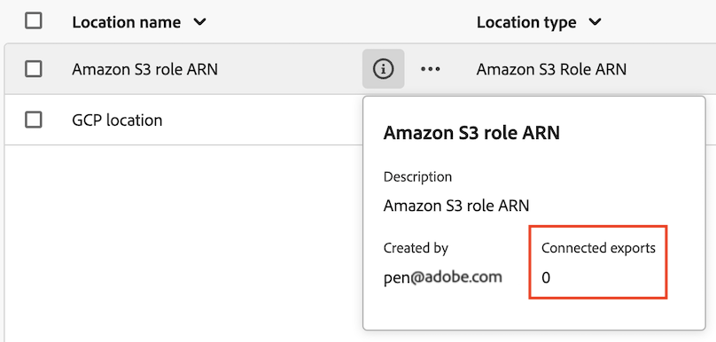

# 管理云导出位置和帐户

您可以查看、编辑和删除云导出位置。

有关如何创建新位置的信息，请参阅 [配置云导出位置](/help/components/exports/cloud-export-locations.md).

## 过滤和搜索位置

要查找所需的信息，可以筛选位置列表或搜索位置。

### 筛选位置列表

1. 在Customer Journey Analytics中，选择 [!UICONTROL **组件**] > [!UICONTROL **导出**].

1. 选择 [!UICONTROL **位置**] 选项卡。

1. 选择 **筛选** 图标。

   <!-- add screenshot -->

   您可以按以下条件进行筛选：

   | 过滤器 | 描述 |
   |---------|----------|
   | [!UICONTROL **位置类型**]<!--should this be changed to Account type?--> | 与位置关联的帐户类型。 可以使用以下帐户类型： <ul><li>[!UICONTROL **Adobe Experience Platform数据登陆区**]</li><li>[!UICONTROL **Amazon S3 Role ARN**]</li><li>[!UICONTROL **Google Cloud Platform**]</li><li>[!UICONTROL **Azure SAS**]</li><li>[!UICONTROL **Azure RBAC**]</li><li>[!UICONTROL **Snowflake**]</li></ul> |
   | [!UICONTROL **帐户**] | 与位置关联的帐户的名称。 |
   | [!UICONTROL **创建者**] | 创建位置的用户的电子邮件地址。 |

   {style="table-layout:auto"}

### 搜索位置

1. 在Customer Journey Analytics中，选择 [!UICONTROL **组件**] > [!UICONTROL **导出**].

1. 选择 [!UICONTROL **位置**] 选项卡。

1. 在搜索选项卡中，开始键入与要搜索的位置相关联的任何信息。 您可以从表中任何可用的列搜索数据。

## 编辑位置

1. 在Customer Journey Analytics中，选择 [!UICONTROL **组件**] > [!UICONTROL **导出**].

1. 选择 [!UICONTROL **位置**] 选项卡，然后选择要编辑的位置。

   <!-- add screenshot? -->

1. 选择 [!UICONTROL **编辑**].

1. 进行任何所需的更改，然后选择 [!UICONTROL **保存**].

## 删除位置

如果删除位置，则使用该位置的所有导出也会被删除。

在删除位置之前，请先通过选择位置名称旁边的信息图标来检查任何导出是否正在使用它。

要删除位置，请执行以下操作：

1. 在Customer Journey Analytics中，选择 [!UICONTROL **组件**] > [!UICONTROL **导出**].

1. 选择 [!UICONTROL **位置**] 选项卡，然后选择要删除的一个或多个位置。

   <!-- add screenshot? -->

1. 选择 [!UICONTROL **删除**]，然后选择 [!UICONTROL **删除**] 确认对话框。

## 编辑帐户

1. 在Customer Journey Analytics中，选择 [!UICONTROL **组件**] > [!UICONTROL **导出**].

1. 选择 [!UICONTROL **位置帐户**] 选项卡。

   

1. 选择 [!UICONTROL **查看详细信息**] 在要编辑的帐户上。

1. 进行任何所需的更改，然后选择 [!UICONTROL **保存**].

## 删除帐户

1. 在Customer Journey Analytics中，选择 [!UICONTROL **组件**] > [!UICONTROL **导出**].

1. 选择 [!UICONTROL **位置帐户**] 选项卡。

   

1. 在要编辑的帐户上选择3点图标，然后选择 [!UICONTROL **删除帐户**].

1. 选择 [!UICONTROL **删除**] 确认对话框。
