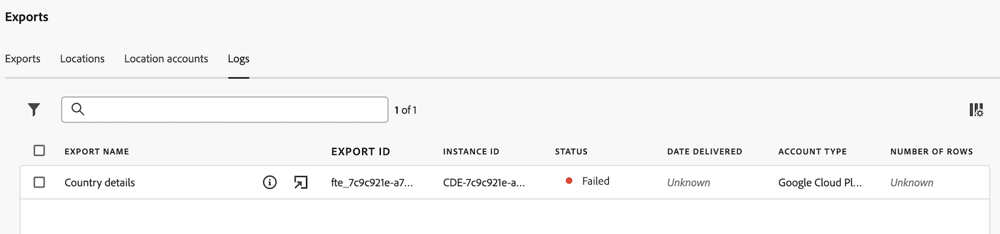

# 管理导出日志

导出日志提供有关每次导出的详细信息，并在每次将Analysis Workspace数据导出到云时生成。 (有关如何将数据导出到云的信息，请参阅[将Customer Journey Analytics报表导出到云](/help/analysis-workspace/export/export-cloud.md)。)

对于计划的导出，日志反映发送日志时的导出设置。 无法删除日志。

## 查看导出日志

1. 在Customer Journey Analytics中，选择&#x200B;[!UICONTROL **组件**] > [!UICONTROL **导出**]。

1. 选择&#x200B;[!UICONTROL **日志**]&#x200B;选项卡。

   显示“日志”选项卡的

   每个日志的详细信息都显示在可用列中。

1. 执行下列任一操作：

   * [自定义显示的列](#configure-columns)。

   * 选择日志名称旁边的&#x200B;**信息图标** 以查看与日志关联的导出。

   * 选择日志名称旁边的&#x200B;**编辑导出图标** 以编辑与日志关联的导出。

     有关编辑导出的更多信息，请参阅[将Customer Journey Analytics报表导出到云](/help/analysis-workspace/export/export-cloud.md)。

## 过滤和搜索日志

要查找所需的信息，可以筛选日志列表或搜索日志。

### 筛选日志列表

1. 在Customer Journey Analytics中，选择&#x200B;[!UICONTROL **组件**] > [!UICONTROL **导出**]。

1. 选择&#x200B;[!UICONTROL **日志**]&#x200B;选项卡。

1. 选择&#x200B;**筛选器**&#x200B;图标。

   

   您可以按以下条件进行筛选：

   | 过滤器 | 描述 |
   |---------|----------|
   | [!UICONTROL **导出ID**] | 指定要查看的导出日志的导出ID。 |
   | [!UICONTROL **帐户类型**] | 与日志关联的帐户类型。 可以使用以下帐户类型： <ul><li>[!UICONTROL **AEP Data Landing Zone**]</li><li>[!UICONTROL **Amazon S3 Role ARN**]</li><li>[!UICONTROL **Azure SAS**]</li><li>[!UICONTROL **Azure RBAC**]</li><li>[!UICONTROL **Google Cloud Platform**]</li><li>[!UICONTROL **Snowflake**]</li></ul>。 |
   | [!UICONTROL **状态**] | 导出的状态。 可以使用以下状态： <ul><li>[!UICONTROL **挂起**]：特定导出实例已启动，但尚未完成。
重新运行状态为“待定”的导出将会延迟导出过程。
</li><li>[!UICONTROL **已完成**]：导出的特定实例已完成处理，可在导出帐户中使用。</li><li>[!UICONTROL **失败**]
各种情况都可能导致导出失败。 将鼠标悬停在失败状态上可查看有关失败的详细信息。
有关失败可能原因的更多信息，请参阅[导出失败疑难解答](/help/components/exports/troubleshoot-exports.md)。
 |

   {style="table-layout:auto"}

### 搜索日志

1. 在Customer Journey Analytics中，选择&#x200B;[!UICONTROL **组件**] > [!UICONTROL **导出**]。

1. 选择&#x200B;[!UICONTROL **日志**]&#x200B;选项卡。

1. 在搜索字段中，开始键入与要搜索的日志相关联的任何信息。 您可以从表中任何可用的列搜索数据。

<!-- removed for MVP: Retry an export You can re-run the export associated with the selected log, using the data as it was on the day the log was originally exported. This is useful when selecting a log that show a failed export or when selecting a log that was accidentally deleted. 

Retrying an export that has a status of Pending will delay the export process.

This option is not available when selecting multiple logs. -->

<!-- 1. In Customer Journey Analytics, select [!UICONTROL **Components**] > [!UICONTROL **Exports**].

1. Select the [!UICONTROL **Logs**] tab, then select a log.

1. Select [!UICONTROL **Retry**]. -->

## 编辑导出

您可以编辑与特定日志关联的导出。

选择多个日志时，此选项不可用。

1. 在Customer Journey Analytics中，选择&#x200B;[!UICONTROL **组件**] > [!UICONTROL **导出**]。

1. 选择&#x200B;[!UICONTROL **日志**]&#x200B;选项卡。

1. 找到与要编辑的导出关联的日志。

1. 选择日志名称旁边的&#x200B;**编辑导出**&#x200B;图标。

   或

   选中日志旁边的复选框，然后选择&#x200B;[!UICONTROL **编辑导出**]。

## 配置各列

您可以在[!UICONTROL 日志]选项卡中添加或删除列以配置显示的信息。

选择列标题以按该列对日志进行排序。 默认情况下，日志按开始导出的日期和时间排序。

要在[!UICONTROL 日志]选项卡上配置列：

1. 在Customer Journey Analytics中，选择&#x200B;[!UICONTROL **组件**] > [!UICONTROL **导出**]。

1. 选择&#x200B;[!UICONTROL **日志**]&#x200B;选项卡。

1. 选择&#x200B;**日志**&#x200B;页面右上角的图标[!UICONTROL 自定义表]。

   以下列可供使用：

   | 可用列 | 描述 |
   |---------|----------|
   | 导出名称 | 导出的名称。 用户在创建导出时为其命名，如[将Customer Journey Analytics报表导出到云](/help/analysis-workspace/export/export-cloud.md)中所述。 |
   | 导出 ID | 创建导出时自动为其分配的ID。<!-- True? --> |
   | 实例 ID | Customer Journey Analytics实例的ID。<!-- True? --> |
   | 数据视图名称 | 与导出关联的数据视图的名称。 用户在创建导出时可以选择数据视图，如[将Customer Journey Analytics报表导出到云](/help/analysis-workspace/export/export-cloud.md)中所述。 |
   | 文件数 | 导出中包含的文件数。 |
   | 大小 | 导出的大小。
文件大小以1024为基数计算，有时表示为KIB和MIB。 如果您的云提供商计算的大小基数为1000，这可能会导致您的云提供商中显示的大小与此处显示的大小略有不同。
 |
   | 位置 | 帐户上导出数据的位置。 |
   | 帐户 | 从中导出数据的帐户。 |
   | 状态 | 导出的状态。 可用状态为[!UICONTROL Pending]、[!UICONTROL Delivered]和[!UICONTROL Failed]。 |
   | 投放日期 | 导出日期。 |
   | 帐户类型 | 从中导出数据的云帐户的类型。 可用的帐户类型包括[!UICONTROL Amazon S3 Role ARN]、[!UICONTROL Google Cloud Platform]、[!UICONTROL Azure SAS]、[!UICONTROL Azure RBAC]、[!UICONTROL Snowflake]和[!UICONTROL Adobe Experience Platform]。 |
   | 行数 | 导出表中包括的行数。 |

   {style="table-layout:auto"}

1. 确保选定您要显示的任何列。 选定的列出现在[!UICONTROL 日志]页上，并显示相关信息。

## 查看审核日志

还在[Customer Journey Analytics审核日志](/help/privacy/audit-log.md)中跟踪全表导出。<!-- Need to see what the Component Type for full-table export will be and add it here. Also, under "Event type captured by audit logs" there would be a new event type called "Full-table export". 4 actions would be "Create, Delete, Edit, Export" and "API_Request"? Also information about the locations. Probably have a different component for the location credentials.-->
