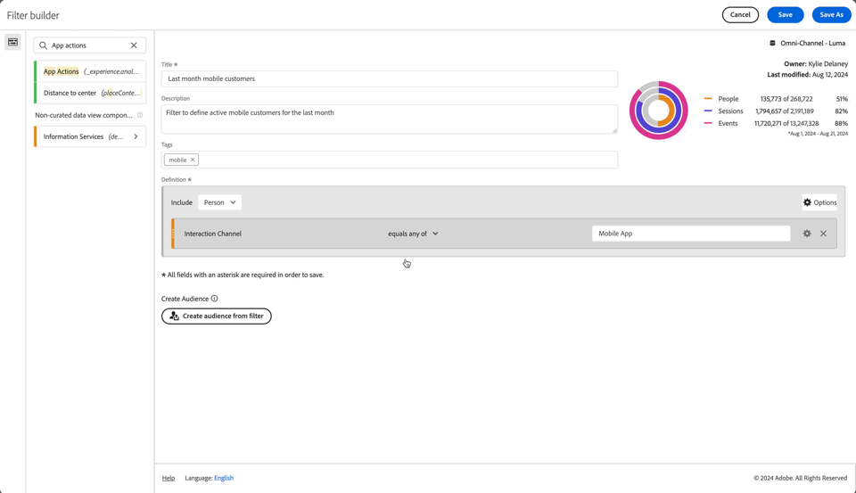

# 构建过滤器 {#build-filters}

<!-- markdownlint-disable MD034 -->

>[!CONTEXTUALHELP]
>id="components_filters_createaudience"
>title="创建受众"
>abstract="可以从过滤器创建受众并与 Adobe Experience Platform 共享以进行激活。"

<!-- markdownlint-enable MD034 -->

<!-- markdownlint-disable MD034 -->

>[!CONTEXTUALHELP]
>id="components_filters_datapreview"
>title="数据预览"
>abstract="将此过滤器的数据与数据视图的数据进行比较。预览百分比基于&#x200B;**过去 90 天**&#x200B;数据视图中的总数。  如果未加载预览，则您的连接有可能仍在进行回填。"

<!-- markdownlint-enable MD034 -->

**[!UICONTROL 筛选器生成器]**&#x200B;对话框用于创建新筛选器或编辑现有筛选器。 该对话框的标题为&#x200B;**[!UICONTROL 新筛选器]**&#x200B;或&#x200B;**[!UICONTROL 编辑筛选器]**，用于从[[!UICONTROL 筛选器]管理器](/help/components/filters/manage-filters.md)创建或管理的筛选器。

>[!BEGINTABS]

>[!TAB 筛选器生成器]

>[!TAB 创建或编辑筛选器]

>[!ENDTABS]

1. 指定以下详细信息（为必要项）：

   | 元素 | 描述 |
   | --- | --- |
   | **[!UICONTROL 数据视图]** | 您可以为筛选器选择数据视图。  您定义的筛选器可在数据视图的[设置](/help/data-views/create-dataview.md#settings-filters)选项卡中作为筛选器使用。 |
   | **[!UICONTROL 仅用于项目的筛选器]** | 一个信息框，用于说明该过滤器仅在创建它的项目中可见，并且不会添加到组件列表中。 启用&#x200B;**[!UICONTROL 使此筛选器对所有项目都可用，并将其添加到组件列表]**&#x200B;以更改该设置。 仅当您使用[!UICONTROL 快速筛选器]界面中的&#x200B;**[!UICONTROL 打开生成器]**&#x200B;创建[快速筛选器](quick-filters.md)并将快速筛选器信息转换为常规筛选器时，此信息框才可见。 |
   | **[!UICONTROL 标题]**  | 为筛选器命名，例如`Last month mobile customers`。 |
   | **[!UICONTROL 描述]** | 提供筛选器的描述，例如`Filter to define the mobile customers for the last month`。 |
   | **[!UICONTROL 标记]** | 通过创建或应用一个或多个标记来组织过滤器。 开始键入，以查找您可以选择的现有标记。或按&#x200B;**[!UICONTROL ENTER]**&#x200B;添加新标记。 选择  以移除标记。 |
   | **[!UICONTROL 定义]**  | 使用[定义生成器](#definition-builder)定义您的筛选器。 |

   {style="table-layout:auto"}

1. 要验证您的过滤器定义是否正确，请使用右上角的不断更新的过滤器结果预览。
1. 要从筛选器创建受众并与Experience Platform共享受众，请选择&#x200B;**[!UICONTROL 从筛选器创建受众]**。 有关详细信息，请参阅[创建和发布受众](/help/components/audiences/publish.md)。
1. 选择：
   * **[!UICONTROL 保存]**&#x200B;以保存筛选器。
   * **[!UICONTROL 另存为]**&#x200B;以保存筛选器的副本。
   * **[!UICONTROL 删除]**&#x200B;以删除该筛选器。
   * **[!UICONTROL 取消]**&#x200B;以取消您对筛选器所做的任何更改或取消创建新筛选器。

## 定义生成器

可使用定义生成器构建过滤器定义。 在该构造中，使用组件、容器、运算符和逻辑。

您可以配置定义的类型和范围：

1. 要指定定义的类型，请指定希望生成是包含还是排除定义。 选择 **[!UICONTROL 选项]**，然后从下拉列表中选择&#x200B;**[!UICONTROL 包含]**&#x200B;或&#x200B;**[!UICONTROL 排除]**。
1. 要指定定义的范围，请从&#x200B;**[!UICONTROL 包含]**&#x200B;或&#x200B;**[!UICONTROL 排除]**&#x200B;下拉菜单中选择是希望定义的范围是&#x200B;**[!UICONTROL 事件]**、**[!UICONTROL 会话]**&#x200B;还是&#x200B;**[!UICONTROL 人员]**。

您以后始终可以更改这些设置。

### 组件

构建过滤器定义的重要部分是使用维度、量度、现有过滤器和日期范围。 所有这些组件都可从筛选器生成器的组件面板中使用。

{width=100%}

要添加组件，请执行以下操作：

1. 将组件从组件面板拖放到&#x200B;**[!UICONTROL 将指标、筛选器和/或Dimension拖放到此处]**。 您可以使用组件栏中的来搜索特定组件。
1. 指定组件的详细信息。 例如，从&#x200B;**[!UICONTROL 选择值]**&#x200B;中选择一个值。 或者输入一个值。 指定一个或多个值的内容和方式取决于组件和运算符。
1. （可选）修改默认运算符。 例如，从&#x200B;**[!UICONTROL 等于]**&#x200B;到&#x200B;**[!UICONTROL 等于任意]**。 有关可用运算符的详细概述，请参阅[运算符](operators.md)。

要编辑组件，请执行以下操作：

* 从运算符下拉菜单中选择组件的新运算符。
* 选择或为运算符指定其他值（如果适用）。
* 如果元件类型是尺寸，则可以定义归因模型。 有关详细信息，请参阅[归因模型](#attribution-models)。

要删除组件，请执行以下操作：

* 在组件中选择。

### 容器

您可以将多个组件分组到一个或多个容器中，并在容器内和容器之间定义逻辑。 容器允许您为过滤器构建复杂的定义。

{Width=100%}

* 要添加容器，请从 **[!UICONTROL 选项]**&#x200B;中选择&#x200B;**[!UICONTROL 添加容器]**。
* 要将现有组件添加到容器，请将该组件拖放到容器中。
* 要将另一个组件添加到容器，请将组件面板中的组件拖放到容器中。 使用蓝色插入线作为指导。
* 要在容器外部添加另一个组件，请从组件面板中将组件拖放到容器外部（但位于主定义容器内）中。 使用蓝色插入线作为指导。
* 要修改容器中的组件之间、容器之间或容器与组件之间的逻辑，请选择适当的&#x200B;**[!UICONTROL And]**、**[!UICONTROL Or]**、**[!UICONTROL Then]**。 选择“Then”时，将该过滤器转换为顺序过滤器。 有关详细信息，请参阅[创建顺序筛选器](seg-sequential-build.md)。
* 若要切换容器级别，请选择 **[!UICONTROL 事件]**、 **[!UICONTROL 会话]**&#x200B;或 **[!UICONTROL 人员]**。

您可以在容器中使用进行以下操作：

| 容器操作 | 描述 |
|---|---|
| **[!UICONTROL 添加容器]** | 向容器添加嵌套容器。 |
| **[!UICONTROL 排除]** | 在筛选器定义中排除容器中的结果。 一个红色细左栏用于标识排除容器。 |
| **[!UICONTROL 包含]** | 在筛选器定义中包含来自容器的结果。 默认为“包括”。 左侧的细灰色条用于标识包含容器。 |
| **[!UICONTROL 名称容器]** | 从容器的默认描述重命名容器。 在文本字段中键入名称。 如果未提供输入，则使用默认描述。 |
| **[!UICONTROL 删除容器]** | 从定义中删除容器。 |

## 日期范围

您可以构建包含滚动日期范围的过滤器。 因此，您可以回答有关持续促销活动或事件的问题。 例如，您可以构建一个过滤器，其中包含过去60天内在线购买过的&#x200B;*每个人*。

>[!BEGINSHADEBOX]

观看演示视频的[区段中的滚动日期范围](https://video.tv.adobe.com/v/25403/?quality=12&learn=on){target="_blank"}。

>[!ENDSHADEBOX]

## 堆叠筛选器 {#stack}

您可以使用过滤器构建过滤器。 在过滤器中使用过滤器时，可以优化过滤器并降低复杂性。

假设您要根据设备类型(2)和美国状态(50)的组合进行过滤。 您可以构建100个过滤器，每个过滤器针对设备类型（手机与平板电脑）和美国州的独特组合。 要获得加州的平板电脑用户，你可以使用100个过滤器中的一个：

或者，您可以定义52个过滤器：50个过滤器适用于美国各州，一个适用于手机，一个适用于平板电脑。 然后栈叠过滤器以获得相同的结果。 要获得加州的平板电脑用户，可以栈叠两个过滤器：

用于CA和平板电脑的

## 归因 {#attribution}

<!-- markdownlint-disable MD034 -->

>[!CONTEXTUALHELP]
>id="components_filters_attribution_repeating"
>title="重复"
>abstract="包括维度的实例及持续值。"

<!-- markdownlint-enable MD034 -->

<!-- markdownlint-disable MD034 -->

>[!CONTEXTUALHELP]
>id="components_filters_attribution_instance"
>title="实例"
>abstract="包括维度的实例及持续值。"

<!-- markdownlint-enable MD034 -->

<!-- markdownlint-disable MD034 -->

>[!CONTEXTUALHELP]
>id="components_filters_attribution_nonrepeatinginstance"
>title="非重复实例"
>abstract="包括维度的独特（非重复）实例"

<!-- markdownlint-enable MD034 -->

在过滤器生成器中使用维度时，您可以选择为该维度指定归因模型。 您选择的归因模型决定了数据是否符合您为维度组件指定的条件。

在维度组件中选择，然后从弹出窗口中选择一个归因模型：

| 模型 | 描述 |
|---|---|
| **[!UICONTROL 重复模型（默认）]** | 包括维度的实例和持久值以确定资格。 |
| **[!UICONTROL 实例]** | 仅包含维度的实例值以确定资格。 |
| **[!UICONTROL 非重复实例]** | 包含维度的唯一实例（非重复）值以确定资格。 |

构建筛选器时

### 示例

作为过滤器定义的一部分，您已指定以下条件：“页面名称”等于“女性”。 与上述示例类似。 使用其他两个归因模型重复此过滤器定义。 因此，您有三个过滤器，每个都有自己的归因模型：

* 女性页面 — 归因 — 重复（默认）
* 女性页面 — 归因 — 实例
* 女性页面 — 归因 — 非重复实例

下表为每个归因模型说明了哪些传入事件符合该条件的。

| 女性页面 — 归因 —  *归因模型* | 事件1： 页面名称等于 女性 | 事件2： 页面名称= 男 | 事件3： 页面名称等于 女性 | 事件4： 页面名称等于 女性 （已保留） | 事件5： 页面名称等于 签出 | 事件6： 页面名称等于 女性 | 事件7： 页面名称等于 主页 |
|---|:---:|:---:|:---:|:---:|:---:|:---:|:--:|
| 重复（默认） |  |  |  |  |  |  |  |
| 实例 |  |  |  |  |  |  |  |
| 非重复实例 |  |  |  |  |  |  |  |

有关使用三个过滤器的事件的示例报告如下所示：

