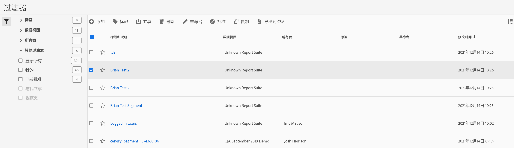

# 管理过滤器

过滤器管理器提供了许多种管理过滤器的方式，如共享、标记、批准、复制、删除和标记为收藏。

过滤器管理器会显示您自己拥有的以及与您共享的所有过滤器。管理员级别的用户可以查看组织内的所有过滤器。此概述介绍了过滤器管理器的用户界面和功能。

要访问过滤器管理器，请在顶部导航栏中依次转到 **[!UICONTROL Customer Journey Analysis]** > **[!UICONTROL 组件]** > **[!UICONTROL 过滤器]**。

## 过滤器管理器 UI {#ui}

| # | UI 功能 | 描述 |
|---|---|---|
| 1 | 过滤器管理工具栏 | 选中某个过滤器后，此工具栏即会显示。大多数管理任务都可以通过此工具栏完成。 |
| 2 | 复选框 | 选中某个过滤器可管理该过滤器。 |
| 4 | 收藏夹 | 单击过滤器旁边的星形标记可将该标记变为黄色，并将此过滤器标记为收藏。 |
| 5 | 标题和描述 | 在过滤器生成器中提供。要编辑标题和描述，请单击标题链接 — 这可以让您返回过滤器生成器。 |
| 7 | 所有者 | 指示过滤器的所有者。如果您不是管理员，则只能看到您拥有的过滤器或与您共享的过滤器。 |
| 8 | 标记（在列选择器中未选择，因此列不显示） | 应用到过滤器的标记，这些标记由您自己或与您共享该过滤器的人添加。 |
| 9 | 共享对象 | 列出您与其共享该过滤器的个人或组（仅限管理员）或所有人（仅限管理员）。 |
| 10 | 修改日期 | 显示上次修改过滤器的日期。 |
| 11 | 列选择器 | （右上方）允许您选择要在过滤器管理器中显示的列。 |
| 12 | 共享图标 | 指示该过滤器是由您共享，还是由他人与您共享。 |
| 13 | 批准图标 | 表示该过滤器已获管理员批准。 |
| 14 | 其他过滤器 | 让您可以按“标记”、“数据视图”、“所有者”和“其他”（“全部显示”、“我的”、“已与我共享”、“已批准”和“收藏”）查看过滤器。 |

## 规划过滤器 {#plan}

花些时间来规划过滤器可以提高过滤器对贵组织的效用，并防止数量过大。

* 考虑受众情况：谁将会使用该区段？将与谁共享？哪些用户组将使用该过滤器以及如何相应地标记该过滤器？这意味着还要提供详尽的过滤器描述。描述至少应回答以下问题：

   * 此过滤器有何用途？

   * 此过滤器应何时使用？

* 确定过滤器范围。哪个[过滤器容器](/help/components/filters/filters-overview.md)最能代表该范围？尽可能使用最小的容器。

* 确定过滤器定义中要包含哪些元素及哪些值。

* 考虑您希望如何进行批准过程。过滤器是由一个人进行审查和批准，还是由委员会做出决定？

* 定义过滤器时考虑构建过滤器库，使企业用户能够通过模块化方式堆叠和重复使用过滤器或组件。需要定义哪些“模块”才能实现此库？

### 标记过滤器 {#tag}

在过滤器管理器中，您可以通过标记过滤器来组织过滤器。所有用户均可为过滤器创建标记，并将一个或多个标记应用于过滤器。但是，您只能查看您所拥有的或与您共享的那些过滤器的标记。

应创建哪种类型的标记？以下是对实用标记的一些建议：

* 基于团队名称的标记，如社交营销、移动营销。

* 项目标记（分析标记），如登录页面分析。

* 类别标记：男士；地理位置。

* 工作流程标记：待批准；策划（为特定的业务部门）

要标记过滤器，请执行以下操作：

1. 在过滤器管理器中，选中要进行标记的过滤器旁边的复选框。此时会出现过滤器管理工具栏。

1. 单击&#x200B;**[!UICONTROL 标记]**&#x200B;并执行以下操作之一

   * 从现有标记中进行选择，或者

   * 输入新标记名称并按  **[!UICONTROL Enter]**。

1. 再次单击&#x200B;**[!UICONTROL 标记]**&#x200B;以标记过滤器。

标记现在应会显示在“标记”列中。（单击右上方的齿轮图标可管理您的列。）您还可以转到&#x200B;**[!UICONTROL 过滤器 > 标记]**，对标记进行过滤。

### 批准过滤器 {#approve}

您可以在过滤器管理器内设置一个工作流程，其中包含各种级别的申请和特定部门或组的批准过滤器，并与报表策略相一致。

下面是如何将过滤器标记为已批准的方法：

1. 在过滤器管理器中，选中“过滤器”标题左侧的复选框。

1. 单击过滤器管理任务栏中的 **[!UICONTROL 批准]**。

1. 考虑将批准的过滤器与您的组织分享。

1. 单击&#x200B;**[!UICONTROL 确定]**。

   请注意列表中过滤器旁的批准图标：

   

1. 您也可以通过单击&#x200B;**[!UICONTROL 取消批准]**&#x200B;来取消批准已批准的过滤器。

### 共享过滤器 {#share}

根据您的权限，可以与整个组织、组或个人用户共享过滤器。

| 管理员 | 非管理员 |
|---|---|
| 可以与“所有人”、“群组”和“用户”共享过滤器。有关详细信息，请参阅 [Admin Console 文档](https://helpx.adobe.com/cn/enterprise/using/manage-products-and-profiles.html)。 | 只能与个人用户共享过滤器。 |

什么情况下应当与整个公司，而不是某个用户组或个人共享过滤器？下面是可能需要遵循的一些最佳实践：

* 作为管理员，如果某个过滤器对整个公司都有用，或者每个人都能熟练使用，那么就应当与所有人共享该过滤器。这种情况下，还应当考虑将其设为已批准的过滤器。

* 作为管理员，如果某个过滤器为团队带来良好的商业价值，那么就应当将该过滤器与特定产品用户档案共享。请勿正式批准此类型的过滤器。

* 作为管理员或个人用户，请将过滤器与其他个人用户共享，以便审查和验证该过滤器。如果经证实没有用处，则可以放弃。请勿正式批准此类型的过滤器。

要共享过滤器，请执行以下操作：

1. 在过滤器管理器中，选中要共享的过滤器旁边的复选框。

1. 单击过滤器管理工具栏中的&#x200B;**[!UICONTROL 共享]**。

1. 如果您是管理员，则可以选择“所有人”或组织中的“组”和“用户”。如果您不是管理员，则只能看到个人用户。使用搜索字段搜索组或用户。单击&#x200B;**[!UICONTROL 共享]**。“共享”图标将会显示在过滤器旁边：

1. 您可以过滤与您共享的过滤器，方法是：转到“过滤器”>“其他过滤器”>“已与我共享”。

### 将过滤器标记为收藏 {#favorites}

将过滤器标记为收藏是另一种组织区段以便于使用的方式。

1. 在过滤器管理器中，选中任意要标记为收藏的过滤器旁边的星标。选择星标后，它会变黄。

1. 您也可以在“过滤器”>“其他过滤器”>“收藏”下对收藏进行过滤。
