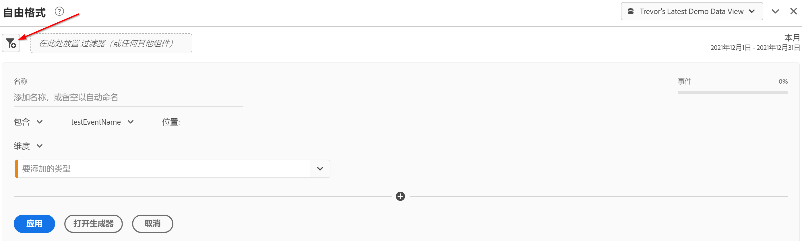
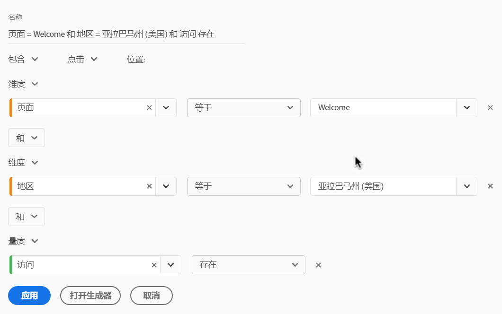
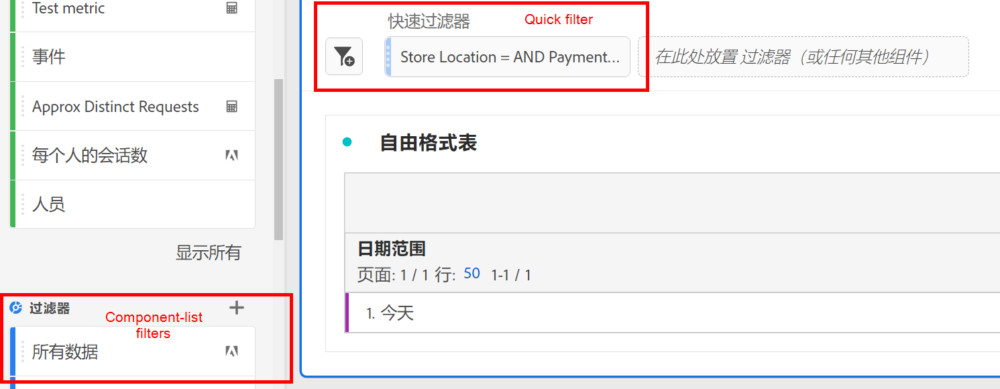
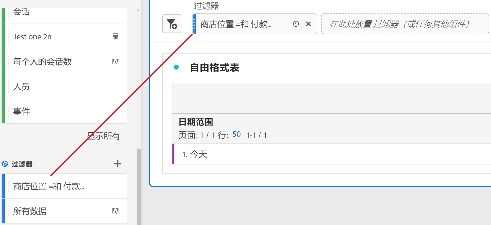

# 快速过滤器

您可以在项目中创建快速过滤器，以绕过完整[过滤器生成器](/help/components/filters/create-filters.md)的复杂性。 快速过滤器

* 仅应用于创建了这些项目的项目（您可以更改此设置）。
* 最多允许3个规则
* 不要包含嵌套容器或顺序规则。

要比较快速过滤器可以执行的操作与完整的组件列表过滤器，请转到[此处](/help/components/filters/filters-overview.md)。

>[!IMPORTANT]
> 快速过滤器当前处于有限测试阶段，通常还不可用。

## 先决条件

任何人都可以创建快速区段。 但是，您需要[Adobe Admin Console](https://experienceleague.adobe.com/docs/analytics/admin/admin-console/permissions/summary-tables.html?lang=en#analytics-tools)中的“区段创建”权限，才能保存快速区段或在区段生成器中将其打开。

## 创建快速过滤器

在自由格式表中，单击面板标题中的过滤器+图标：

| 设置 | 描述 |
| --- | --- |
| 名称 | 过滤器的默认名称是过滤器中规则名称的组合。 您可以将过滤器重命名为更易记的名称。 |
| 包含/排除 | 您可以在过滤器定义中包含或排除组件，但不能同时包含和排除这两个组件。 |
| 点击/访问/访客容器 | 快速过滤器仅包含一个[过滤器容器](https://experienceleague.adobe.com/docs/analytics-platform/using/cja-components/cja-filters/filters-overview.html?lang=zh-Hans#filter-containers)，该容器允许您在过滤器中（或从中排除）包含维度/量度/日期范围。  访客包含所有访问和页面查看中特定于该访客的一切数据。通过[!UICONTROL 访问]容器可设置规则来根据访问对访客的数据进行划分，通过[!UICONTROL 点击]容器可根据各个页面查看对访客信息进行划分。 默认容器为[!UICONTROL Hit]。 |
| 组件(Dimension/量度/日期范围) | 通过添加组件（维度和/或量度和/或日期范围）及其值，最多定义3个规则。 有3种方法可找到正确的组件：<ul><li>开始键入内容，[!UICONTROL 快速过滤器]生成器会自动找到相应的组件。</li><li>使用下拉列表查找组件。</li><li>从左边栏拖放组件。</li></ul> |
| 运算符 | 使用下拉菜单查找标准运算符和[!UICONTROL Distinct Count]运算符。 [了解详情](https://experienceleague.adobe.com/docs/analytics/components/filteration/segment-reference/seg-operators.html?lang=en) |
| 加号(+) | 添加其他规则 |
| 和/或限定符 | 您可以在规则中添加“AND”或“OR”限定符，但不能在单个过滤器定义中混合使用“AND”和“OR”。 |
| 应用 | 将此过滤器应用到面板。 如果过滤器不包含数据，则系统将询问您是否要继续。 |
| 打开生成器 | 打开过滤器生成器。 在过滤器生成器中保存或应用过滤器后，该过滤器不再被视为“快速过滤器”。 它将成为组件列表筛选器库的一部分。 |
| 取消 | 取消此快速过滤器 — 请勿应用它。 |
| 日期范围 | 验证器使用面板日期范围进行数据查找。 但是，快速过滤器中应用的任何日期范围都会覆盖面板顶部的面板日期范围。 |
| 预览（右上方） | 允许您查看是否具有有效的过滤器以及过滤器的范围。 表示在应用此过滤器时您可能会看到的数据集的划分。 您可能会收到一条通知，指示此过滤器没有数据。 在这种情况下，您可以继续或更改过滤器定义。 |

以下是将维度和量度组合在一起的过滤器示例：

过滤器将显示在顶部。 请注意其蓝色条纹侧栏，而不是左侧过滤器库中组件级别过滤器的蓝色侧栏。

## 编辑快速过滤器

1. 将鼠标悬停在快速过滤器上，然后选择铅笔图标。
1. 编辑过滤器定义或过滤器名称。

## 保存快速过滤器

您可以选择在[!UICONTROL 快速过滤器生成器]中或在[!UICONTROL 过滤器生成器]中保存快速过滤器。

>[!IMPORTANT]
>保存或应用过滤器后，您将无法再在快速过滤器生成器中编辑该过滤器，只能在常规过滤器生成器中进行编辑。

### 在快速过滤器生成器中保存

1. 应用快速过滤器后，将鼠标悬停在该过滤器上，然后选择信息(“i”)图标。
1. 单击&#x200B;**[!UICONTROL 使所有项目都可用并添加到组件列表]**。
1. （可选）重命名过滤器。
1. 单击&#x200B;**[!UICONTROL 保存]**。

请注意过滤器的侧栏如何从条纹蓝色更改为浅蓝色。 现在，它会显示在左边栏的组件列表中。

### 在过滤器生成器中保存

1. 将鼠标悬停在快速过滤器上，然后选择信息(“i”)图标。
1. 选择&#x200B;**[!UICONTROL 保存过滤器]**
1. 将名称保留为原样，或重命名过滤器。

   返回到工作区，并注意过滤器现在如何具有浅蓝色侧栏。 这表示无法再在快速过滤器生成器中编辑/打开过滤器。 通过保存，它将成为组件列表的一部分。

   

应用过滤器后，您可以选择将其添加到过滤器组件列表，并使其可用于所有项目。

1. 将鼠标悬停在保存的过滤器上，然后选择铅笔图标。

1. 在过滤器生成器顶部，请注意以下对话框：

   

1. 选中&#x200B;**[!UICONTROL Make available of all projects and add to your component list（使所有项目都可用并添加到组件列表）旁边的复选框。]**
1. 单击&#x200B;**[!UICONTROL 保存]**。
1. 过滤器现在会显示在您的过滤器组件列表中，以供您的所有项目使用。
1. 您还可以[与组织中的其他人员共享过滤器](/help/components/filters/manage-filters.md)。

## 什么是仅限项目的过滤器？

仅限项目的过滤器可以是快速过滤器，也可以是临时工作区项目过滤器。 在[!UICONTROL 过滤器生成器]中编辑/打开它们时，将显示仅项目框。

如果您在生成器中应用快速过滤器，但未选中“提供可用”框，则该过滤器仍是仅限项目的过滤器，但无法再在[!UICONTROL 快速过滤器生成器]中打开。 如果选中该框并单击&#x200B;**[!UICONTROL Save]**，则它现在是组件列表筛选器。
