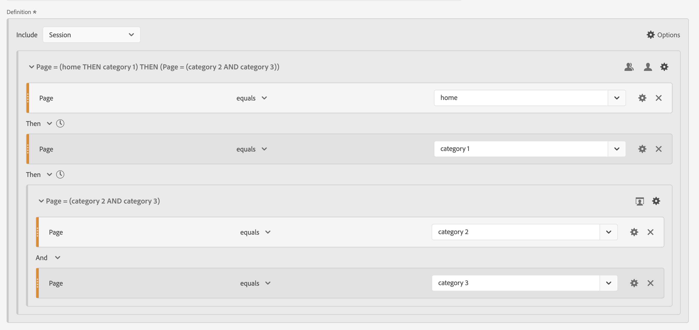

# 顺序过滤器

在组件、容器和组件或容器之间使用[!UICONTROL Then]逻辑运算符创建顺序筛选器。 [!UICONTROL Then]逻辑运算符表示出现一个筛选条件，然后出现另一个筛选条件。

+++ 以下是一段演示顺序区段的视频。

>[!VIDEO](https://video.tv.adobe.com/v/25405/?quality=12)

{{videoaa}}

+++

顺序筛选器具有一些[基本功能](#basics)和其他选项，您可以配置这些选项来增加顺序筛选器的复杂性：

* 序列筛选器定义中Then逻辑的[After和within](#after-and-within)约束：

* [包含哪些数据作为过滤器定义的整体序列的一部分](#include)。 或者，对于定义为容器一部分的序列。 默认情况下，会考虑所有匹配数据。 该数据由 [!UICONTROL 包含每个人]标识。

   * 选择 **[!UICONTROL Only Before Sequence]**&#x200B;以仅考虑序列之前的数据。
   * 选择 **[!UICONTROL Only After After Sequence]**&#x200B;以仅考虑序列之后的数据。

* 要将[排除](#exclude)的数据作为顺序筛选器定义的一部分。

* 如何在顺序筛选器定义中对[条件进行逻辑分组](#logic-group)。

## 基础知识

生成顺序过滤器的基本原理与使用[过滤器生成器](filter-builder.md)生成常规过滤器相同。 您可以使用[定义生成器](filter-builder.md#definition-builder)来构造您的筛选器定义。 在该构造中，使用组件、容器、运算符和逻辑。 当您在主定义或您在[定义生成器](filter-builder.md#definition-builder)中使用的任何容器中选择&#x200B;**[!UICONTROL Then]**&#x200B;运算符时，常规筛选器就会自动变为顺序筛选器。

### 示例

以下示例说明如何在各种用例中使用顺序过滤器。

#### 简单序列

识别查看了某个页面然后又查看了另一个页面的人员。 使用此序列过滤事件级别的数据。 不考虑以前、过去或临时人员会话，也不考虑会话之间发生的页面查看时间或次数。

#### 跨会话的序列

识别在一个会话中查看了某个页面，然后在另一个会话中查看了另一个页面的人员。 若要区分会话，请使用容器生成序列并为每个容器定义 **[!UICONTROL 会话]**&#x200B;级别。

#### 混合级别序列

确定在次数不定的会话中查看两个页面，然后在单独的会话中查看第三个页面的人员。 同样，使用容器构建序列并在定义单独会话的容器上定义 **[!UICONTROL 会话]**&#x200B;级别。

#### 聚合序列

确定在首次会话时访问特定页面，然后访问某些其他页面的人员。 若要区分事件的序列，请使用容器在 **[!UICONTROL 会话]**&#x200B;容器级别上分离逻辑。

#### 嵌套序列

确定以下所有会话：用户先访问一个页面，然后再访问另一个页面，然后进行涉及其他两个页面的跟进会话。 例如，确定人员首先访问主页，然后访问类别1页面，然后又访问其他会话，其中每个会话访问类别2和类别3页面。

## [!UICONTROL After]和[!UICONTROL Within]

您可以使用 **[!UICONTROL After]**&#x200B;和 **[!UICONTROL Within]** **[!UICONTROL Then]**&#x200B;运算符为事件、会话或Dimension](#event-session-and-dimension-constraints)定义其他[时间约束](#time-constraints)或[约束。

### 时间限制

要将时间约束应用于&#x200B;**[!UICONTROL Then]**&#x200B;运算符：

1. 选择。
1. 从上下文菜单中选择&#x200B;**[!UICONTROL Within]**&#x200B;或&#x200B;**[!UICONTROL After]**。
1. 指定一个时间段（**[!UICONTROL 分钟]**，**[!UICONTROL 小时]**，最多&#x200B;**[!UICONTROL 年]**）。
1. 选择 **[!UICONTROL *number *]**以打开一个弹出窗口，允许您使用**[!UICONTROL -]**或**[!UICONTROL +]**键入或指定数字。

若要移除时间限制，请使用。

下表更详细地说明了时间限制运算符。

| 运算符 | 描述 |
|--- |--- |
| **[!UICONTROL After]** | [!UICONTROL After]运算符用于指定两个检查点之间的时间长度的最小限制。 设置After值时，时间限制从应用过滤器时开始。 例如，如果在容器上设置[!UICONTROL After]运算符以识别访问页面A，但直到一天后才返回访问页面B的人员，则访客离开页面A时将会开始该日期。 对于要包含在过滤器中的访客，离开页面A后必须至少经过1440分钟（一天）才能查看页面B。 |
| **[!UICONTROL Within]** | [!UICONTROL Within] 运算符用于指定两个检查点之间的时间长度的最大限制。例如，如果在容器上设置[!UICONTROL Within]运算符以识别访问页面A，然后在一天内返回访问页面B的人员，则该时间将从该人员离开页面A时开始。要包含在过滤器中，人员最多需要在一天之后打开页面B。对于要包含在过滤器中的人员，在离开页面A以查看页面B后最多1440分钟（一天）内必须出现打开页面B。 |
| **[!UICONTROL 晚于]**&#x200B;之内 | 同时使用[!UICONTROL After]和[!UICONTROL Within]运算符时，这两个运算符是并行开始和结束的，而不是按顺序开始和结束。  例如，您生成了一个容器设置为`After = 1 Week(s) and Within = 2 Week(s)`的筛选器。 此筛选条件中用于识别访客的条件仅在一周到两周之间满足。 这两个条件是从第一次查看页面时开始执行的。 |

#### 示例

有关使用时间约束的一些示例。

##### [!UICONTROL After]运算符

识别仅两周后访问了一个页面然后又访问另一个页面的人员。 例如，访问主页的人员，但 | 仅两周后才能翻页。

之后

如果主页的页面查看发生在2024年6月1日00:01，则页面查看针对页面女性 | 只要该页面查看发生在2024年6月15日00:01之后，鞋就会匹配。

##### [!UICONTROL Within]运算符

识别在五分钟内访问了一个页面然后访问另一个页面的人员。 例如，访问主页的人，然后访问妇女 | 在5分钟内完成“鞋子”页面。

内排序

如果主页的页面查看发生在2024年6月1日12:01，则页面查看针对页面女性 | 只要该页面查看发生在2024年6月15日12:16之前，鞋就会匹配。

##### [!UICONTROL After]但[!UICONTROL Within]运算符

识别访问了一个页面然后在两周后但在一个月内访问另一个页面的人员。 例如，访问主页的人，两周后在一个月内访问的女性 | “鞋子”页面。

但在此范围内

2024年6月1日点击主页并返回妇女之家的任何人 | 2019年6月15日00:01之后但2019年7月1日之前的“鞋子”页面符合该区段的条件。

### [!UICONTROL 事件]、[!UICONTROL 会话]和[!UICONTROL Dimension]约束

 **[!UICONTROL After]**&#x200B;和 **[!UICONTROL Within]**&#x200B;约束不仅允许您指定时间约束，还可以指定事件、会话或维度约束。 选择&#x200B;**[!UICONTROL 事件]**、**[!UICONTROL 会话]**&#x200B;或&#x200B;**[!UICONTROL 其他维度]**  **[!UICONTROL *Dimension名称&#x200B;*]**。 您可以使用&#x200B;[!UICONTROL *搜索*]字段来搜索维度。

#### 示例

以下是顺序过滤器的示例，该过滤器查找访问过一个产品类别页面的人员（女性） | 鞋子)，然后是结帐页面（结帐） | 谢谢)。

内进行序列筛选

以下示例序列匹配或不匹配：

| 序列 |  |
|--- | :---: |
| 页面`Women \| Shoes`后跟页面`Checkout \| Thank You` |  |
| 页面`Women \| Shoes`后跟页面`Women \| Tops`，后跟页面`Checkout \| Thank You` |  |

## [!UICONTROL 包含]

您可以指定在顺序过滤器或作为顺序过滤器一部分的顺序容器中包含哪些数据。

### [!UICONTROL 每个人] {#include_everyone}

要创建包含每个人的顺序筛选器，请选择选项 **[!UICONTROL 包含每个人]**。

顺序过滤器识别整体匹配给定模式的数据。  以下是基本序列过滤器的示例，该过滤器查找访问过某个产品类别页面的人员（女性） | 鞋子)，然后是结帐页面（结帐） | 谢谢)。 筛选器设置为 **[!UICONTROL 包含每个人]**。

以下示例序列匹配或不匹配：

| | 序列 |  |
|---:|--- | --- |
| 1 | 在同一会话中`Women \| Shoes`然后`Checkout \| Thank You` |  |
| 2 | `Women \| Shoes`然后`Men \| Shoes`然后`Checkout \| Thank You`（跨不同会话） |  |
| 3 | `Checkout \| Thank You`，然后`Women \| Shoes` |  |

### [!UICONTROL 仅在序列之前]，[!UICONTROL 仅在序列之后]

选项 **[!UICONTROL Only Before Sequence]**&#x200B;和 **[!UICONTROL Only Before Sequence]**&#x200B;将数据过滤到指定序列之前或之后的子集。

*  **Only Before Sequence**：包含序列之前的所有数据和序列本身的第一个数据。 如果序列作为数据的一部分出现多次，则[!UICONTROL 仅在序列之前]包括该序列最后一个实例的第一次点击和所有先前的点击。
*  **Only After Sequence**：包含序列之后的所有点击以及该序列本身的最后一个数据。 如果序列作为数据的一部分出现多次，则[!UICONTROL 仅在序列之后]包括该序列第一个实例的最后一次点击以及所有后续点击。

考虑一个定义，该定义指定具有由B标识的标准、后跟(Then)具有由D标识的标准的组件序列的组件。三个选项将按以下方式标识数据：

| B然后D | A | B | C | D | E | F |
|---|:---:|:---:|:---:|:---:|:---:|:---:|
| 包含每个人 |  |  |  |  |  |  |
| 仅在序列前 |  |  |  |  |  |  |
| 仅在序列后 |  |  |  |  |  |  |

| B然后D（出现多次） | A | B | C | D | B | C | D | E |
|---|:---:|:---:|:---:|:---:|:---:|:---:|:---:|:---:|
| 包含每个人 |  |  |  |  |  |  |  |  |
| 仅在序列前 |  |  |  |  |  |  |  |  |
| 仅在序列后 |  |  |  |  |  |  |  |  |

#### 示例

您已为网站区域定义了三个版本的顺序过滤器。 一个具有选项 **[!UICONTROL 包括所有人]**，一个具有选项 **[!UICONTROL 且仅在Sequence]**&#x200B;之前，另一个具有选项 **[!UICONTROL 且仅在Sequence]**&#x200B;之后。 您相应地命名了三个过滤器。

使用这三个过滤器报告网站区域时，自由格式表中的示例输出如下所示：

## [!UICONTROL 排除]

筛选器定义包括所有数据，除非您使用&#x200B;**[!UICONTROL 排除]**&#x200B;专门排除 [!UICONTROL 人员]、 [!UICONTROL 会话]或 [!UICONTROL 事件]数据。

[!UICONTROL 排除]允许您消除常见数据并创建重点更突出的过滤器。 “Exclude”（排除）还允许您创建排除特定人员组的过滤器。 例如，定义一个筛选器，该筛选器指定下订单的人员，然后排除该组人员以识别&#x200B;*非购买者*。 最佳做法是创建使用宽泛定义的规则，而不是尝试使用[!UICONTROL 排除]来定位与特定包含值匹配的特定角色。

排除定义的示例包括：

* **排除页面**。使用筛选器定义从报告中排除特定页面（如&#x200B;*主页*），创建页面等于`Home Page`的事件规则，然后排除该规则。 此定义自动包括&#x200B;*主页*&#x200B;以外的所有页面。
* **排除反向链接域**。请使用仅包含来自Google.com的反向链接域并排除所有其他域的定义。
* **确定非顾客**。识别订单大于零的时间，然后排除[!UICONTROL 人员]。

[!UICONTROL Exclude]可用于识别人员不是特定会话一部分的序列或执行特定事件。 [!UICONTROL 排除]也可以包含在[!UICONTROL 逻辑组]中（请参阅下文）。

您可以排除容器而非组件。

### 示例

有关使用[!UICONTROL 排除]的示例，请参见下文。

#### [!UICONTROL 排除]，在

识别访问了一个页面、未访问另一个页面、然后又访问另一个页面的人员。 您使用 [!UICONTROL 排除]排除容器。 排除的容器由左侧的红色细条标识。

#### 开始时[!UICONTROL 排除]

识别从未访问过某个页面就访问过另一个页面的人员。 例如，访客结帐后从未访问过主页。

#### 在末尾[!UICONTROL 排除]

识别访问过一个页面但从未访问过其他页面的人员。 例如，访问过您的主页但从未访问过任何结账页面的人员。

## [!UICONTROL 逻辑组]

>[!NOTE]
>
>[!UICONTROL 逻辑组]只能在顺序筛选器中定义，这意味着容器中会使用[!UICONTROL Then]运算符。

使用逻辑组，您可以将条件分组到单个顺序过滤器检查点中。 作为序列的一部分，在标识为逻辑组的容器中定义的逻辑将在任何先前顺序检查点之后和任何后续顺序检查点之前进行评估。

可以按任意顺序满足逻辑组本身中的条件。 相反，非顺序容器（事件、会话、人员）不要求在整个序列中满足其条件，如果与Then运算符一起使用，则会产生可能不直观的结果。

[!UICONTROL 逻辑组]设计成将&#x200B;*多个条件视为一个组，在分组条件中没有任何排序*。 除此以外，逻辑组中条件的顺序无关。

使用逻辑组的一些最佳实践包括：

* 对顺序检查点进行分组。
* 简化顺序过滤器的构建。

### 示例

以下是如何使用逻辑组容器的示例。

#### 任何订单

识别访问了一个页面，然后以任意顺序从另一组页面中查看了每个页面的人员。 例如，访客访问了主页，然后又访问了“男性”页面、“女性”页面和“儿童”页面，而不管顺序如何。

您可以在不使用[!UICONTROL 逻辑组]的情况下构建此筛选器，但构建过程将会非常复杂和费力。 指定访客可以查看的每个页面序列。 为清楚起见，仅打开第一个容器，关闭其他容器。 您可以通过标题来派生其他容器的内容。

您可以使用[!UICONTROL 逻辑组]来简化生成此筛选器的过程，如下所示。 请确保为容器选择 **[!UICONTROL 逻辑组]**。

#### 第一个匹配项

识别访问了一个页面或其他页面，然后又访问另一个页面的人员。 例如，访问了“女性”页面或“男性”页面，然后访问了“结帐”的人员 | 感谢页面。

#### [!UICONTROL 排除] [!UICONTROL 和]

识别访问了一个页面，然后明确未访问一组其他页面，但又访问了另一页面的人员。 例如，访问过主页的人员，没有访问男性页面或女性页面，但访问了儿童页面。

#### [!UICONTROL 排除] [!UICONTROL 或]

识别访问了一个页面，然后明确不访问一组页面中的任何页面，但又访问另一个页面的人员。 例如，访问主页的人没有访问“男女”页面，但访问了“孩子”页面。

<!--
An example of a complex sequential filter if you want to find the persons that 

| Session One | Session Two | Session Three |
| --- | --- | --- |
| The person went to the main landing page A, excluded the campaign page B, and then viewed the Product page C.| The person again went to the main landing page A, excluded the campaign page B, and went again to the Product page C, and then to a new page D. | The person entered and followed that same path as in the first and second visits, then excluded page F to go directly to a targeted product on page G. |
-->

## 最后一个示例

最后一个示例，您希望识别学习了特定产品页面的人员，并且这些人员从未被您的“启用您的移动”营销活动所接触。 在第一次访问网上商店时，他们浏览了主页，但没有进一步查看“男性”类别的任何健身（装备）产品。 但是，在随后的下一个会话中，他们直接转到产品页面并下达在线订单，而没有先访问主页。

