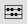
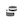

# 组件概述

组件是 Customer Journey Analytics 中的功能，可以在报告中使用，或者用于补充报告功能。您可以通过以下步骤管理这些组件：

1. 使用您的 Adobe ID 凭据登录 [analytics.adobe.com](https://analytics.adobe.com)。
2. 在标题菜单中，导航到[!UICONTROL 组件] > [!UICONTROL 组件]。

您可以管理以下组件：

* [**批注**](/help/components/annotations/overview.md)：向您的组织传达上下文数据的细微差别和见解。
* [**过滤器**](filters/filters-overview.md)：排除部分数据，以重点关注常见的维度项目
* [**计算量度**](calc-metrics/calc-metr-overview.md)：使用量度和公式作为新组件以便在报告中使用
* [**日期范围**](date-ranges/overview.md)：自定义和优化 Analysis Workspace 中提供的日期范围
* [**项目**](/help/analysis-workspace/home.md)：组织和维护 Analysis Workspace 中的项目

## Analysis Workspace 组件

Analysis Workspace 中的组件包括量度、维度、区段和时间粒度，您可以将这些组件拖放到项目中。您创建的自定义组件会被添加到这些面板中，例如自定义日期范围。

要访问“组件”面板，请单击左边栏中的&#x200B;**[!UICONTROL 组件]**&#x200B;图标。您可以使用左边栏图标或[热键](/help/analysis-workspace/build-workspace-project/fa-shortcut-keys.md)在面板（空白面板、[自由格式面板](/help/analysis-workspace/visualizations/freeform-table/freeform-table.md)、[快速分析面板](/help/analysis-workspace/c-panels/quickinsight.md)或[Attribution IQ](/help/analysis-workspace/c-panels/attribution.md) 面板）、[可视化图表](/help/analysis-workspace/visualizations/freeform-analysis-visualizations.md)和“组件”之间切换。

请参阅[创建项目](/help/analysis-workspace/home.md)，以了解有关在项目中使用组件的信息。

## 组件操作

您可以通过多种方式管理组件（逐个选择或通过选择多个组件）。右键单击组件，或单击组件列表顶部的&#x200B;**[!UICONTROL 操作]**。

>[!NOTE]
>
>这些操作不适用于“时间”组件。

| 组件操作 | 描述 |
| --- | --- |
| 标记 | 通过对组件应用标记来组织或管理组件。然后，它显示在相应的组件管理器中，如 [!UICONTROL Analytics] > [!UICONTROL 组件] > [!UICONTROL 过滤器]，或 [!UICONTROL Analytics] > [!UICONTROL 组件] > [!UICONTROL 项目] |
| 收藏 | 将组件添加到您的收藏夹列表中。然后，它显示在相应的组件管理器中，如 [!UICONTROL Analytics] > [!UICONTROL 组件] > [!UICONTROL 过滤器]，或 [!UICONTROL Analytics] > [!UICONTROL 组件] > [!UICONTROL 项目]。 |
| 批准 | 批准组件以使其成为规范。然后，它显示在相应的组件管理器中，如 [!UICONTROL Analytics] > [!UICONTROL 组件] > [!UICONTROL 过滤器]，或 [!UICONTROL Analytics] > [!UICONTROL 组件] > [!UICONTROL 项目] |
| 共享 | 仅适用于过滤器。 |
| 删除 | 仅适用于过滤器。 |

观看有关创建量度、过滤器和日期的视频：

>[!VIDEO](https://video.tv.adobe.com/v/23979)

## 管理元件 {#actions}

您可以直接在左側邊欄中管理元件。

1. 以滑鼠右鍵按一下元件。

   或

   選取元件，然後選取 **動作** 元件清單頂端的（3點）圖示。

   >[!TIP]
   >
   >   按住Shift鍵或按住Command鍵(在Mac上)或Ctrl鍵（在Windows上）可選取多個元件。

   

   | 元件動作 | 描述 |
   |--- |--- |
   | [!UICONTROL **标记**] | 通过对组件应用标记来组织或管理组件。然后，您可以通过单击过滤器或者键入 # 在左边栏中按标记搜索。标记在组件管理器中也可用作过滤器。 |
   | [!UICONTROL **收藏**] | 将组件添加到您的收藏夹列表中。与标记相似，您可在左边栏中按“收藏”进行搜索，然后在组件管理器中对其进行过滤。 |
   | [!UICONTROL **批准**] | 将组件标记为“已批准”可告知用户该组件得到了组织的批准。与标记相似，您可在左边栏中按“已批准”进行搜索，然后在组件管理器中对其进行过滤。 |
   | [!UICONTROL **共享**] | 将组件与组织中的用户共享。此選項僅適用於自訂元件，例如篩選器或計算量度。 |
   | [!UICONTROL **删除**] | 删除不再需要的组件。此選項僅適用於自訂元件，例如篩選器或計算量度。 |

自定义组件也可通过其相应的组件管理器进行管理。例如， [管理篩選器](/help/components/filters/manage-filters.md).

## 搜尋、篩選及排序元件清單

您可以在Analysis Workspace的左側邊欄中搜尋、篩選和排序元件清單，以快速找到特定元件。

### 搜尋元件清單

1. 選取 **元件** 圖示  在左側邊欄中。

1. 在搜尋欄位中，開始輸入您要在專案中使用的元件名稱。

   元件型別可由顏色和圖示識別。 **Dimension**  是橙色， **篩選器**  是藍色的， **日期範圍**  是紫色的，並且 **量度**  是綠色的。 Adobe圖示  表示計算量度範本或篩選器範本，以及計算器圖示  表示貴組織中Analytics管理員建立的計算量度。

1. 當元件出現在下拉式清單中時選取該元件。

### 篩選元件清單

1. 選取 **元件** 圖示  在左側邊欄中。

1. 選取 **篩選** 圖示 .

   或

   在搜尋欄位中輸入井字型大小(#)。

1. 選取下列任一篩選選項來篩選元件清單：

   | 选项 | 函数 |
   |---------|----------|
   | [!UICONTROL **已批准**] | 仅显示标记为由管理员批准的组件。 |
   | [!UICONTROL **收藏夹**] | 仅显示收藏夹列表中的组件。如需有關將元件新增至您的最愛清單的資訊，請參閱 [管理元件](#manage-components). |
   | [!UICONTROL **维度**] | 仅显示维度的组件。 |
   | [!UICONTROL **量度**] | 仅显示量度的组件。 |
   | [!UICONTROL **筛选器**] | 僅顯示屬於篩選器的元件。 |
   | [!UICONTROL **日期范围**] | 仅显示日期范围的组件。 |
   | [!UICONTROL **显示所有**] | 显示所有组件。仅管理员有此选项可用。 |
   | [!UICONTROL **未批准**] | 仅显示未标记为由管理员批准的组件。作为管理员，这有助于确定需要您审阅和批准的组件。仅管理员有此选项可用。 |

1. （可選）若要進一步美化清單，您可以排序元件清單，如所述 [排序元件清單](#sort-the-component-list).

### 排序元件清單

{{release-limited-testing-section}}

1. （可選）將任何篩選器套用至元件清單，如所述 [篩選元件清單](#filter-the-component-list).

1. 選取 **元件** 圖示  在左側邊欄中。

1. 選取 **排序** 圖示 ，然後選取下列任一篩選選項來排序元件清單：

   {{components-sort-options}}

## 组件访问权限

在 Analysis Workspace 中，管理员可[管理](/help/analysis-workspace/curate-share/curate.md)哪些组件在报告中对用户可见。
