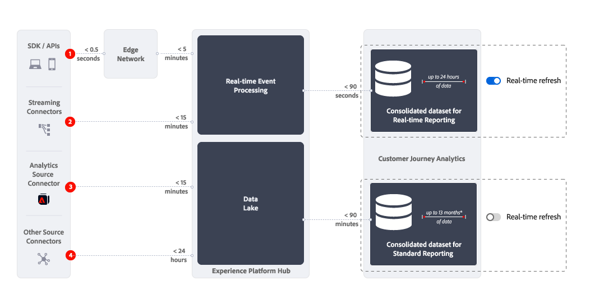

# 实时报表概述

Customer Journey Analytics 中的实时报告功能可以实时显示并更新 Analysis Workspace 的一个或多个面板中的数据和可视化图表。

{{ultimate-package}}

>[!TIP]
>
>如果您有权使用Ultimate包，但未看到[实时刷新切换开关](use-real-time.md)，请创建一个客户关怀票证，以请求为您的组织启用实时报表。

## 用例

此部分概述了有价值和不那么有价值的典型用例。 以及何时不考虑实时报表的信息。

* 实时报表最有价值的用例是关于主要销售、促销或产品发布。
在该启动项中，您想了解：

   * 与上一次销售相比，销售情况如何？
   * 与上次产品发布相比，本次产品发布情况如何？
   * 您为这一重要日子或活动举行的促销活动是否真的有效？

* 实时报表的相关用例（但价值较低的用例）是验证用例。
例如，您要验证：

   * 您最近启动的活动历程是否实际有效？
   * 新产品页面上线时，您是否从该页面收集客户数据？
   * 您的直播媒体活动是否正常？

对于操作监控用例，请勿考虑实时报告。 例如，回答站点是否正常运行的问题。 由于[实时刷新切换开关](use-real-time.md)会在30分钟后自动禁用并且实时报表停止刷新，因此您不应将实时报表用作这些用例的可靠源。

## 工作原理

实时报表使用的合并数据集与用于标准报表的[合并（组合）数据集](/help/connections/combined-dataset.md)完全不同。 您使用[实时刷新切换开关](use-real-time.md)来切换：

* 实时报告包含长达24小时滚动数据的合并数据集。
* 有关合并数据集的标准报表，该数据集包含最多13个月的滚动数据（如果许可了扩展数据容量加载项，则更长）。

{zoomable="yes"}

### 延迟

收集数据的方式决定了Customer Journey Analytics中实时报表的延迟。 上图和下表显示了使用实时报表和（比较）标准报表时，各种数据收集方案的大致延迟。

| | 数据收集 | 实时报告延迟 (约 小于) | 标准报告延迟 (约 小于) |
|:---:|---|--:|--:|
| 1 | 将Edge Network SDK / API引入Edge Network | 7 分钟 | 95 分钟 |
| 2 | 流连接器 | 17 分钟 | 105 分钟 |
| 3 | Adobe Analytics源连接器 | 17 分钟 | 105 分钟 |
| 4 | 进入源连接器的其他源连接器（包括批量数据） | 25 小时 | 25 小时 |

如果服务中断超过半小时，则解决问题后实时数据不会回填数据。 相反，实时报表会从服务重新开始工作的那一刻开始收集实时数据。 在此期间，不会丢失任何数据，并且仍可以使用实时报表之外的标准报表功能。

## 限制

请注意实时报表的以下限制：

* 实时报表仅报告滚动时段24小时内的可用数据。 超过24小时之前的数据不可用于实时报表。 禁用或自动关闭报表的[实时刷新](use-real-time.md)后，通常用于Customer Journey Analytics中报表的[统一数据集](/help/connections/combined-dataset.md)中的所有相关数据将再次可用。
* 归因、分段、计算量度等仅适用于滚动时段（24小时）内的可用数据。 例如，*重复访客*&#x200B;区段在实时报表中包含的用户非常少，因为此报表仅包含过去24小时内多次访问的人。 类似的限制同样适用于创建关于之前点击了不再活动的营销策划的人员的实时报表。
* 实时报表最适用于事件和会话级别的数据，因此，在对人员级别的数据使用实时报表时应当谨慎。 由于实时报表仅提供滚动的24小时周期中的事件，因此人员的事件历史记录也仅限于此窗口。 选择维度和（计算）量度时，请考虑事件和会话级别数据的首选项。 当您在启用实时刷新的面板中使用划分、下一个或上一个以及更多等功能时。
* 您不能将拼合与实时报表结合使用。 实时报表是关于事件和会话级别的数据，与基于人员的数据不太相关。
* 除媒体开始和媒体关闭量度外，没有可用的心跳收集媒体量度。 因此，您仍然可以使用实时报表来启用媒体用例。
* 使用[下载或导出选项](/help/analysis-workspace/export/download-send.md)下载项目或从自由格式表中导出数据时，请考虑以下事项：
   * 下载的CSV项目或导出的CSV文件包含下载或导出时可用的实时数据。
   * 下载的PDF项目包含非实时数据，类似于禁用实时刷新时显示的数据。
