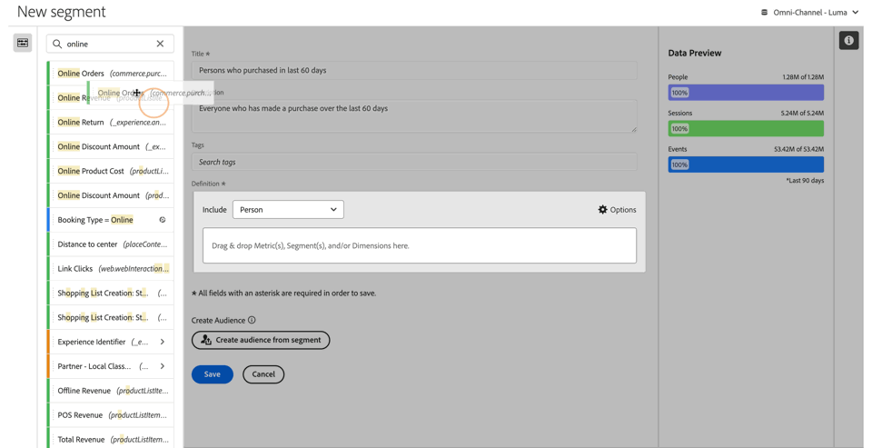
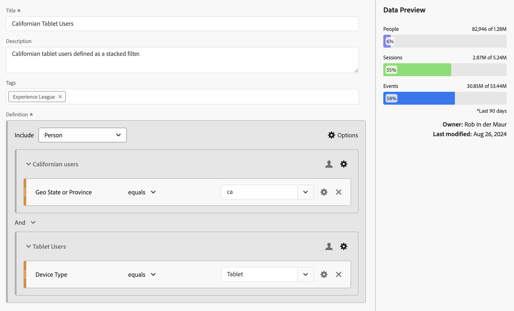
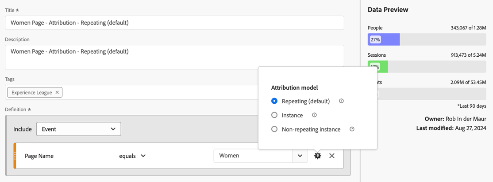

# 生成区段 {#build-segments}

>[!CONTEXTUALHELP]
>id="components_filters_createaudience"
>title="创建受众"
>abstract="可以从区段创建受众，与 Adobe Experience Platform 共享受众以将其激活。"

>[!CONTEXTUALHELP]
>id="components_filters_datapreview"
>title="数据预览"
>abstract="将此区段的数据与数据视图的数据进行比较。预览百分比基于&#x200B;**过去 90 天**&#x200B;数据视图中的总数。  如果预览未加载，可能是您的连接仍在进行数据回填。"

**[!UICONTROL 区段生成器]**&#x200B;对话框可用于创建新区段或编辑现有区段。对于您通过[[!UICONTROL 区段]管理器](/help/components/segments/seg-manage.md)创建或管理的区段，该对话框的标题为&#x200B;**[!UICONTROL 新区段]**&#x200B;或&#x200B;**[!UICONTROL 编辑区段]**。

>[!BEGINTABS]

>[!TAB 区段生成器]

>[!TAB 创建或编辑区段]

>[!ENDTABS]

1. 指定以下详细信息（为必要项）：

   | 元素 | 描述 |
   | --- | --- |
   | **[!UICONTROL 数据视图]** | 您可以选择区段的数据视图。您定义的区段可用作某个数据视图的[设置](/help/data-views/create-dataview.md#settings-filters)选项卡中的区段。 |
   | **[!UICONTROL “仅用于项目的区段]** | 一个信息框，说明该区段仅在创建它的项目中可见，且不会添加到您的组件列表中。启用&#x200B;**[!UICONTROL 提供此区段给您的所有项目，并将其添加到组件列表中]**，以更改该设置。此信息框仅在您创建[快速区段](seg-quick.md)，并通过[!UICONTROL 快速区段]界面中的&#x200B;**[!UICONTROL 打开生成器]**&#x200B;将此快速区段转换为常规区段时可见。 |
   | **[!UICONTROL 标题]** | 命名该区段，例如，`Last month mobile customers`。 |
   | **[!UICONTROL 描述]** | 提供关于该区段的描述，例如，`Segment to define the mobile customers for the last month`。 |
   | **[!UICONTROL 标记]** | 通过创建或应用一个或多个标记来组织区段。开始键入，以查找您可以选择的现有标记。或者按&#x200B;**[!UICONTROL 输入]**&#x200B;键添加新的标记。选择  以移除标记。 |
   | **[!UICONTROL 定义]** | 使用[定义生成器](#definition-builder)来定义区段。 |

   {style="table-layout:auto"}

1. 要验证您的区段定义是否正确，请使用右上角不断更新的区段结果预览。
1. 要从区段创建受众并与 Experience Platform 共享该受众，请选择&#x200B;**[!UICONTROL 从区段创建受众]**。请参阅[创建和发布受众](/help/components/audiences/publish.md)，以了解更多信息。
1. 选择：
   * **[!UICONTROL 保存]**&#x200B;可以保存区段。
   * **[!UICONTROL 另存为]**&#x200B;可以保存区段的副本。
   * **[!UICONTROL 删除]**&#x200B;可以删除区段。
   * **[!UICONTROL 取消]**&#x200B;可以取消对区段所做的任何更改，或取消创建新区段。

## 定义生成器

您可以使用定义生成器来构建区段定义。在该构造中，您可以使用组件、容器、运算符和逻辑。

您可以配置定义的类型和范围：

1. 要指定定义的类型，请指定是否要生成包含或排除定义。选择**[!UICONTROL 选项]**&#x200B;并从下拉菜单中&#x200B;**[!UICONTROL 包括]**&#x200B;或&#x200B;**[!UICONTROL 排除]**。
1. 要指定定义的范围，请从&#x200B;**[!UICONTROL 包含]**&#x200B;或&#x200B;**[!UICONTROL 排除]**&#x200B;下拉菜单中选择是希望定义的范围是&#x200B;**[!UICONTROL 事件]**、**[!UICONTROL 会话]**、**[!UICONTROL 人员]**、**[!UICONTROL 全局帐户]**&#x200B;[!BADGE B2B edition]{type=Informative url="https://experienceleague.adobe.com/zh-hans/docs/analytics-platform/using/cja-overview/cja-b2b/cja-b2b-edition" newtab=true tooltip="Customer Journey Analytics B2B Edition"}、**[!UICONTROL 帐户]**&#x200B;[!BADGE B2B edition]{type=Informative url="https://experienceleague.adobe.com/zh-hans/docs/analytics-platform/using/cja-overview/cja-b2b/cja-b2b-edition" newtab=true tooltip="Customer Journey Analytics B2B Edition"}、**[!UICONTROL 机会]**&#x200B;[!BADGE B2B edition]{type=Informative url="https://experienceleague.adobe.com/zh-hans/docs/analytics-platform/using/cja-overview/cja-b2b/cja-b2b-edition" newtab=true tooltip="Customer Journey Analytics B2B Edition"}还是&#x200B;**[!UICONTROL 购买群]** [!BADGE B2B edition]{type=Informative url="https://experienceleague.adobe.com/zh-hans/docs/analytics-platform/using/cja-overview/cja-b2b/cja-b2b-edition" newtab=true tooltip="Customer Journey Analytics B2B Edition"}

您稍后可以随时更改这些设置。

### 组件

构建区段定义的一个重要部分是使用维度、量度、现有区段和日期范围。所有这些组件都可以从区段生成器中的组件面板中获得。

{width=100%}

要添加组件，请执行以下操作：

1. 将一个组件从组件面板拖放到 **[!UICONTROL 将量度、区段和/或维度拖放到此处]**。您可以使用组件栏中的来搜索特定组件。
1. 指定组件的详细信息。例如，从&#x200B;**[!UICONTROL 选择值]**&#x200B;中选择一个值。或输入一个值。指定一个或多个值的内容和方式取决于组件和运算符。
1. 可选择修改默认运算符。例如，从&#x200B;**[!UICONTROL 等于]**&#x200B;到&#x200B;**[!UICONTROL 等于任意一个]**。请参阅 [运算符](seg-operators.md)，了解可用运算符的详细概述。

要编辑组件，请执行以下操作：

* 从运算符下拉菜单中为组件选择一个新的运算符。
* 如果合适，为运算符选择或指定不同的值。
* 如果组件类型是维度，则可以定义归因模型。有关更多信息，请参阅[归因模型](#attribution)。

要删除组件：

* 在组件中选择 。

### 容器

您可以将多个组件分组到一个或多个容器中，并定义容器内和容器之间的逻辑。容器允许您为区段构建复杂的定义。

{Width=100%}

* 要添加容器，请从&#x200B;**[!UICONTROL 设置]**&#x200B;选项**[!UICONTROL 添加容器]**。
* 要将现有组件添加到容器中，请将该组件拖放到容器中。
* 要向容器添加另一个组件，请将组件从组件面板拖放到容器中。使用蓝色插入线作为指南。
* 要在容器外部添加另一个组件，请将组件从组件面板拖放到容器外部、主定义容器内部。使用蓝色插入线作为指南。
* 要修改容器内组件之间、容器之间或容器与组件之间的逻辑，请选择相应的 **[!UICONTROL And]**、**[!UICONTROL Or]**、**[!UICONTROL Then]**。当您选择 Then 时，该区段就会变成一个顺序区段。有关更多信息，请参阅[创建顺序区段](seg-sequential-build.md)。
* 要切换容器级别，请选择 **[!UICONTROL 全球帐户]** [!BADGE B2B Edition]{type=Informative url="https://experienceleague.adobe.com/zh-hans/docs/analytics-platform/using/cja-overview/cja-b2b/cja-b2b-edition" newtab=true tooltip="Customer Journey Analytics B2B Edition"}、 **[!UICONTROL 帐户]** [!BADGE B2B Edition]{type=Informative url="https://experienceleague.adobe.com/zh-hans/docs/analytics-platform/using/cja-overview/cja-b2b/cja-b2b-edition" newtab=true tooltip="Customer Journey Analytics B2B Edition"}、 **[!UICONTROL 机会]** [!BADGE B2B Edition]{type=Informative url="https://experienceleague.adobe.com/zh-hans/docs/analytics-platform/using/cja-overview/cja-b2b/cja-b2b-edition" newtab=true tooltip="Customer Journey Analytics B2B Edition"}、 **[!UICONTROL 购买群组]** [!BADGE B2B Edition]{type=Informative url="https://experienceleague.adobe.com/zh-hans/docs/analytics-platform/using/cja-overview/cja-b2b/cja-b2b-edition" newtab=true tooltip="Customer Journey Analytics B2B Edition"}、 **[!UICONTROL 事件]**、 **[!UICONTROL 会话]**&#x200B;或 **[!UICONTROL 人员]**。

您可以在容器中使用来执行以下操作：

| 容器操作 | 描述 |
|---|---|
| **[!UICONTROL 添加容器]** | 向容器中添加嵌套容器。 |
| **[!UICONTROL 排除]** | 在区段定义中排除容器中的结果。左侧的细红色条身份标识排除容器。 |
| **[!UICONTROL 包含]** | 在区段定义中包含容器中的结果。默认为包含。左侧的细灰色条身份标识了包含容器。 |
| **[!UICONTROL 为容器命名]** | 根据容器的默认描述重命名容器。在文本字段中输入名称。如果您未提供任何输入内容，则会使用默认描述。 |
| **[!UICONTROL 删除容器]** | 从定义中删除容器。 |

## 日期范围

您可以构建包含滚动日期范围的区段。这样，您就可以回答有关正在进行的营销活动或事件的问题。例如，您可以构建一个包含&#x200B;*过去 60 天中在线购买过产品的用户*&#x200B;的区段。

>[!BEGINSHADEBOX]

请参阅  [区段中的滚动日期范围](https://experienceleague.adobe.com/en/docs/analytics-learn/tutorials/components/segmentation/rolling-date-ranges-in-segments){target="_blank"}以获取演示视频。

>[!ENDSHADEBOX]

## 堆叠区段 {#stack}

您可以使用若干区段来构建一个区段。在一个区段中使用若干区段时，您可以优化该区段，降低复杂性。

假设您想要根据设备类型（2）和美国联邦州（50）的组合进行分段。您可以构建 100 个区段，每个区段都针对设备类型（手机与平板电脑）与美国联邦州的某个独特组合。要获取加利福尼亚州的平板电脑用户，您可以使用这 100 个区段中的一个：

或者，您也可以定义 52 个区段：50 个美国联邦州的区段，一个手机的区段，一个平板电脑的区段。然后通过堆叠区段来获得相同的结果。为了获得加利福尼亚州的平板电脑用户，您需要堆叠两个区段：

## 归因 {#attribution}

>[!CONTEXTUALHELP]
>id="components_filters_attribution_repeating"
>title="重复"
>abstract="包括维度的实例及持续值。"

>[!CONTEXTUALHELP]
>id="components_filters_attribution_instance"
>title="实例"
>abstract="包括维度的实例。"

>[!CONTEXTUALHELP]
>id="components_filters_attribution_nonrepeatinginstance"
>title="非重复实例"
>abstract="包括维度的独特（非重复）实例"

如果您在区段生成器中使用维度，可以选择指定该维度的归因模型。您选择的归因模型决定了数据是否符合您为维度组件指定的条件。

选择维度组件中的，并从弹出窗口中选择其中一个归因模型：

| 模型 | 描述 |
|---|---|
| **[!UICONTROL 重复模型（默认）]** | 包含维度的实例值和持久值以确定资格。 |
| **[!UICONTROL 实例]** | 仅包含维度的实例值以确定资格。 |
| **[!UICONTROL 非重复实例]** | 包括维度的唯一实例（非重复）值以确定资格。 |

### 示例

作为区段定义的一部分，您指定了以下条件：页面名称等于女性。与上面的例子类似。您使用另外两个归因模型重复这个区段定义。这样您就有三个区段，每个区段都有自己的归因模型：

* 女性页面 - 归因 - 重复（默认）
* 女性页面 - 归因 - 实例
* 女性页面 - 归因 - 非重复实例

下表针对每种归因模型，解释了哪些传入事件符合  该条件。

| 女性页面 - 归因 -  *归因模型* | 事件 1： 页面名称等于 女性 | 事件 2： 页面名称等于 男性 | 事件 3： 页面名称等于 女性 | 事件 4： 页面名称等于 女性 （持久） | 事件 5： 页面名称等于 结账 | 事件 6： 页面名称等于 女性 | 事件 7： 页面名称等于 主页 |
|---|:---:|:---:|:---:|:---:|:---:|:---:|:--:|
| 重复（默认） |  |  |  |  |  |  |  |
| 实例 |  |  |  |  |  |  |  |
| 非重复实例 |  |  |  |  |  |  |  |

使用这三个区段的事件报告示例如下：

