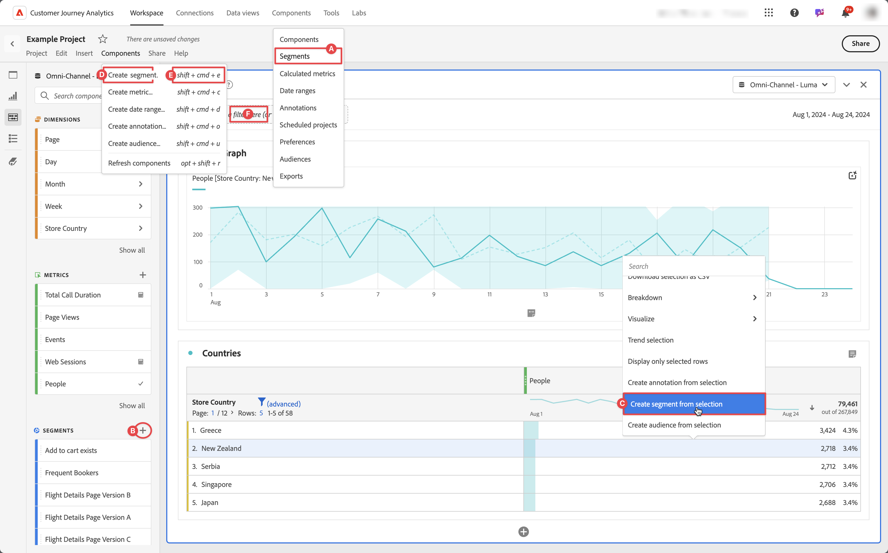

# 创建区段

您可以在Customer Journey Analytics中创建不同类型的区段。  您选择的类型取决于区段需要达到的复杂程度以及区段是应仅应用于当前Workspace项目还是应应用于所有项目。 可直接在Customer Journey Analytics的主界面中或在Workspace项目中工作时创建区段。

默认情况下，只有管理员可以创建区段。 用户有权查看区段，这与用户查看其他组件（例如，注释、计算量度等）的方式类似。

但是，管理员可以通过&#x200B;**[!UICONTROL Admin Console]**&#x200B;向用户授予&#x200B;**[!UICONTROL 编辑CJA Workspace访问权限]**&#x200B;中&#x200B;**[!UICONTROL 报告工具]**&#x200B;的[区段创建](/help/technotes/access-control.md#user-level-access)权限。

可通过以下方式创建区段：

* **A**。在主界面中，选择&#x200B;**[!UICONTROL 组件]**&#x200B;并选择&#x200B;**[!UICONTROL 区段]**。 从管理器[!UICONTROL **[!UICONTROL 中选择]**]AddCircle[Add](/help/components/segments/seg-manage.md)。
* **B**。在Workspace项目中，从“组件”左侧面板中选择 上的&#x200B;**添加**。
* **C**。在Workspace项目中，从可视化图表的上下文菜单中，选择&#x200B;**[!UICONTROL 从所选内容创建区段]**。
* **D**。在Workspace项目中，从菜单中选择&#x200B;**[!UICONTROL 组件]**，然后选择&#x200B;**[!UICONTROL 创建区段]**。
* **E**。 在Workspace项目中，使用快捷键&#x200B;**[!UICONTROL shift+cmd+e]** (macOS)或&#x200B;**[!UICONTROL shift+ctrl+e]** (Windows)。
* **F**。 选择(在&#x200B;***在此处放置区段（或任何其他组件）***&#x200B;放置区域)。 此操作创建一个仅用于项目的区段。

要定义新区段，请使用[区段生成器](/help/components/segments/seg-builder.md)。

当您在Workspace项目中时，还可以使用[快速区段](/help/components/segments/seg-quick.md)快速创建区段。
