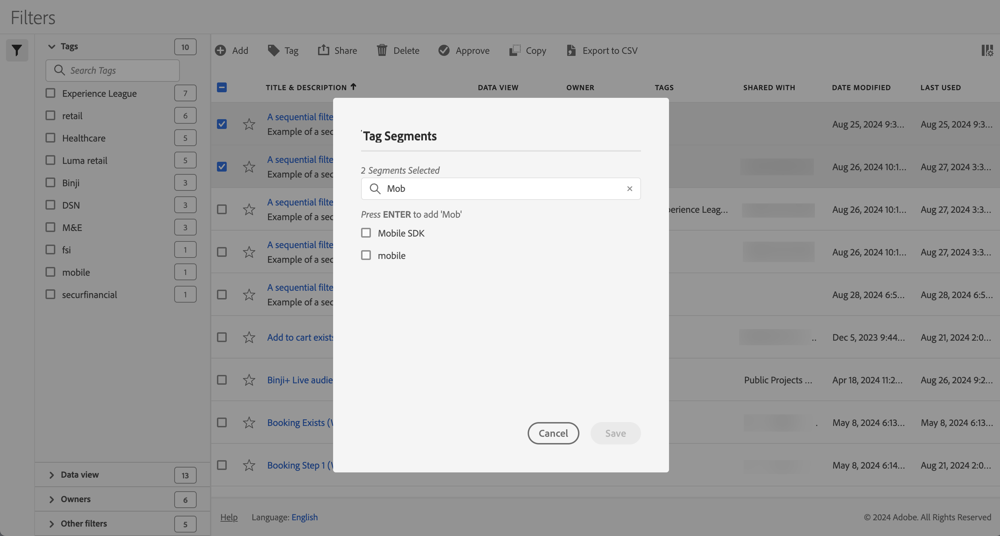

# 标记区段

在[区段管理器](seg-manage.md)中，您可以使用标记来组织区段。 管理员可以标记所有区段。 非管理员只能标记他们自己创建的区段或与他们共享的区段。

要标记一个或多个区段，请执行以下操作：

1. 在[区段管理器](seg-manage.md)中，选择要标记的一个或多个区段。
1. 从操作栏中选择 **[!UICONTROL 标签]**。
1. 在&#x200B;**[!UICONTROL 标记区段]**&#x200B;对话框中：

   

   1. （可选）使用来搜索和限制标记列表。

   2. 根据标记列表：

      * 从列表中选择一个或多个现有标记，或
      * 输入新标记并按&#x200B;**[!UICONTROL ENTER]**。 重复以上步骤以添加多个新标记。

1. 选择&#x200B;**[!UICONTROL 保存]**&#x200B;以保存区段的标记。 选择&#x200B;**[!UICONTROL 取消]**&#x200B;即可取消。

保存后，标记将列在[区段生成器](seg-builder.md)中选定区段的[!UICONTROL 标记]字段中。

## 建议

以下是一些建议来组织基于的标记：

* **团队**：例如，社交营销、移动营销。

* **项目**：例如，登入页面分析。

* **类别**：。 比如男人，女人，孩子。

* **地理位置**：例如：美国、加利福尼亚。

* **工作流**：例如：待批准、策划

