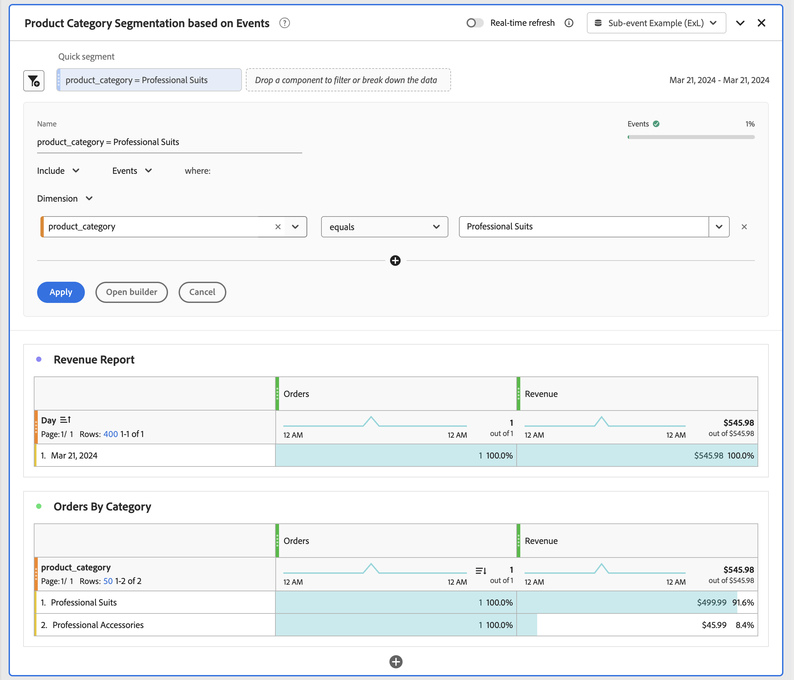

# 子事件分析

{{release-limited-testing}}

通过子事件分析，可在比事件级别更精细的级别分析事件数据。 您可以对事件中的单个容器进行分段，而不是筛选整个事件。 例如：

* 按特定产品类别进行分段，不包括在同一订单中购买的所有其他产品。
* 在内容分析数据中对特定资产类别进行分段。
* 在Media Analytics数据中对特定媒体渠道进行分段。

在Customer Journey Analytics中，您可以在数据视图中定义要为其使用子事件分析的容器。 如果没有子事件分析，对容器项属性进行分段将返回您定义的所有事件、会话、人员、（全局）帐户[!BADGE B2B edition]{type=Informative url="https://experienceleague.adobe.com/zh-hans/docs/analytics-platform/using/cja-overview/cja-b2b/cja-b2b-edition" newtab=true tooltip="Customer Journey Analytics B2B Edition"}、购买组[!BADGE B2B edition]{type=Informative url="https://experienceleague.adobe.com/zh-hans/docs/analytics-platform/using/cja-overview/cja-b2b/cja-b2b-edition" newtab=true tooltip="Customer Journey Analytics B2B Edition"}、机会[!BADGE B2B edition]{type=Informative url="https://experienceleague.adobe.com/zh-hans/docs/analytics-platform/using/cja-overview/cja-b2b/cja-b2b-edition" newtab=true tooltip="Customer Journey Analytics B2B Edition"}或其他[容器](/help/data-views/create-dataview.md#containers-1)。 结果是不正确的归因和夸大的收入量度。 子事件分析可将过滤器范围设置为事件中的单个容器行，并解决这些问题。

在子事件分析中，“排除”逻辑的行为与针对容器的标准事件级别排除的行为不同。 在容器中排除项目属性时，区段返回容器中有&#x200B;**项目**&#x200B;但不匹配排除条件的事件。 该区段不会返回根本没有项目的事件。

## 示例

您只想测量专业西装类别的收入。 如果没有子事件分析，应用专业套装细分将包括来自任何订单（事件）上的每项产品的收入，该订单（事件）至少包含一项具有专业套装类别的产品。 通过子事件分析，您可以将该过滤器范围限定为产品级别，并且只返回专业西装类别产品的收入。

您还需要测量除专业套装类别外的所有其他类别的在线收入。

>[!BEGINTABS]

>[!TAB 事件分析]

在分段生成器中，或作为&#x200B;**[!UICONTROL 快速区段]**&#x200B;的一部分，您指定在&#x200B;**[!UICONTROL 事件]**&#x200B;容器上&#x200B;**[!UICONTROL 包含]** **[!UICONTROL Dimension]** **[!UICONTROL product_category]** **[!UICONTROL 等于]** **[!UICONTROL 专业套装]**。

因此，至少包含一个&#x200B;**[!UICONTROL 专业套装]** **[!UICONTROL product_category]**&#x200B;的所有订单都将被考虑，这些订单中来自其他产品的收入包含在&#x200B;**[!UICONTROL 收入]**量度中。
当您报告类别时，报告了**[!UICONTROL product_category]**&#x200B;的所有其他值，这些值属于包含&#x200B;**[!UICONTROL 专业套装]** **[!UICONTROL product_category]**&#x200B;产品的订单。

>[!TAB 子事件分析]

您已在数据视图中定义了&#x200B;**[!UICONTROL 产品详细信息]** [自定义容器](/help/data-views/create-dataview.md#containers)，以便对产品进行子事件分析。

在分段生成器中，或作为&#x200B;**[!UICONTROL 快速区段]**&#x200B;的一部分，您指定在&#x200B;**[!UICONTROL 产品详细信息]**&#x200B;容器上&#x200B;**[!UICONTROL 包含]** **[!UICONTROL Dimension]** **[!UICONTROL product_category]** **[!UICONTROL 等于]** **[!UICONTROL 专业套装]**。

因此，所有至少包含&#x200B;**[!UICONTROL 专业套装]** **[!UICONTROL product_category]**&#x200B;的订单都被考虑在内，并且只有属于&#x200B;**[!UICONTROL 专业套装]** **[!UICONTROL product_categorey]**&#x200B;的产品收入包含在&#x200B;**[!UICONTROL 收入]**指标中。
当您报告类别时，仅报告**[!UICONTROL 专业套装]** **[!UICONTROL product_category]**。

>[!TAB 子事件分析（排除）]

您已在数据视图中定义了&#x200B;**[!UICONTROL 产品详细信息]** [自定义容器](/help/data-views/create-dataview.md#containers)，以便对产品进行子事件分析。

在分段生成器中，或作为&#x200B;**[!UICONTROL 快速区段]**&#x200B;的一部分，您指定在&#x200B;**[!UICONTROL 产品详细信息]**&#x200B;容器上&#x200B;**[!UICONTROL 排除]** **[!UICONTROL Dimension]** **[!UICONTROL product_category]** **[!UICONTROL 等于]** **[!UICONTROL 专业套装]**。

要在产品级别排除，应包含至少包含一个产品的事件，然后在该范围内应用子事件级别的排除。 此排除项与事件级别排除项不同，后者排除整个事件。

>[!ENDTABS]
