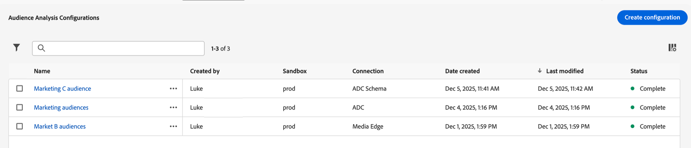

# 管理受众分析配置{#manage-audience-analysis}

在您[创建受众分析配置](/help/connections/audience-analysis/audience-analysis-configure.md)后，您可以查看、编辑或删除它们。

只有系统管理员才能管理受众分析配置。

有关受众分析的信息，请参阅[受众分析概述](/help/connections/audience-analysis/audience-analysis-overview.md)。

## 查看和筛选现有配置

要查看现有受众分析配置，请执行以下操作：

1. 在Customer Journey Analytics中，选择&#x200B;**[!UICONTROL 数据管理]** > **[!UICONTROL 受众分析配置]**。

   

   以下各列提供了有关每个配置的信息：

   * **[!UICONTROL 创建者]**：创建配置的用户。

   * **[!UICONTROL 沙盒]**：包含您添加到连接的配置文件数据集的Experience Platform沙盒。

   * **[!UICONTROL 连接]**：您添加到配置的连接。

   * **[!UICONTROL 创建日期]**：配置的创建日期。

   * **[!UICONTROL 上次修改时间]**：上次修改配置的日期。

   * **[!UICONTROL 状态]**：配置的状态。 可能的状态包括“完成”、“进行中”或“失败”。<!--true?-->

   通过选择“列”图标，取消选择要隐藏的任何列，然后选择&#x200B;**[!UICONTROL 应用]**，可以隐藏任何列。

1. （可选）要筛选配置列表，请选择&#x200B;**筛选器** ，然后按以下任意条件进行筛选：

   * **[!UICONTROL 连接]**

   * **[!UICONTROL 创建者]**

   * **[!UICONTROL 沙盒]**

   * **[!UICONTROL 状态]**

## 编辑配置

要编辑现有的受众分析配置，请执行以下操作：

1. 在Customer Journey Analytics中，选择&#x200B;**[!UICONTROL 数据管理]** > **[!UICONTROL 受众分析配置]**。

   

1. 选择要编辑的配置名称。

   或

   选中要编辑的配置旁边的复选框，然后选择&#x200B;**[!UICONTROL 编辑]**。

1. 对配置进行任何所需的更改，然后选择&#x200B;**[!UICONTROL 保存]**。

## 删除配置

要删除现有的受众分析配置，请执行以下操作：

1. 在Customer Journey Analytics中，选择&#x200B;**[!UICONTROL 数据管理]** > **[!UICONTROL 受众分析配置]**。

   

1. 选中要删除的配置旁边的复选框，然后选择&#x200B;**[!UICONTROL 删除]**。
